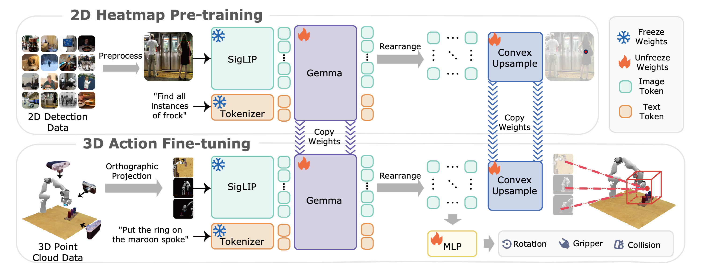

<div align="center">

# BridgeVLA: Input-Output Alignment for Efficient 3D Manipulation Learning with Vision-Language Models

A 3D VLA framework that aligns the input and output within a shared 2D space in both pre-training and fine-tuning, enabling strong data efficiency and achieves impressive performance in both basic and generalization settings.


[\[📄Paper\]](https://arxiv.org/abs/2506.07961)  [\[🏠Project Page\]](https://bridgevla.github.io/)  [\[📊Dataset\]](https://huggingface.co/datasets/LPY/BridgeVLA)  [\[🤗Checkpoints\]](https://huggingface.co/datasets/LPY/BridgeVLA)


</div>


## 🔥 News
* **`2026.04.06`** 🌟 We release [MV-VDP](https://lpy1219.github.io/MV-VDP-Web/), a spatio-temporal aware video action model that leverages the similar projection and back-projection strategy. It demonstrates great data-efficiency, robustness, generalization and interpretability. We invite you to check it out!
* **`2025.09.20`** 🌟 BridgeVLA was accepted by NeurIPS 2025! 🥳🥳🥳
* **`2025.06.15`** 🌟 We are proud to introduce BridgeVLA, a model designed to bridge the gap between VLM backbone and VLA by aligning input and output within a shared 2D space during both pre-training and fine-tuning.

## 👀 Contents

- [Model Overview](#Model-Overview)
- [Installation](#Installation)
- [Training](#Training)
- [Evaluation](#evaluation)
- [Experimental Results](#experimental-results)
- [TODO](#TODO)
- [Acknowledgement](#Acknowledgement)
- [Contact](#Contact)
- [Citation](#Citation)


## 📋 Model Overview
As illustrated in the following figure, BridgeVLA employs a dual-phase training recipe. During pre-training, it is trained to predict 2D heatmaps on object detection datasets. During fine-tuning, point clouds are projected into multiple 2D images as inputs to the VLM backbone. The model is trained to predict 2D heatmaps for estimating the translational action and other action components. **This design aligns the input and output within a shared 2D space in both pre-training and fine-tuning.**

## 🛠️ Installation
1. **Clone this repository and navigate to the BridgeVLA folder:**
```bash
git clone https://github.com/BridgeVLA/BridgeVLA.git
cd BridgeVLA
```

2. **Install the required package:**
```bash
conda create -n bridgevla python=3.9 -y
conda activate bridgevla

# For pre-training
cd pretrain
bash ./pretrain_install.sh

# For RLBench fine-tuning
cd finetune/RLBench
bash ./install_rlbench.sh

# For Colosseum fine-tuning
cd finetune/Colosseum
bash ./install_colosseum.sh

# For GemBench fine-tuning
cd finetune/GemBench
bash ./install_gembench.sh
```
3. Note: To avoid potential conflicts between different simulation benchmarks, we suggest creating separate virtual environments for each benchmark. Also, our model is built upon [Paligemma](https://huggingface.co/google/paligemma-3b-pt-224), which is a gated repo. Therefore, you should first be authenticated to access it.
## 🚀 Training
If you want to reproduce our results, please use the same training hyperparameters in the config file. **Do not forget to modify the corresponding saving path in the file before running the following code.**
1. **Pre-training:**
We use the object detection data in the RoboPoint dataset to pre-train the model. We upload the data and checkpoints [here](https://huggingface.co/datasets/LPY/BridgeVLA/tree/main/). With the `pretrain/pretrain.py` file, you can do three things:
* `visualiztion`: This function is used to visualize the pre-training dataset.
* `pre-training`: This function is used to pre-train the Paligemma model on the dataset .
* `evaluation`: This function is used to test the pre-trained checkpoints.
What you need to do is to modify the checking branch in the file and then run the following code:
```bash
cd pretrain
bash pretrain.sh --branches BRANCH_OPTION --config_path PATH_TO_CONFIG_FILE --json_detection_path PATH_TO_DETECTION_JSON --image_folder PATH_TO_IMAGE_FOLDER
```
2. **RLBench Fine-tuning:** To finetune on RLBench, you should first prepare the dataset. You can generate the train and test data yourself by following the instructions in [PerAct repository](https://github.com/peract/peract?tab=readme-ov-file#data-generation). Or you can directly download the dataset we generate to fully reproduce our results [here](https://huggingface.co/datasets/LPY/BridgeVLA_RLBench_TRAIN_DATA/tree/main). To improve the data loading speed, we will first convert the raw data into replay buffer. The training code will automatically do that if it does not find the replay buffer. Meanwhile, you can also directly download the replay buffer we preprocess [here](https://huggingface.co/datasets/LPY/BridgeVLA_RLBench_TRAIN_BUFFER/tree/main). After the data is ready, you can use the `finetune/RLBench/train.sh` file to finetune the model. Please run the following code:
```bash
cd finetune/RLBench
bash train.sh --exp_cfg_path  configs/rlbench_config.yaml \
              --exp_note debug \
              --freeze_vision_tower \
              --log_dir exp/RLBench \
              --load_pretrain \
              --pretrain_path  LPY/BridgeVLA/checkpoints/RLBench/model_80.pth 
```

### RLBench fine-tuning on one 8 x 40 GB node

The reduced-hardware profiles keep the paper-scale effective batch size of
192 with gradient accumulation. The recommended profile uses batch size 2 per
GPU on 8 GPUs and accumulates 12 micro-batches before each optimizer update.

Run the four-task trend reproduction (20,000 optimizer steps):

```bash
cd finetune/RLBench
GPUS_PER_NODE=8 bash train_8x40.sh \
    --exp_cfg_path configs/rlbench_trend_8x40.yaml \
    --exp_note trend_seed0 \
    --freeze_vision_tower \
    --log_dir exp/RLBench \
    --load_pretrain \
    --pretrain_path PATH_TO_2D_HEATMAP_PRETRAINED_MODEL \
    --save_initial_checkpoint \
    --save_optimizer_state
```

For the full 18-task, 83,300-step schedule, replace the config with
`configs/rlbench_full_8x40.yaml`. Checkpoints include the completed optimizer
step when `--save_optimizer_state` is enabled, so the same command can resume
with `--resume /path/to/model_last.pth`. Prebuilt replay buffers are strongly
recommended; replay generation is not part of the distributed training run.

Evaluate all 18 tasks with one isolated simulator process per GPU:

```bash
python eval_parallel.py \
    --model-folder PATH_TO_CHECKPOINT_FOLDER \
    --eval-datafolder PATH_TO_RLBENCH_EVAL_DATA \
    --model-name model_80.pth \
    --gpus 0,1,2,3,4,5,6,7 \
    --eval-episodes 25
```

The runner creates a unique run directory, merges the 18 task CSV files, and
writes `summary.json` with the macro success rate. It does not record videos.


### RLBench Raw → Replay 独立生成

`tools/generate_rlbench_replay.py` 使用与训练入口完全相同的
`create_replay()` / `fill_replay()` 实现，把已保存的 RLBench raw episode 转换为标准
BridgeVLA/YARR replay。它会完成关键帧发现、demo augmentation、动作离散化、四相机观测、
RN50 CLIP 语言特征、`replay_info.npy` 和 final-observation sentinel。请在已安装
RLBench/PyRep/YARR/peract_colab 的 `bridgevla` 环境中，从仓库根目录运行。

先仅检查任务和 episode：

```bash
python tools/generate_rlbench_replay.py \
    --raw-data-dir LPY/BridgeVLA_RLBench_TRAIN_DATA \
    --output-dir LPY/BridgeVLA_RLBench_TRAIN_Buffer \
    --split train \
    --task stack_blocks \
    --start-episode 0 \
    --num-demos 100 \
    --demo-augmentation-every-n 10 \
    --device cuda:0 \
    --dry-run
```

确认路径和 episode 数量后移除 `--dry-run` 正式生成。输出位于
`LPY/BridgeVLA_RLBench_TRAIN_Buffer/stack_blocks`，可直接作为下一节 Oracle 增强脚本的
`--replay-dir`。如果 `--raw-data-dir` 已经指向 `.../train`，程序也会自动识别，
不需要再次拼接 `train`。

| 参数 | 默认值 | 说明 |
| --- | --- | --- |
| `--raw-data-dir PATH` | 必填 | 数据集根目录、`train` split、单任务目录或 `episodes` 目录。 |
| `--output-dir PATH` | 必填 | Replay 输出根目录；每个任务写入 `PATH/<task>`，必须与 raw 路径相互独立。 |
| `--split NAME` | `train` | raw 根目录下的 split 名。 |
| `--task NAME` | `all` | 任务名、逗号分隔任务名或 `all`；可重复传入。 |
| `--start-episode N` | `0` | 第一个 raw episode 编号。 |
| `--num-demos N` | 从起点到最后 | 连续 episode 数量；若范围内缺号会在生成前报错。 |
| `--demo-augmentation-every-n N` | `10` | 每隔 N 个 raw 帧创建一个 demo augmentation replay 子序列，与原训练默认值一致。 |
| `--no-demo-augmentation` | 关闭 | 每个 episode 只从起始帧生成一个子序列，数据更少且与默认训练数据分布不同。 |
| `--device DEVICE` | `auto` | CLIP 特征设备；`auto` 优先 `cuda:0`，也可指定 `cpu` 或其他 CUDA 卡。 |
| `--clip-model NAME_OR_PATH` | `RN50` | OpenAI CLIP 名称或本地权重路径；首次使用名称时可能需要下载权重。 |
| `--batch-size N` | `1` | YARR replay schema 的 batch size；不影响生成的 transition 内容。 |
| `--replay-capacity N` | `300000` | 内部 UniformReplayBuffer 容量。 |
| `--dry-run` | 关闭 | 只发现并检查输入，不加载 CLIP、不创建输出。 |
| `--skip-existing` | 关闭 | 校验已有任务 replay 后跳过；不会补写不完整目录。 |
| `--overwrite` | 关闭 | 删除并重建已存在的精确任务输出；与 `--skip-existing` 互斥。 |

生成时先写入 `<output-dir>/.<task>.raw_to_replay.tmp`。只有 replay 文件连续、
`replay_info.npy` 长度一致且普通 transition/final sentinel 校验通过后，才会原子改名为
正式任务目录。若程序中断，临时目录会保留用于检查；确认无需保留后使用
`--overwrite` 重新生成。

### RLBench Oracle 3D 物体 Replay 数据准备

`tools/augment_replay_with_oracle_objects.py` 可直接为已有 BridgeVLA replay 追加
RLBench GT instance 点云，无需重新采集数据或重建原始 replay。脚本用每个
`N.replay` 的 `episode_idx` 和 `sample_frame` 找到四路相机 mask，经
`rgb_handles_to_mask` 解码后与 replay 点云逐像素对齐，并跨视角合并相同 handle。

```text
N.replay[episode_idx, sample_frame]
  -> episode{episode_idx}/{camera}_mask/{sample_frame}.png
  -> front / left_shoulder / right_shoulder / wrist 点云融合
  -> 固定尺寸 Oracle instance 张量
```

新增字段：

```text
oracle_object_points   [MAX_OBJECTS, NUM_POINTS, 3]  float32
oracle_object_centers  [MAX_OBJECTS, 3]              float32
oracle_object_sizes    [MAX_OBJECTS, 3]              float32
oracle_object_ids      [MAX_OBJECTS]                 int32
oracle_object_valid    [MAX_OBJECTS]                 bool
oracle_object_roles    [MAX_OBJECTS]                 int8
```

`oracle_object_roles` 与 ID/valid 使用相同 slot：`0=unknown/padding`、
`1=target`、`2=reference`。启用时序匹配后，角色按夹爪抓取周期计算：闭爪位置附近被
抓取的 object 是 `target`，松爪/放置位置附近除 target 外最近的 object 是
`reference`。同一抓取周期内 T/R 的稳定 object ID 固定不变，只在下一个抓取周期重新
选择；放置位置附近没有有效候选时 reference 为空。
启用时序匹配后，同一刚性物体的多个 raw mask handle 会先合并点云，再占用一个 slot；
`oracle_object_ids` 使用组内最小 handle ID 作为稳定代表，原始成员保存在 task handle
JSON 的 `object_groups` 和 `group_by_handle` 中。

`sample_frame` 是当前 observation 对应的 raw 帧；`keypoint_frame` 不参与 Oracle
对齐。`terminal == -1` 是 YARR final-observation sentinel，写入全 invalid 的填充张量；
可视化时会通过上一条 replay 的 `next_keypoint_frame` 恢复最终 raw 帧。

推荐先在命令末尾保留 `--dry-run` 检查结果，确认后移除它进行正式写入：

```bash
python tools/augment_replay_with_oracle_objects.py \
    --replay-dir LPY/BridgeVLA_RLBench_TRAIN_Buffer \
    --raw-data-dir LPY/BridgeVLA_RLBench_TRAIN_DATA/train \
    --output-dir LPY/BridgeVLA_RLBench_TRAIN_TASK_OBJECT_Buffer \
    --detect-robot-handles \
    --robot-detection-frames 128 \
    --robot-detection-stride 5 \
    --robot-detection-window 200 \
    --robot-motion-threshold 0.1 \
    --robot-link-motion-threshold 0.001 \
    --robot-adjacency-distance 0.10 \
    --temporal-id-matching \
    --task-detection-frames 16 \
    --task-prior-filter \
    --filter-thin-planes \
    --min-object-points 1 \
    --max-objects 32 \
    --num-points 512 \
    --workers 8 \
    --cache-frames 256 \
    --visualize-every 100 \
    --visualize-output-dir oracle_visualizations \
    --visualize-objects-only \
    --thin-plane-max-thickness 0.02 \
    --dry-run
```

如果多任务生成中断，不要添加 `--overwrite`。使用与原来完全相同的参数重新运行，
仅在末尾增加 `--resume`（并确保没有 `--dry-run`）：

    python tools/augment_replay_with_oracle_objects.py [原来的全部参数] --resume

工具的正式 replay 使用临时文件校验后原子改名，因此 `--resume` 会跳过输出目录中
已完成的 `*.replay`；只留下 `*.replay.tmp` 或尚未生成正式文件的条目会重新处理。
已完整完成的 task 会在 episode detection 前直接跳过，部分完成的 task 也只检测和处理
剩余 replay 所涉及的 episode。续跑必须保持原 replay、raw data 和过滤参数不变；
如果需要修改生成参数，应改用新的输出目录或显式 `--overwrite` 全量重建。

#### 参数表

| 类别 | 参数 | 默认值 | 说明 |
| --- | --- | --- | --- |
| 输入 | `--replay-dir PATH` | 必填 | 原始 BridgeVLA replay 目录；可为单任务目录或包含多个任务的根目录。 |
| 输入 | `--raw-data-dir PATH` | 必填 | RLBench raw data 的 `train` 目录或可解析到 episode 的上级目录。 |
| 输入 | `--task NAME` | `all` | 任务名、逗号分隔任务名或 `all`；可重复传入。 |
| 输出 | `--output-dir PATH` | 无 | 写入新的 Oracle replay 目录；非 dry-run 时必须与 `--in-place` 二选一。 |
| 输出 | `--in-place` | 关闭 | 原地修改 replay；与 `--output-dir` 互斥，建议优先使用新目录。 |
| 输出 | `--resume` | 关闭 | 断点续跑：跳过已原子写完的正式 replay，只生成缺失文件；与 `--overwrite` 互斥。 |
| 输出 | `--overwrite` | 关闭 | 重新处理并覆盖已有输出 replay/元数据；与 `--resume` 互斥。 |
| 输出 | `--durable-write` | 关闭 | 临时文件重命名前执行 `fsync`；更安全，但网络盘上更慢。 |
| 张量 | `--max-objects N` | `32` | 每帧固定的最大 instance 槽位数；超出部分会截断。 |
| 张量 | `--num-points N` | `512` | 每个 instance 的固定采样点数；不足时有放回采样。 |
| 张量 | `--min-object-points N` | `20` | 跨相机融合并移除 NaN/Inf 后少于该点数的实例会删除；高召回检查可设为 `1`。 |
| 几何过滤 | `--filter-thin-planes` | 关闭 | 用抗噪主平面内点比例删除大薄平面；几何判定优先于当前帧 target/reference。 |
| 几何过滤 | `--thin-plane-max-thickness METRES` | `0.010` | 点到拟合平面的最大内点距离；默认允许主体平面具有约 1 cm 深度噪声。 |
| 几何过滤 | `--thin-plane-min-extent METRES` | `0.30` | 平面内两个方向都至少达到该尺寸时才删除；小于约 30 cm 的托盘、支架面等中小型平面默认保留。 |
| 几何过滤 | `--thin-plane-min-inlier-ratio RATIO` | `0.80` | 至少该比例的点落在平面距离带内才删除；默认允许最多约 20% 深度离群点。提高该值会更保守。 |
| 几何过滤 | `--filter-thin-planes-all-roles` | 默认行为 | 兼容旧命令；现在 target/reference 薄平面也默认删除。 |
| 几何过滤 | `--preserve-role-thin-planes` | 关闭 | 仅当任务确实包含薄片状相关物体时，选择保留 target/reference 薄平面。 |
| 张量 | `--camera NAME` | 四路相机 | 指定相机，可重复传入；默认 `front`、`left_shoulder`、`right_shoulder`、`wrist`。 |
| 排除 | `--exclude-object-id ID` | `0` | 精确排除 decoded handle，可重复传入；`--exclude-robot-id` 是同义参数。 |
| 单帧先验 | `--task-prior-filter` | 关闭 | 按下一关键动作距离排序，并删除明显大平面背景；默认高召回，不按半径删除远处实例。 |
| 单帧先验 | `--task-prior-strict` | 关闭 | 配合 `--task-prior-filter` 删除交互半径外实例；召回率更低，仅在明确需要激进筛选时使用。 |
| 单帧先验 | `--task-prior-radius METRES` | 按任务 | 覆盖 18 个任务配置中的交互半径。 |
| 单帧先验 | `--task-prior-max-instances N` | 高召回不限；strict 按任务 | 限制先验保留的 simulator handle 数。 |
| 单帧先验 | `--task-prior-background-extent METRES` | `0.60` | 两个轴均达到该尺度时视为明显桌面/地面。 |
| 时序匹配 | `--temporal-id-matching`（兼容旧名 `--temporal-task-filter`） | 关闭 | 建立稳定 `handle ID → object group → slot`；以闭爪处物体为 T、松爪放置位置最近的其他物体为 R，并在同一抓取周期固定 T/R；不删除当前帧可见实例。 |
| 时序任务 | `--task-detection-frames N` | `16` | 每个 episode 均匀抽取的最大检测帧数；需覆盖闭爪和松爪边界，长 episode 建议提高到 `24` 或 `32`。 |
| 时序匹配 | `--task-handle-cache-dir PATH` | `<output-dir>/<task>/task_handle_maps` | episode 稳定 slot 与 task handle JSON 缓存；显式 PATH 作为根目录并追加 task 名。 |
| 时序任务 | `--refresh-task-handle-cache` | 关闭 | 忽略已有 task handle JSON 并重新检测。 |
| 机器人 | `--detect-robot-handles` | 关闭 | 检测 wrist 稳定的夹爪 seed，并沿持续邻接的运动学链扩展到机械臂及静止底座；只使用第一次闭合前的前缀，避免把被抓物体当作机器人。 |
| 机器人 | `--robot-detection-frames N` | `64` | 自适应扩展时最多读取的 raw 证据帧数；正常有运动时通常只读取初始窗口的 21 帧。 |
| 机器人 | `--robot-detection-stride N` | `5` | raw 帧采样间隔；默认依次读取 `0, 5, 10, ...`。 |
| 机器人 | `--robot-detection-window N` | `100` | 从 raw 帧 0 开始的初始闭区间；运动不足时才在该窗口之后继续扩展。 |
| 机器人 | `--robot-motion-threshold METRES` | `0.02` | 只控制自适应 raw 采样：夹爪最大位移达到该值后不再扩展采样；不直接改变 arm 判定。 |
| 机器人 | `--robot-link-motion-threshold METRES` | `0.008` | 第一段机械臂 link 需要达到的最小位移；漏掉低幅运动 link 时可尝试 `0.002` 或 `0.001`。 |
| 机器人 | `--robot-adjacency-distance METRES` | `0.05` | 两个 robot handle 的 AABB 最大连接间隙；分段机械臂链断开时可尝试 `0.08`，过大会增加误删风险。 |
| 机器人 | `--robot-handle-cache-dir PATH` | `<output-dir>/<task>/robot_handle_maps` | episode robot handle JSON 缓存；显式 PATH 作为根目录并追加 task 名。 |
| 机器人 | `--refresh-robot-handle-cache` | 关闭 | 忽略已有 robot handle JSON 并重新检测。 |
| 性能 | `--refresh-replay-metadata-cache` | 关闭 | 强制重建 replay 元数据索引；仅在同名 `.replay` 被原地改写时使用，日常运行不要添加。 |
| 容错 | `--skip-invalid-frames` | 关闭 | raw 帧越界时保留 replay 并写入 `valid=False` 的空 Oracle；进度条和最终汇总输出忽略的唯一帧数及 replay 数。O2 非 strict 配置会对这些样本退回原始 heatmap。 |
| 性能 | `--workers N` | `1` | replay 线程数；建议从 `4` 或 `8` 测试，过高会增加内存和网络盘竞争。 |
| 性能 | `--cache-frames N` | `128` | 相同 raw 帧 Oracle 结果的 LRU 容量；`0` 禁用，内存有限时降低。 |
| 性能 | `--seed N` | `0` | 控制确定性点采样和 dry-run 抽样。 |
| 性能 | `--no-progress` | 关闭 | 关闭 tqdm 进度条。 |
| 检查 | `--dry-run` | 关闭 | 只验证和可视化，不写 replay，也不新建/覆盖 handle 缓存。 |
| 检查 | `--dry-run-samples N` | `5` | 未指定间隔可视化时，dry-run 随机检查的普通 transition 数。 |
| 可视化 | `--visualize-index N` | 无 | 保存指定 replay index；与 `--visualize-every` 互斥。 |
| 可视化 | `--visualize-every N` | `0` | 每隔 N 个排序后的 replay 保存一张 PNG；`0` 关闭。 |
| 可视化 | `--visualize-output-dir PATH` | `oracle_visualizations` | PNG 输出目录，不设置时也会自动创建该默认目录。 |
| 可视化 | `--visualize-objects-only` | 关闭 | 隐藏点云面板中的灰色完整场景，仅绘制保留实例；不影响上排 RGB。 |

#### 关键行为与检查

- 推荐同时启用 `--detect-robot-handles`、`--temporal-id-matching` 和
  `--task-prior-filter`：先排除机器人，再建立 episode 级稳定 slot，最后进行单帧
  排序和背景清理。旧参数名 `--temporal-task-filter` 保持兼容，但不再执行硬过滤。
- 时序检测会把交互/邻接 handle 排在 episode slot 映射前部，并把其他观测到的
  handle 追加到稳定映射；`rejected_dynamic_handles` 仅作为诊断和优先级证据，不会由
  temporal 模式删除。某个稳定 handle 在当前帧不可见时保留该 slot，写入
  `valid=False`；其他可见 handle 会使用剩余 slot。
- 时序流程先按持续空间邻接和多帧相对位姿合并 raw handle；`max_instances` 限制的是 group
  数而不是 raw handle 数。episode 内其他帧的夹爪开闭、物体随动、动作邻近和静态接触会
  形成 task group 及 `role_cycles`。每个周期在闭爪时选择附近被抓取的 group 作为 T，
  在后续松爪时选择离夹爪放置位置最近的其他 group 作为 R；从该周期开始到松爪帧，所有
  replay observation 都查询同一组 T/R，不会因夹爪移动或当前帧距离变化而切换。周期外或
  未检测到完整开闭事件时，才使用时序先验与当前帧几何的兼容回退；reference 始终可选且
  每周期最多一个。检测结果保存在 task handle JSON 的 `role_cycles` 字段，运行日志中的
  `cycles=` 依次显示 `[start_frame, end_frame, target_id, reference_id]`，其中
  `reference_id=-1` 表示没有 R。若抓取任务日志为 `cycles=[]`，可使用
  `--task-detection-frames 32`（长 episode 可继续提高）并添加
  `--refresh-task-handle-cache` 重新检测。low-dim observation 使用最多 8 个 episode 的
  LRU 缓存并自动淘汰。
- 刚性分组要求两个 handle 在至少 75% 的共同可见证据中可用、80% 以上持续邻接，且
  多帧中心间距离标准差不超过 1 cm。方向和幅度一致的共同运动可以合并；若两者一直静止，
  边界长期紧密接触也可以合并。所有持续兼容关系最终按连接图的连通分量合并，因此支架的
  多个末端区域即使彼此不直接接触，只要都稳定连接到同一中心/底座，也会形成一个 object
  group。仅在任务后期才接触支架的杯子不满足全时段持续邻接要求，不会并入支架。逐帧角色
  只对分组后的 object group 计算，不对 raw handle 单独赋值。
  普通第一阶段始终使用 2 cm，避免把静止邻近物体在整幅场景中误合并。`place_cups` 只有在
  多帧证据先找到 reference 支架种子后，才允许从该种子向其他静止、相对位姿稳定的区域做
  6 cm 二阶段结构扩展；target 和发生明显运动的杯子不会进入该扩展。
- Robot 检测使用 raw observation 中的当前夹爪位姿、`gripper_open`、GT mask 和 raw
  depth。depth 会用同帧相机内外参重建世界坐标点云，与 mask 像素严格对齐。夹爪 seed 以
  wrist 图像稳定性为主，并允许夹爪旋转造成的世界坐标偏移、部分遮挡及距离离群；夹爪
  handle 不必在第 0 帧可见，在 episode 早期窗口内首次出现（如 raw frame 10）时，会以
  它自己的首个可见帧检查 wrist 邻接和后续随动。严格评分没有 seed 时会从 wrist 稳定候选
  恢复 seed。只在外部相机可见、wrist mask 中不可见的夹爪 link 也允许在早期首次出现；
  arm 扩展会使用它与 seed 的首个共同可见帧，而不再强制要求 raw frame 0 可见。arm 扩展先确认紧邻夹爪的移动 link，
  再沿 episode 早期已连接且持续邻接的运动学链扩展，因此可覆盖运动较少的机械臂底座。
  默认在 `0–100` raw 帧内每隔 5 帧取样；若夹爪相对第 0 帧的最大位移不足 2 cm，则继续
  按相同间隔向后扩展，直到运动足够、达到帧数上限、episode 结束或夹爪第一次闭合。
  `--robot-motion-threshold` 只影响这里的采样长度。机械臂是否进入 `arm_handles` 由
  `--robot-link-motion-threshold`、`--robot-adjacency-distance`、可见率和持续邻接共同决定。
  低幅 link 只要达到独立的绝对运动阈值，就不会再仅因运动量小于夹爪的 25% 被当作静止物体。
  若一直静止会打印 `motion-based robot evidence is weak`，提示运动证据不足。检测只使用
  第一次闭合之前的前缀，因此不会把随后被夹起并跟随夹爪运动的任务物体当成机械臂。
  夹爪持续运动而某实例基本静止时，该实例不会判为机器人；证据不足的实例只进入
  `ambiguous_handles`，不会加入 `excluded_object_ids`。task prior 和时序任务筛选会
  使用 replay 的下一关键动作，因此属于 action-conditioned Oracle 离线标注，不是
  无标签推理阶段的公平筛选器。整个流程不调用 Qwen 或 SAM。
- Replay 文件编号按写入顺序排列，但 `sample_frame` 是稀疏关键帧，不保证 raw 帧号
  连续；`terminal == -1` 分隔的是 replay 子序列。Demo augmentation 可能让同一个
  `episode_idx` 出现多段子序列。Robot 只借助 replay metadata 确定 episode，检测证据
  直接来自 episode 前部等间隔的 raw 帧；检测出的稳定 handle ID 会应用到后续整个
  episode。task 仍执行 episode 级 replay 均匀采样，并按
  `(episode_idx, sample_frame, next_keypoint_frame)` 保留不同动作边。
- 提供 `--output-dir` 时，Task 缓存位于
  `<output-dir>/<task>/task_handle_maps/episode_NNNN.json`，robot 缓存位于
  `<output-dir>/<task>/robot_handle_maps/episode_NNNN.json`。显式指定对应的
  `--*-handle-cache-dir PATH` 时使用 `PATH/<task>/episode_NNNN.json`，避免多任务间
  episode 文件重名。Robot cache 会记录 raw 采样间隔、窗口、帧数上限、采样运动阈值、
  link 运动阈值和邻接距离；
  修改这些参数时会自动失效。修改 task 检测帧数、半径或实例限制后仍应使用
  `--refresh-task-handle-cache`；修复前生成的旧版 task/robot 缓存也会自动失效。
- 缺少可用的 `replay_info.npy` 时，首次运行必须读取每个 `.replay` 的 metadata，并写入
  `.oracle_replay_metadata_v2.npz`。缓存会根据 replay 文件名、大小和修改时间自动失效；
  提供 `--output-dir` 时，缓存位于对应的输出 task
  目录（包括 dry-run）；未提供输出目录或使用 `--in-place` 时才写入输入 replay 目录。
  以后运行会显示
  `replay metadata disk cache hit`，同一次运行中 robot/task 共用索引时显示
  `memory cache hit`。新增、删除或重命名 replay 会自动使索引失效；若原地改写同名文件，
  使用一次 `--refresh-replay-metadata-cache`。如果日志提示无法保存索引，需要检查 replay
  目录写权限，否则下次仍会全量扫描。
- 如果提示 `Cannot read current gripper_pose for frame N`，且 raw episode 中也没有
  第 `N` 帧，先使用一次 `--refresh-replay-metadata-cache`。若刷新后仍报错，则对应
  `.replay` 的 `sample_frame`/`next_keypoint_frame` 与 raw episode 不匹配，通常表示
  replay 与 raw data 来自不同版本或 raw episode 不完整；不要把越界帧强行截到最后一帧，
  否则会造成图像、点云、夹爪状态和动作监督错位。若允许这些少量异常样本退回
  baseline，可添加 `--skip-invalid-frames`：程序保留 replay 的连续结构、写入空 Oracle，
  并输出 `ignored_invalid_frames` 与 `ignored_invalid_replays`。
- `dry-run` 会打印 `excluded_object_ids`、`no_finite_point_object_ids`、
  `small_object_ids`、`task_prior_filtered_object_ids`、
  `temporal_filtered_object_ids` 和 `truncated_object_ids`。命令行时序匹配不再产生
  `temporal_filtered_object_ids`；若缺失 ID 不在其他列表中，说明它在当前帧所选相机
  的 GT mask 中不可见。
- 每张可视化 PNG 使用两排八个面板：上排为 front、left shoulder、right shoulder、
  wrist RGB；下排为 3D、XY、XZ、YZ 点云。相同 episode/handle ID 跨帧颜色固定；图中
  不直接显示可能达到千万级的 simulator handle，而按 episode 稳定 slot 映射为从 `1`
  开始的连续小编号。上排利用同帧 GT mask 为下排实际保留的 ID 绘制半透明同色框：
  unknown 只显示小编号（例如 `3`），target/reference 分别简写为 `T_3` / `R_4`。
  底层 `oracle_object_ids` 和 handle 缓存仍保留真实 ID，不影响跨帧匹配与训练数据。
  3D 图例和三个正交视图采用相同标签；某个实例在当前相机不可见时不画框。
  点云使用固定米制
  场景边界；缺失 RGB 显示
  `RGB unavailable`，不会中断生成。
- 默认先写 `.tmp`、回读验证后原子重命名，不覆盖原始数据。缓存会自动淘汰已完成的
  旧帧；进度条中的 `cache_hits`、`cache_misses` 和 `cache_entries` 可用于检查效果。

**突然只剩一个物体时：**先比较启动日志中的 `slots=[...]` 和图片标题里的
`episode_idx/sample_frame`。`--max-objects 32` 是 episode 稳定映射的容量上限，不会
补回当前帧不可见的实例。

- 如果 `task handles` 只有一个，但 `slots` 有多个，其他实例仍会保留；task handles
  现在只决定容量不足时的优先级，不再构成白名单。旧版按白名单删除实例的 task cache
  会通过版本号自动失效。
- 如果某个 replay 只剩一个，检查 dry-run 输出：`excluded_object_ids` 表示被
  robot/手工 ID 排除，`task_prior_filtered_object_ids` 表示被显式单帧先验删除，
  `small_object_ids` 表示点数不足，`thin_plane_object_ids` 表示被显式薄平面规则删除，
  `protected_thin_plane_object_ids` 表示几何上是薄平面但因 target/reference 角色而保留，
  `no_finite_point_object_ids` 表示 mask 可见但点云
  全为 NaN/Inf。缺失 ID 不在任何列表时，说明它在当前帧所选相机的 GT mask 中不可见
  或被完全遮挡；不再归因于 temporal 匹配。
- 若 robot 检测仍有疑似误判，检查
  `<output-dir>/<task>/robot_handle_maps/episode_NNNN.json`：只有
  `gripper_handles` 和
  `arm_handles` 会硬删除；`grasped_handles` 是被抓物体保护集合，
  `ambiguous_handles` 仅供诊断。旧版 robot cache 会自动失效；重新生成 robot 结果后
  也应刷新 task cache。
- 图片标题切换到新的 `episode_idx` 时，会改用另一份 episode cache；这不是同一
  episode 内 ID 突变。`sentinel=True` 对应 `terminal == -1` 填充 transition，保存的
  Oracle 张量为空是预期行为。

可先提高 robot/task 采样密度和交互半径重新检查；dry-run 只实时重检，不写入新缓存，
确认后需移除 `--dry-run` 才会保存结果。robot 结果会影响后续 task slot，因此刷新顺序
是先 robot、再 task：

```bash
--detect-robot-handles \
--robot-detection-frames 64 \
--robot-detection-stride 5 \
--robot-detection-window 100 \
--robot-motion-threshold 0.02 \
--robot-link-motion-threshold 0.002 \
--robot-adjacency-distance 0.08 \
--refresh-robot-handle-cache \
--temporal-id-matching \
--task-detection-frames 32 \
--task-prior-radius 0.30 \
--refresh-task-handle-cache \
--dry-run \
--visualize-index 100
```

同一 `episode_idx` 的多个 replay 子序列共用 slot 映射；切换到新的 `episode_idx` 时
使用独立映射。训练随机采样 replay 时不依赖上一条 transition。

训练加载 Oracle replay 时，需要将
finetune/RLBench/utils/peract_utils_rlbench.py 中的
TRAIN_REPLAY_STORAGE_DIR 指向 Oracle 输出目录，并启用与数据准备阶段一致的张量
尺寸：

    bash train.sh \
        --exp_cfg_opts 'use_oracle_objects True oracle_max_objects 32 oracle_num_points 512' \
        [其他训练参数]

use_oracle_objects 默认为 False，因此原始非 Oracle replay 的加载行为保持不变。

### O2：训练当前应操作实例 GT

O2 不把 GT heatmap 作为固定 mask 或手工 logit 约束。程序先保留 BridgeVLA 原始
trans_raw，再将 trans_raw 和 GT 实例三视角 heatmap 输入一个小型、可训练的
residual fusion head；最终 trans 参与原有 translation loss。fusion 最后一层为
零初始化，因此训练开始时 trans 与 trans_raw 相等。Oracle 无效时也强制回退
trans_raw。

推荐先冻结整个原 BridgeVLA，只训练新增 fusion head：

    bash train.sh --exp_cfg_path configs/rlbench_o2_gt_instance.yaml --init_checkpoint /path/to/baseline_model.pth --train_oracle_fusion_only

如果希望联合训练动作相关模块、但不 fine-tune Gemma，改用：

    bash train.sh --exp_cfg_path configs/rlbench_o2_gt_instance.yaml --init_checkpoint /path/to/baseline_model.pth --freeze_language_model

专用配置文件为
`finetune/RLBench/configs/rlbench_o2_gt_instance.yaml`，集中配置 Oracle replay
shape、O2 fusion 模式、active role 和 heatmap sigma。checkpoint 路径以及
`--train_oracle_fusion_only` / `--freeze_language_model` 属于单次运行策略，
仍通过命令行指定。临时修改单个值时，仍可在配置文件之后使用
`--exp_cfg_opts 'tasks stack_blocks rvt.oracle_prior_strict True'` 覆盖。

init_checkpoint 只初始化模型权重，fusion 保持零初始化，epoch 和 optimizer 从头开始；
继续已开始的 O2 训练则使用 resume_checkpoint。两者不能同时指定。

auto 在当前夹爪打开时选择 role T，闭合时选择 role R。评估器也可以直接提供
oracle_active_object_points [B,P,3] 和可选的
oracle_active_object_valid [B]，此时不经过 T/R 自动选择。训练日志同时记录
trans_loss（fused）和 trans_loss_raw（原 heatmap），便于判断 fusion 是改善还是
伤害原预测。oracle_prior_strict 默认为 False：当前 role 缺失或存在多个候选时，
该样本回退 trans_raw；oracle_prior_coverage 用于监控实际有效比例。数据审计时可
显式设置 rvt.oracle_prior_strict True，使异常样本直接报错。

use_oracle_objects=False、rvt.oracle_prior_mode=none 均为默认值；此时不创建
fusion 参数、不要求 Oracle 字段，旧 replay、旧 checkpoint 和原始前向路径保持
不变。O2 在训练和评估时均使用 GT 实例，属于 privileged Oracle 上界，不应作为
无 GT 的部署结果报告。

#### O2 代码插入位置

O2 不进入 Gemma 或视觉编码器，而是插在 MVT translation head 输出之后、
translation loss 和坐标 decode 之前。核心实现位于
`finetune/bridgevla/mvt/mvt.py::_apply_oracle_instance_prior`：

    raw_logits = stage_out['trans']
    stage_out['trans_raw'] = raw_logits.detach()
    stage_out['trans'] = fusion(raw_logits, prior, valid)

完整执行路径如下：

1. `finetune/RLBench/utils/dataset.py::create_replay` 注册 Oracle points、
   valid、roles 等 replay 字段；
2. `finetune/bridgevla/models/bridgevla_agent.py::_select_oracle_prior_points`
   根据当前夹爪状态选择唯一 Target 或 Reference；
3. `bridgevla_agent.py::update` 临时把 instance points 拼入场景点云，使其和
   场景及动作标签执行相同 SE(3) augmentation，完成后立即拆开；
4. `mvt.py::_apply_oracle_instance_prior` 将完整实例点投影成三视图 prior，
   再由 `OraclePriorFusion` 学习 residual；
5. MVT1 在第一次 `self._apply_oracle_instance_prior(..., True, ...)` 调用处
   融合，MVT2 在第二次 `self._apply_oracle_instance_prior(..., False, ...)`
   调用处融合；
6. `bridgevla_agent.py::update` 中的 `trans_loss` 使用 fused
   `q_trans`，而 `trans_loss_raw` 仅用于监控原始预测。

Fusion head 定义在
`finetune/bridgevla/models/oracle_prior.py::OraclePriorFusion`，结构为
`Conv(2→hidden) → GELU → Conv(hidden→1)`，最后一层零初始化。因此启用 O2
后的初始 translation 输出与 baseline 完全相同。

O2 评估可视化需要同时启用开关和输出目录：

    python eval.py [原评估参数] --visualize --visualize_root_dir exp/RLBench_O2_vis

每个 step 的 `mvt1/` 和 `mvt2/` 目录会保存：

- `original_N.png`、`gray_N.png`、`overlay_N.png`：输入视图、最终 fused
  translation heatmap 和其最大值位置；
- `o2_prior_N.png`、`o2_prior_overlay_N.png`：GT instance prior；
- `o2_raw_N.png`、`o2_raw_overlay_N.png`：原始 BridgeVLA heatmap；
- `o2_fused_N.png`、`o2_fused_overlay_N.png`：融合后 heatmap。

完整路径为
`<visualize_root_dir>/<task>/episode_<N>/<language_goal>/step<N>/{mvt1,mvt2}/`。
只设置 `--visualize_root_dir` 不会启用可视化。online observation 未提供 Oracle
字段时，默认非严格模式会打印警告、回退原始 logits，并写入
`o2_unavailable.txt`；这种结果不是有效 O2 评测。设置
`rvt.oracle_prior_strict True` 可改为立即报错。

#### O2 训练中间可视化

训练样本可视化由实验 YAML 控制，默认配置关闭；O2 配置示例已开启：

    train_visualization:
      enabled: True
      interval: 500
      save_png: True
      tensorboard: True
      output_dir: train_visualizations

interval 使用 optimizer step，而不是梯度累积的 micro-step。每次只采集 rank 0
最后一个 micro-batch 的第一个样本，并分别生成 MVT1/MVT2 拼图。每张拼图包含
Input、经过当前 SE(3) 增强和投影后的 GT translation heatmap、
Oracle prior、Raw pred 和 Fused pred。

当 save_png=True 时，图片保存到
`<log_dir>/<output_dir>/step_XXXXXXXX/{mvt1,mvt2}.png`。当
tensorboard=True 时，必须同时使用 --log_backend tensorboard，图片显示在
TensorBoard 的 train_visualization/mvt1 和 train_visualization/mvt2 下。
两种输出可以独立关闭；可视化未命中的 step 不会拷贝训练张量到 CPU。

#### O2 训练代码测试

在服务器的 `bridgevla` 环境、仓库根目录运行：

    python -m unittest tests.test_oracle_prior tests.test_rlbench_training_utils tests.test_rlbench_training_visualization -v

`tests.test_oracle_prior` 检查当前实例选择、完整实例点投影、零初始化 identity、
无效 prior 回退、fusion 反向梯度和训练 GT/pred 张量拆分；
`tests.test_rlbench_training_utils` 检查 fusion-only 冻结范围和
batch/optimizer-step 规划；`tests.test_rlbench_training_visualization` 检查
PNG 与 TensorBoard 拼图输出。

确认专用 YAML 能被项目 YACS 配置系统加载：

    PYTHONPATH=finetune python -c "from bridgevla.config import get_cfg_defaults; c=get_cfg_defaults(); c.merge_from_file('finetune/RLBench/configs/rlbench_o2_gt_instance.yaml'); assert c.use_oracle_objects and c.rvt.oracle_prior_mode == 'o2_gt_instance'; print(c)"

上述测试属于代码级检查；正式训练前仍应在 GPU 上运行一个真实 replay batch 的
forward/backward，并确认 `oracle_prior_coverage`、`trans_loss_raw` 和
`trans_loss` 均能正常输出。

训练默认只在 `model_*.pth` 中保存 `epoch` 和 `model_state`，适用于评估与
推理，不保存体积较大的 Adam optimizer state。如果需要完整恢复优化器以继续
训练，启动训练时显式添加 `--save_optimizer_state`。轻量 checkpoint 仍可直接
传给 RLBench `eval.py`；使用轻量 checkpoint 执行 `--resume` 时只恢复模型
权重，优化器会重新初始化。

### RLBench 训练日志与实时 Loss

训练日志可通过 `--log_backend` 在 TensorBoard、W&B 和关闭指标记录之间切换。
默认使用 TensorBoard，不需要账号或网络连接；无论选择哪种后端，主进程都会在
tqdm 进度条中实时显示 total、translation、rotation、gripper 和 collision loss。

默认 TensorBoard 模式等价于：

    bash train.sh [其他参数] --log_backend tensorboard

全部标量 loss 和 learning rate 会写入当前实验目录下的 `tensorboard` 子目录。

启动训练后，在另一个终端执行：

    tensorboard --logdir /path/to/experiment/tensorboard --port 6006

然后在浏览器打开 `http://localhost:6006`。如果训练运行在远程服务器，可使用
SSH 端口转发：

    ssh -L 6006:localhost:6006 user@server

默认每 10 个 iteration 额外输出一行纯文本 loss，便于保存 shell 日志。可以
调整为每 50 步输出：

    bash train.sh [其他参数] --loss_print_interval 50

使用 `--loss_print_interval 0` 可关闭纯文本 loss，但 tqdm 和选定的日志后端
仍会继续工作。TensorBoard 默认每 10 秒刷新一次，可通过
`--tensorboard_flush_secs` 调整。

需要切换回 W&B 在线记录时：

    bash train.sh [其他参数] --log_backend wandb --wandb_project BridgeVLA

可选使用 `--wandb_entity ENTITY` 指定团队或用户。服务器无法联网时，可以先写入
本地 W&B 离线目录，之后再执行 `wandb sync`：

    bash train.sh [其他参数] --log_backend wandb --wandb_mode offline

完全关闭 TensorBoard/W&B 指标记录可使用 `--log_backend none`；tqdm 实时 loss
和由 `--loss_print_interval` 控制的纯文本 loss 不受影响。

3. **COLOSSEUM Fine-tuning:** For COLOSSEUM, we fine-tune the model with the training dataset provided by the [COLOSSEUM challenge](https://huggingface.co/datasets/colosseum/colosseum-challenge/tree/main). Similarly, our training code will first convert the raw data into replay buffer. You can also directly download the replay buffer we preprocess [here](https://huggingface.co/datasets/LPY/BridgeVLA_COLOSSEUM_TRAIN_BUFFER/tree/main). Then, you can use the `finetune/Colosseum/train.sh` file to finetune the model. Please run the following code:
```bash
cd finetune/Colosseum
bash train.sh --exp_cfg_path  configs/colosseum_config.yaml \
              --exp_note debug \
              --freeze_vision_tower \
              --log_dir PATH_TO_LOG_DIR \
              --load_pretrain \
              --pretrain_path  PATH_TO_PRETRAINED_MODEL
```
4. **GemBench Fine-tuning:** To finetune on GemBench, you should first download the dataset from [here](https://huggingface.co/datasets/rjgpinel/GEMBench/tree/main). The structure of GemBench is different from RLBench and COLOSSEUM. We did not use replay buffer and did not do demo augmentation. You can use the `finetune/GemBench/train.sh` file to finetune the model. Please run the following code:
```bash
cd finetune/GemBench
bash train.sh --exp_cfg_path  configs/gembench_config.yaml \
              --exp_note debug \
              --freeze_vision_tower \
              --log_dir PATH_TO_LOG_DIR \
              --load_pretrain \
              --pretrain_path  PATH_TO_PRETRAINED_MODEL
```
## 🧪 Evaluation
1. **RLBench Evaluation:** To evaluate on RLBench, you can just run the following code:
```bash
cd finetune/RLBench
bash eval.sh # Please modify the evaluated tasks and the checkpoint path in the file.
```
2. **COLOSSEUM Evaluation:** To evaluate on COLOSSEUM, you should first preprocess the eval data as the original format is not suitable for our data loading. Run the following code to preprocess them. Or you can directly download the cleaned data we have tided from [here](https://huggingface.co/datasets/LPY/BridgeVLA_COLOSSUM_EVAL_DATA/tree/main).
```bash
cd finetune/Colosseum
python3   cleanup_script.py   LPY/COLOSSEUM_EVAL_DATA/
```
After cleaning the eval dataset, you can run the following code to evaluate the model:
```bash
cd finetune/Colosseum
bash eval.sh  VARIATION LOG_NAME MODEL_EPOCH MODEL_FOLDER
```

COLOSSEUM requires to evaluate on all the variation factors. We provide the  `Colosseum/cal_statics.py` to compute the per task success rate on each variation factor. Just replace the results folder path in the file and run the following code:
```bash
cd finetune/Colosseum
python3 cal_statics.py
```
Note: During the evaluation of Variations 1 and 6, three tasks—“close laptop lid,” “wipe desk,” and “insert onto peg”—occasionally encountered errors in certain evaluation episodes. These issues stem from problems within the evaluation data itself. I have contacted the COLOSSEUM authors, who have confirmed the issue and plan to address it in a future update. In the meantime, I adopted the following workaround: I recorded only the successful trials and repeated the evaluation until I had collected 25 successful runs for each of these tasks. These 25 valid trials were then used to compute the final performance metrics.

3. **GemBench Evaluation:** To evaluate on GemBench, you should first launch the server. Run the following code:
```bash
cd finetune/GemBench
bash run_server.sh  MODEL_EPOCH  MODEL_BASE_PATH
```
After lanuching the server, you can run the following code to evaluate the model:
```bash
cd finetune/GemBench
bash run_client.sh  SEED MODEL_EPOCH
```
The results are saved as `results.json`, which record the success status of each trial. We provide the `GemBench/cal_results.py` to compute the average success rates of each task in each setting for each seed. Just replace the results folder path in the file and run the following code:
```bash
cd finetune/GemBench
python3 cal_results.py
```
## 📈 Experimental Results
BridgeVLA's performance on three simulation benchmarks is shown in the following table:
### RLBench Task Success Rates (Part 1)

| Model                          | Avg. Success (%) ↑ | Avg. Rank ↓ | Close Jar      | Drag Stick     | Insert Peg     | Meat off Grill | Open Drawer    | Place Cups     | Place Wine     | Push Buttons   |
|--------------------------------|--------------------|-------------|----------------|----------------|----------------|----------------|----------------|----------------|----------------|----------------|
| Image-BC (CNN)                 | 1.3                | 9.3         | 0.0            | 0.0            | 0.0            | 0.0            | 0.0            | 4.0            | 0.0            | 0.0            |
| Image-BC (ViT)                 | 1.3                | 9.7         | 0.0            | 0.0            | 0.0            | 0.0            | 0.0            | 0.0            | 0.0            | 0.0            |
| C2F-ARM-BC                     | 20.1               | 8.7         | 24.0           | 24.0           | 4.0            | 20.0           | 20.0           | 0.0            | 8.0            | 72.0           |
| HiveFormer                     | 45.3               | 6.9         | 52.0           | 76.0           | 0.0            | **100.0**      | 52.0           | 0.0            | 80.0           | 84.0           |
| PolarNet                       | 46.4               | 6.5         | 36.0           | 92.0           | 4.0            | **100.0**      | 84.0           | 0.0            | 40.0           | 96.0           |
| PerAct                         | 49.4               | 6.3         | 55.2±4.7       | 89.6±4.1       | 5.6±4.1        | 70.4±2.0       | 88.0±5.7       | 2.4±3.2        | 44.8±7.8       | 92.8±3.0       |
| Act3D                          | 65.0               | 4.3         | 92.0           | 92.0           | 27.0           | 94.0           | 93.0           | 3.0            | 80.0           | 99.0           |
| RVT                            | 62.9               | 4.4         | 52.0±2.5       | 99.2±1.6       | 11.2±3.0       | 88.0±2.5       | 71.2±6.9       | 4.0±2.5        | 91.0±5.2       | **100.0±0.0**  |
| 3D Diffuser Actor              | 81.3               | 2.5         | 96.0±2.5       | **100.0±0.0**  | 65.6±4.1       | 96.8±1.6       | 89.6±4.1       | 24.0±7.6       | 93.6±4.8       | 98.4±2.0       |
| RVT-2                          | 81.4               | 2.5         | **100.0±0.0**  | 99.0±1.7       | 40.0±0.0       | 99.0±1.7       | 74.0±11.8      | 38.0±4.5       | **95.0±3.3**   | **100.0±0.0**  |
| **BridgeVLA (Ours)**           | **88.2**           | **1.9**     | **100.0±0.0**  | **100.0±0.0**  | **88.0±2.8**   | **100.0±0.0**  | **100.0±0.0**  | **58.4±10.0**  | 88.0±2.8       | 98.4±2.2       |

### RLBench Task Success Rates (Part 2)

| Model                          | Put in Cupboard   | Put in Drawer    | Put in Safe      | Screw Bulb      | Slide Block     | Sort Shape      | Stack Blocks    | Stack Cups      | Sweep to Dustpan | Turn Tap        |
|--------------------------------|-------------------|------------------|------------------|-----------------|-----------------|-----------------|-----------------|------------------|------------------|-----------------|
| Image-BC (CNN)                 | 0.0               | 8.0              | 4.0              | 0.0             | 0.0             | 0.0             | 0.0             | 0.0              | 0.0              | 8.0             |
| Image-BC (ViT)                 | 0.0               | 0.0              | 0.0              | 0.0             | 0.0             | 0.0             | 0.0             | 0.0              | 0.0              | 16.0            |
| C2F-ARM-BC                     | 0.0               | 4.0              | 12.0             | 8.0             | 16.0            | 8.0             | 0.0             | 0.0              | 0.0              | 68.0            |
| HiveFormer                     | 32.0              | 68.0             | 76.0             | 8.0             | 64.0            | 8.0             | 8.0             | 0.0              | 28.0             | 80.0            |
| PolarNet                       | 12.0              | 32.0             | 84.0             | 44.0            | 56.0            | 12.0            | 4.0             | 8.0              | 52.0             | 80.0            |
| PerAct                         | 28.0±4.4          | 51.2±4.7         | 84.0±3.6         | 17.6±2.0        | 74.0±13.0       | 16.8±4.7        | 26.4±3.2        | 2.4±2.0          | 52.0±0.0         | 88.0±4.4        |
| Act3D                          | 51.0              | 90.0             | 95.0             | 47.0            | 93.0            | 8.0             | 12.0            | 9.0              | 92.0             | 94.0            |
| RVT                            | 49.6±3.2          | 88.0±5.7         | 91.2±3.0         | 48.0±5.7        | 81.6±5.4        | 36.0±2.5        | 28.8±3.9        | 26.4±8.2         | 72.0±0.0         | 93.6±4.1        |
| 3D Diffuser Actor              | **85.6±4.1**      | 96.0±3.6         | 97.6±2.0         | 82.4±2.0        | **97.6±3.2**    | 44.0±4.4        | 68.3±3.3        | 47.2±8.5         | 84.0±4.4         | **99.2±1.6**    |
| RVT-2                          | 66.0±4.5          | 96.0±0.0         | 96.0±2.8         | **88.0±4.9**    | 92.0±2.8        | 35.0±7.1        | **80.0±2.8**    | 69.0±5.9         | **100.0±0.0**   | 99.0±1.7        |
| **BridgeVLA (Ours)**           | 73.6±4.6          | **99.2±1.8**     | **99.2±1.8**     | 87.2±6.6        | 96.0±2.8        | **60.8±7.7**    | 76.8±8.7        | **81.6±3.6**     | 87.2±1.8         | 92.8±3.3        |

### COLOSSEUM Task Success Rates (Part 1)

| Models                  | Average ↑ | Avg. Rank ↓ | All Perturbations      | MO-COLOR          | RO-COLOR          | MO-TEXTURE        | RO-TEXTURE        | MO-SIZE          |
|-------------------------|-----------|-------------|------------------------|-------------------|-------------------|-------------------|-------------------|------------------|
| R3M-MLP                 | 0.8       | 5.71        | 0.6                   | 0.4              | 0.0               | 0.0               | 0.0              | 1.8             |
| MVP-MLP                 | 1.6       | 5.0         | 0.8                   | 1.2              | 0.0               | 0.4               | 0.0              | 4.44            |
| PerAct                  | 27.9      | 3.71        | 7.2                   | 24.0             | 29.2              | 28.8              | 17.71            | 35.6            |
| RVT                     | 35.4      | 3.28        | 6.4                   | 26.0             | 31.3              | 44.8              | 41.1             | 35.3            |
| RVT-2                   | 56.7      | 1.92        | 15.6 ± 0.8            | 53.0 ± 0.9       | 54.6 ± 0.6        | 59.7 ± 0.7        | 56.7 ± 1.4       | 60.9 ± 0.9      |
| **BridgeVLA (Ours)**    | **64.0**  | **1.07**    | **18.7 ± 2.2**        | **60.5 ± 1.1**   | **63.8 ± 0.1**    | **63.5 ± 1.5**    | **68.4 ± 3.3**   | **69.3 ± 1.0**  |

### COLOSSEUM Task Success Rates (Part 2)

| Models                  | RO-SIZE          | Light Color       | Table Color        | Table Texture      | Distractor         | Background Texture | RLBench          | Camera Pose      |
|-------------------------|------------------|-------------------|--------------------|--------------------|--------------------|--------------------|------------------|------------------|
| R3M-MLP                 | 0.0              | 1.0               | 1.4                | 0.2                | 1.6                | 1.2                | 2.0              | 0.8              |
| MVP-MLP                 | 0.0              | 1.6               | 1.6                | 1.0                | 3.8                | 2.2                | 2.0              | 2.6              |
| PerAct                  | 29.3             | 29.1              | 30.4               | 23.2               | 27.1               | 33.5               | 39.4             | 36.3             |
| RVT                     | 40.5             | 34.0              | 30.0               | 45.2               | 18.8               | 46.4               | 53.4             | 42.2             |
| RVT-2                   | 53.4 ± 1.5       | 58.0 ± 1.1        | 62.6 ± 0.9         | 56.6 ± 0.9         | **60.8 ± 0.5**     | 68.7 ± 1.1         | 68.8 ± 1.3       | 64.4 ± 0.5       |
| **BridgeVLA (Ours)**    | **61.7 ± 0.8**   | **69.7 ± 1.2**    | **75.7 ± 0.9**     | **71.3 ± 0.7**     | 51.8 ± 1.5         | **74.8 ± 1.0**     | **73.1 ± 0.2**   | **73.8 ± 0.3**   |

### Performance on GemBench

| Method                         | Avg.  | L1              | L2              | L3              | L4             |
|--------------------------------|-------|-----------------|-----------------|-----------------|----------------|
| Hiveformer                     | 30.4  | 60.3±1.5        | 26.1±1.4        | 35.1±1.7        | 0.0±0.0        |
| PolarNet                       | 38.4  | 77.7±0.9        | 37.1±1.4        | 38.5±1.7        | 0.1±0.2        |
| 3D diffuser actor              | 44.0  | 91.9±0.8        | 43.4±2.8        | 37.0±2.2        | 0.0±0.0        |
| RVT-2                          | 44.0  | 89.1±0.8        | 51.0±2.3        | 36.0±2.2        | 0.0±0.0        |
| 3D-LOTUS                       | 45.7  | **94.3±1.4**    | 49.9±2.2        | 38.1±1.1        | 0.3±0.3        |
| 3D-LOTUS++                     | 48.0  | 68.7±0.6        | 64.5±0.9        | 41.5±1.8        | **17.4±0.4**   |
| **BridgeVLA (Ours)**           | **50.0** | 91.1±1.1        | **65.0±1.3**    | **43.8±1.2**    | 0.0±0.0        |


## 📅 TODO 

- [x] Release the pre-training code
- [x] Release the training & evaluation code of RLBench
- [x] Release the training & evaluation code of COLOSSEUM
- [x] Release the training & evaluation code of GemBench
- [x] Release the pre-training data
- [x] Release the checkpoints

</details>

## 🙏 Acknowledgement
We stand on the shoulders of giants, and our work in developing BridgeVLA has been inspired and empowered by the remarkable open source projects in the field. We would like to extend our heartfelt gratitude to each of these initiatives and their dedicated developers.
- [PerAct](https://peract.github.io/)
- [RVT-2](https://robotic-view-transformer-2.github.io/)
- [Palligemma](https://huggingface.co/blog/paligemma)
- [RLBench](https://github.com/stepjam/RLBench/tree/master)
- [GemBench](https://www.di.ens.fr/willow/research/gembench/)
- [COLOSSEUM](https://robot-colosseum.github.io/)
- [RoboPoint](https://github.com/wentaoyuan/RoboPoint)

## ✉️ Contact
If you have any questions about the code, please contact peiyan.li@cripac.ia.ac.cn.
## 📝 Citation

```bibtex
@misc{li2025bridgevla,
    title={BridgeVLA: Input-Output Alignment for Efficient 3D Manipulation Learning with Vision-Language Models},
    author={Peiyan Li and Yixiang Chen and Hongtao Wu and Xiao Ma and Xiangnan Wu and Yan Huang and Liang Wang and Tao Kong and Tieniu Tan},
    year={2025},
    eprint={2506.07961},
    archivePrefix={arXiv},
    primaryClass={cs.RO}
}
```


