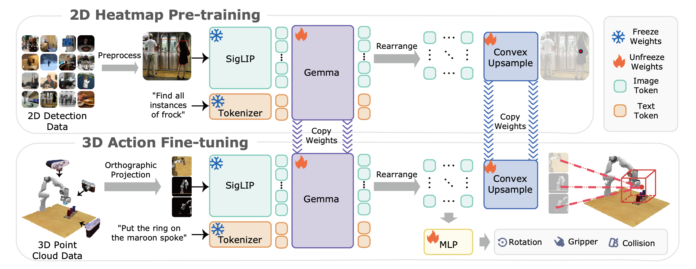

<div align="center">

# BridgeVLA: Input-Output Alignment for Efficient 3D Manipulation Learning with Vision-Language Models

A 3D VLA framework that aligns the input and output within a shared 2D space in both pre-training and fine-tuning, enabling strong data efficiency and achieves impressive performance in both basic and generalization settings.


[\[📄Paper\]](https://arxiv.org/abs/2506.07961)  [\[🏠Project Page\]](https://bridgevla.github.io/)  [\[📊Dataset\]](https://huggingface.co/datasets/LPY/BridgeVLA)  [\[🤗Checkpoints\]](https://huggingface.co/datasets/LPY/BridgeVLA)


</div>

<a id=model-overview></a>

## 📋 Model Overview

As illustrated in the following figure, BridgeVLA employs a dual-phase training recipe. During pre-training, it is trained to predict 2D heatmaps on object detection datasets. During fine-tuning, point clouds are projected into multiple 2D images as inputs to the VLM backbone. The model is trained to predict 2D heatmaps for estimating the translational action and other action components. **This design aligns the input and output within a shared 2D space in both pre-training and fine-tuning.**


## Current Status

| Status | Module | Current Progress |
| --- | --- | --- |
| Completed | Data Annotation for OCRR in Simulated and Zero-Shot Scenarios | Simulator-based annotation; SAM3 + Qwen3 for zero-shot annotation. |
| Completed | OCRR Implementation | Object-centric Target/Reference representation and relation modeling. |
| Completed | Object-Centric VLA | Integrate object-centric features into BridgeVLA training and inference. |
| In Progress | Evaluation on OHT Tasks | OHT data pipeline is ready; training and closed-loop evaluation are in progress. |
| Next | Object-Centric WAM | Predict the next relational key state, key action, and scene point cloud. |

## 快速开始

以下命令面向 Linux / Bash。安装脚本中的路径、模拟器环境变量，以及训练配置中的数据和权重路径，需要先按机器修改；不同 benchmark 建议使用独立 Conda 环境，并提前取得 PaliGemma 权重访问权限。

<a id=installation></a>

### 安装

```bash
git clone https://github.com/BridgeVLA/BridgeVLA.git
cd BridgeVLA
conda create -n bridgevla python=3.9 -y
conda activate bridgevla
# 修改安装脚本中的路径后，从仓库根目录执行：
(cd finetune/RLBench && bash install_rlbench.sh)
```

其他 benchmark 和预训练环境见 [安装说明](docs/guides/installation.md)。

<a id=training></a>

### OHT v423

OHT 数据迁移、baseline 与 predicted object assistance 的命令和接入说明见 [OHT 实施指南](finetune/OHT/README.md)；设计依据见 [迁移方案](docs/design/oht-data-migration.md)。

### RLBench 训练

准备 raw data 或预生成 replay，修改配置中的保存路径，然后从仓库根目录运行：

```bash
cd finetune/RLBench
GPUS_PER_NODE=2 bash train_8x40.sh --exp_cfg_path configs/rlbench_config.yaml \
    --exp_note baseline --freeze_vision_tower \
    --log_dir exp/RLBench --load_pretrain \
    --pretrain_path PATH_TO_PRETRAINED_MODEL
```

`train_8x40.sh` 可指定 GPU 数，不限 8 卡；先配置本机 simulator 环境。数据、断点恢复和日志见 [训练说明](docs/guides/training.md)。

<a id=evaluation></a>

### 评估

在 `finetune/RLBench` 下修改 `eval.sh` 中的任务和 checkpoint 路径后执行 `bash eval.sh`。
长时间测试可加 `EVAL_RESUME=1`，按 episode 自动恢复；参数签名、限制和结果位置见
[闭环日志与恢复限制](docs/guides/object-conditioning.md#评估日志与最终统计)。
其他 benchmark 见 [评估说明](docs/guides/evaluation.md)；O2 的 GT、预测与 no-prior 对照见 [O2 评估](docs/guides/object-conditioning.md#closed-loop评估)。

## 文档导航

| 需求 | 文档 |
| --- | --- |
| 环境与依赖 | [安装](docs/guides/installation.md) |
| 预训练、各 benchmark 微调、8×40GB 和日志 | [训练](docs/guides/training.md) |
| Raw 数据转 replay | [Replay 生成](docs/guides/replay.md) |
| Oracle 实例字段、参数和排错 | [Oracle replay](docs/guides/oracle-replay.md) |
| 严格 simulator-GT 角色标注 | [Semantic-GT](docs/guides/semantic-gt.md) |
| O2 配置、GT/预测训练、闭环、可视化与验收 | [统一操作指南](docs/guides/object-conditioning.md) |
| 各 benchmark 评估命令 | [评估](docs/guides/evaluation.md) |
| 论文结果、发布记录 | [结果与历史](docs/experiments/results.md) |
| O2 整体架构与精简角色方案（研究设计） | [架构图](docs/design/role-relation-prior.md#整体架构) |
| 无 GT 的真实机器人部署路线 | [Real-world 设计](docs/design/role-relation-prior.md#真实机器人部署后续规划) |
| 数据流、对应函数与项目审查 | [代码索引](docs/reference/code-map.md) |
| Object-centric policy / memory 论文调研 | [Survey](docs/research/object-centric-policy-memory.md) |

完整阅读路径见 [文档索引](docs/README.md)。O2 的 GT 配置是 Oracle 上界实验；external
prediction 和 internal slots 才是无 Oracle 的部署路线。研究设计文档中的扩展方案不等同于已实现功能。

<a id=experimental-results></a>

## 实验结果

原始 RLBench、COLOSSEUM、GemBench 结果表已移至 [实验结果](docs/experiments/results.md#experimental-results)，数值保持不变。

<a id=todo></a>

发布状态与 News 见 [结果与历史](docs/experiments/results.md#todo)。


<details>
<summary>旧章节链接（已迁移）</summary>

<a id=o2-training></a>

[o2-training](docs/guides/object-conditioning.md#gt-adapter-only)

<a id=o2-adapter-only></a>

[o2-adapter-only](docs/guides/object-conditioning.md#gt-adapter-only)

<a id=o2-full-action></a>

[o2-full-action](docs/guides/object-conditioning.md#动作网络微调补充)

<a id=o2-relation-switch></a>

[o2-relation-switch](docs/guides/object-conditioning.md#gt-adapter-only)

<a id=o2-loss-comparison></a>

[o2-loss-comparison](docs/guides/object-conditioning.md#loss与checkpoint)

<a id=o2-code-path></a>

[o2-code-path](docs/guides/object-conditioning.md#最小验证)

<a id=o2-training-visualization></a>

[o2-training-visualization](docs/guides/object-conditioning.md#测试诊断与可视化)

<a id=o2-tests></a>

[o2-tests](docs/guides/object-conditioning.md#最小验证)

<a id=oracle-replay></a>

[oracle-replay](docs/guides/oracle-replay.md#oracle-replay)

<a id=oracle-parameters></a>

[oracle-parameters](docs/guides/oracle-replay.md#oracle-parameters)

<a id=oracle-checks></a>

[oracle-checks](docs/guides/oracle-replay.md#oracle-checks)

<a id=rlbench-raw-replay></a>

[rlbench-raw-replay](docs/guides/replay.md#rlbench-raw-replay)

<a id=semantic-gt-roles></a>

[semantic-gt-roles](docs/guides/semantic-gt.md#semantic-gt-roles)

<a id=rlbench-8x40></a>

[rlbench-8x40](docs/guides/training.md#rlbench-8x40)

<a id=rlbench-training-logs></a>

[rlbench-training-logs](docs/guides/training.md#rlbench-training-logs)

</details>

<a id=acknowledgement></a>

## 🙏 Acknowledgement

We stand on the shoulders of giants, and our work in developing BridgeVLA has been inspired and empowered by the remarkable open source projects in the field. We would like to extend our heartfelt gratitude to each of these initiatives and their dedicated developers.
- [PerAct](https://peract.github.io/)
- [RVT-2](https://robotic-view-transformer-2.github.io/)
- [Palligemma](https://huggingface.co/blog/paligemma)
- [RLBench](https://github.com/stepjam/RLBench/tree/master)
- [GemBench](https://www.di.ens.fr/willow/research/gembench/)
- [COLOSSEUM](https://robot-colosseum.github.io/)
- [RoboPoint](https://github.com/wentaoyuan/RoboPoint)

<a id=contact></a>

## ✉️ Contact

If you have any questions about the code, please contact peiyan.li@cripac.ia.ac.cn.
<a id=citation></a>

## 📝 Citation

```bibtex
@misc{li2025bridgevla,
    title={BridgeVLA: Input-Output Alignment for Efficient 3D Manipulation Learning with Vision-Language Models},
    author={Peiyan Li and Yixiang Chen and Hongtao Wu and Xiao Ma and Xiangnan Wu and Yan Huang and Liang Wang and Tao Kong and Tieniu Tan},
    year={2025},
    eprint={2506.07961},
    archivePrefix={arXiv},
    primaryClass={cs.RO}
}
```


