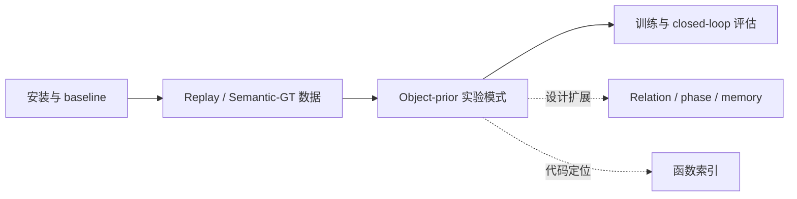

# 文档索引

[返回项目首页](../README.md)



## 推荐阅读路径

| 目标 | 从这里开始 | 下一步 |
| --- | --- | --- |
| 复现原始 BridgeVLA | [安装](guides/installation.md) | [训练](guides/training.md) → [评估](guides/evaluation.md) |
| 生成严格 T/R 数据 | [Semantic-GT](guides/semantic-gt.md) | [O2 训练](experiments/o2-training.md) |
| 快速理解每个 O2 YAML | [配置流程图](guides/o2-config-flows.md) | 对应实验与代码索引 |
| 比较 Oracle、外部预测和内部 slots | [Object-prior 模式](experiments/object-prior-modes.md) | 对应实验配置 |
| 查看 phase-dependent anchor | [Relation anchor](experiments/relation-anchor.md) | [研究设计](design/role-relation-prior.md) |
| 先 GT、后预测的联合训练 | [联合实验](experiments/object-conditioned-joint.md) | 同预算对照 → 三-seed 配对闭环准入 |
| 从概念定位代码 | [数据流与函数索引](reference/code-map.md) | 对应源码与测试 |

## 目录层次

```text
docs/
├── README.md                         # 总入口与阅读顺序
├── guides/                           # 使用指南与数据准备
│   ├── installation.md
│   ├── training.md
│   ├── replay.md
│   ├── oracle-replay.md
│   ├── semantic-gt.md
│   ├── o2-config-flows.md
│   └── evaluation.md
├── experiments/                      # 实验操作与结果
│   ├── o2-training.md
│   ├── object-prior-modes.md
│   ├── relation-anchor.md
│   ├── predicted-objects.md
│   ├── internal-object-slots.md
│   ├── object-conditioned-joint.md
│   └── results.md
├── design/                           # 研究方案（非实现承诺）
│   ├── role-relation-prior.md        # 精简主线与实施顺序
│   ├── real-world-deployment.md      # 无 GT 真实机器人部署契约
│   └── role-relation-details.md      # 公式、接口与验收细节
├── reference/
│   └── code-map.md                   # 数据流与函数索引
└── handoff/                          # 实现背景与交接
    └── oracle-prior.md
```

## 1. 使用指南

- 环境准备：[安装与依赖](guides/installation.md)。
- 复现 baseline：[训练、8×40GB 与日志](guides/training.md) → [评估](guides/evaluation.md)。
- 准备数据：[Raw → Replay](guides/replay.md) → [Oracle 实例增强](guides/oracle-replay.md) → [严格 Semantic-GT 角色](guides/semantic-gt.md)。
- 配置速查：[O2 配置简易流程图](guides/o2-config-flows.md)。

## 2. 实验与结果

- 三种 object 输入方式：[Object-prior 模式](experiments/object-prior-modes.md)。
- Oracle 上界实验：[Semantic-GT 数据](guides/semantic-gt.md) → [O2 训练、消融与评估](experiments/o2-training.md)。
- 无 Oracle 路线：[外部 predicted objects](experiments/predicted-objects.md) / [网络内部 slots](experiments/internal-object-slots.md)。
- 论文结果与发布记录：[结果与历史](experiments/results.md)。

O2 在训练和评估时使用 GT 实例，不能作为无 GT 的部署结果报告。启发式 Oracle 角色与严格 semantic-GT 标注须区分。

## 3. 研究设计

[精简设计](design/role-relation-prior.md)：复用现有 adapter/anchor 的单帧 object-conditioned 完整动作策略。

[真实机器人落地](design/real-world-deployment.md)：无 GT 部署接口、短时 object memory、sim-to-real 与安全评估。

[详细设计与可选扩展](design/role-relation-details.md)：最小状态、训练、代码落点、验收反例与按瓶颈启用的扩展。

单帧条件化已有 opt-in 代码；收益尚待闭环验证。memory、visibility 和恢复能力仍为后续实验，见[联合实验](experiments/object-conditioned-joint.md)。

## 4. 实现交接

[Oracle prior 交接](handoff/oracle-prior.md)：实验动机、实现位置、历史状态和后续扩展。

交接文档保留原有日期与历史语境。实际运行参数以当前脚本、配置和使用／实验指南为准。

## 5. 代码定位

[数据流与函数索引](reference/code-map.md) 汇总 semantic manifest、replay 重写、prior 构造、
relation/anchor adapter 和 internal slot predictor 的对应函数。

## 命令约定

命令在仓库根目录或明确指定的代码目录执行，**不在文档目录下执行**。
带 `cd` 的独立示例默认从仓库根目录开始；同一示例中的后续命令沿用其工作目录。
替换示例中的 `PATH_TO_*`、`/path/to/*` 和机器专用绝对路径后再运行。
