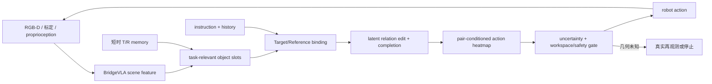
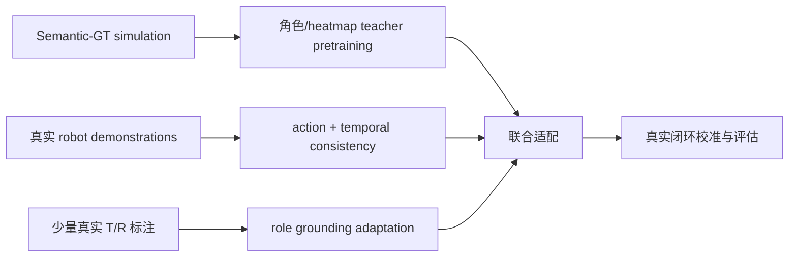

# BridgeVLA-ARE：真实机器人落地设计

[精简设计](role-relation-prior.md) · [Object-prior 模式](../experiments/object-prior-modes.md) · [文档索引](../README.md)

目标不是把 RLBench 的 Oracle 接口搬到真实机器人，而是用仿真与少量人工标注训练一个
部署时无 GT 的角色绑定、关系状态和动作模型。



## 1. 训练 teacher 与部署输入分离

| 信息 | 仿真训练可用 | 真实部署可用 |
| --- | --- | --- |
| simulator handle / instance ID | 只作监督 | 不可用 |
| GT Target/Reference / phase | 只作 teacher 或评估 | 不可用 |
| success condition | 生成 completion 标签 | 由视觉、接触、本体状态估计 |
| RGB-D 与相机参数 | 可做随机化和退化 | 直接输入，允许噪声与缺帧 |
| robot proprioception | 输入 | 输入 |
| 历史观测与动作 | 输入 | 输入 |

Semantic-GT buffer 的作用是教会网络“当前操作谁、相对谁”，不是定义真实部署协议。
训练时可使用 Oracle 点生成 heatmap teacher，但 policy-side relation/action 路径必须只接收
预测 slots；这正是 `o2_internal_slots` 应保持的隔离边界。Adapter-only 只是早期诊断，后续
可联合更新完整动作 decoder 与选定 backbone 层，Oracle 仍不能进入部署前向。

## 2. 最小 real-world 状态

首版不维护完整场景图，只维护当前 committed Target/Reference：

```text
ObjectBelief = {
  role, slot_embedding, center_mean, covariance,
  appearance_key, present_prob, visible_prob,
  last_seen_time, observation_source
}
```

- `present` 表示任务语义上需要该实体；`visible` 表示当前传感器能否提供可靠几何。
- 遮挡时保留身份与不确定位置，不能把 `visible=False` 改成 NULL Reference。
- memory 只保存 belief 与不确定性，不伪造精确的隐藏表面点云。
- 重新观测到物体后，用 3D、appearance 和角色一致性更新；冲突时降低置信度并重新绑定。
- 跨任务或 relation edit 结束后及时释放无关 memory，控制状态和误关联累积。

这比一开始实现通用多物体 SLAM/scene graph 更小，也直接针对 BridgeVLA 投影视角无法消除
真实遮挡的问题。

默认直接复用共享 scene features，不为每个物体再次运行 VLM。只有真实实验确认小物体局部
分辨率是主要瓶颈后，才对 committed T/R 增加一次可选 local refine。

## 3. Phase 不依赖 simulator

真实部署中的 phase 应表示当前 active relation edit 的执行状态，而不是 RLBench 的离散
时间标签。建议网络输出：

- 当前 T/R/NULL binding；
- latent edit embedding，APPROACH/CONNECT 等名称只作可选辅助监督；
- `completion_prob`：目标关系已经成立；
- `transition_confidence`：是否允许切换下一 edit；
- `failure_or_unknown`：抓取失败、身份丢失或几何不可观测。

只有 completion 连续稳定、必须保持的 relation 未被破坏时才切换。夹爪开合、电流/力矩、
末端位姿、物体相对运动和视觉变化可以提供弱事件标签；固定时间步或轨迹百分比不能作为
真实部署 phase 的主要依据。

## 4. 动作与安全边界

共享 relation-conditioned action path 预测完整 action；现有 relation/anchor adapter 可用于
warm-up，但不是最终唯一可训练模块。real-world 执行前增加确定性的轻量 gate：

1. waypoint 在标定工作空间和当前 depth support 内；
2. Target identity 与置信度没有在动作生成后发生切换；
3. 关节、碰撞与 gripper 命令满足控制器限制；
4. uncertainty 超阈值时执行真实的新观测动作，或安全停止。

再观测必须改变真实传感器证据，例如移动 wrist camera、调整机械臂视角或等待外部遮挡消失。
对同一可见点云重新生成正交投影不算 active perception。首版若没有验证过的再观测控制器，
应选择停止并记录失败，不能把 baseline fallback 称为安全恢复。

## 5. 数据与训练顺序



推荐顺序：

1. 用 Semantic-GT warm-up T/R heatmap、NULL arity 和 relation conditioning，并验证 Oracle 不进入 policy 输入。
2. 用深度噪声、外参扰动、视角缺失、遮挡和背景随机化缩小 sim-to-real 差异。
3. 逐步解冻完整动作 decoder、multimodal projector 与上层视觉语言特征，联合训练动作 BC、role binding 和 relation state。
4. 在真实 demonstration 上加入跨帧 slot consistency、memory 与 completion evidence。
5. 用少量真实 T/R mask/point 标签校准 role grounding；无标注帧只用高置信伪标签。
6. 训练完成并固定模型与选择规则后，在独立真实闭环集上校准 confidence / reject threshold。

不要仅依赖 synthetic GT mask：真实物体的透明、反光、薄结构、深度空洞和相机外参漂移会
直接改变 projected heatmap。输入和训练增强必须保留 `observed / remembered / unknown`
来源，而不是把空深度填成看似完整的点云。

## 6. 最小实现优先级

| 优先级 | 内容 | 验收 |
| --- | --- | --- |
| R0 | 统一真实 RGB-D、标定、proprio 输入与时间戳 | replay/live observation 数值和坐标一致 |
| R1 | predicted slots + 独立 `present/visible/confidence` | 无 Oracle 字段也能完整 forward |
| R2 | 只维护 committed T/R 的短时 memory | 短遮挡后 identity 不交换，不输出伪精确表面 |
| R3 | event-based completion/transition | 扰动、停顿和不同执行速度下不过早切换 |
| R4 | workspace、uncertainty 与控制器 gate | 拒绝和停止均计入结果，不静默执行未知动作 |
| R5 | sim-to-real adaptation 与闭环校准 | 多场景、多光照、多物体实例的真实成功率 |

不建议首版同时加入完整 scene graph、长时全场景 memory、任意视角搜索和 learned world
model。先证明 role binding、短时遮挡保持和 relation transition 在真实闭环中分别有效。

## 7. 真实机器人评估

除任务成功率外，至少报告：

- T/R grounding accuracy、NULL accuracy 和 identity-switch rate；
- 可见、部分遮挡、完全短时遮挡三组成功率；
- premature/delayed phase transition 与 keep-relation violation；
- waypoint/rotation/gripper/collision 的失败分解；
- confidence calibration、拒绝率、再观测次数及恢复成功率；
- 端到端延迟、显存、动作数，以及相机外参扰动和深度缺失下的退化。

Oracle Semantic-GT 结果只用于回答结构上限；真正的 real-world claim 必须来自不提供 GT
object、GT phase 或 simulator success condition 的闭环机器人实验。
