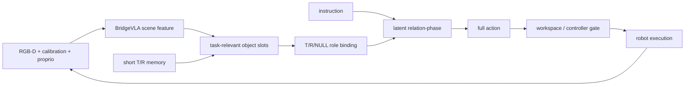
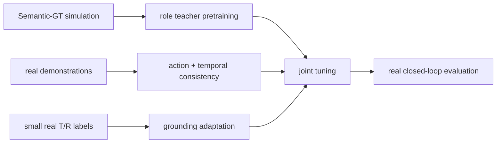

# 真实机器人落地设计

[精简设计](role-relation-prior.md) · [详细设计](role-relation-details.md) · [Object-prior 模式](../experiments/object-prior-modes.md)

## 1. 部署流程



真实部署不输入 simulator object ID、GT role、GT phase 或 success condition。Oracle 数据只用于
训练 label、teacher 和评估。

## 2. 最小运行时状态

每个 committed role 只保留：

```text
token / identity confidence
center mean / covariance
present / visible
age / last observation time
```

不缓存完整点云，不维护长期 scene graph。object 暂时不可见时保留 identity 并增加不确定性；
重新观测后才更新几何。

## 3. Phase 从当前状态重新推断

```text
current objects + instruction + proprioception + short history
→ latent relation-phase
→ current action
```

phase 不是固定时间步，也不是只能前进的计数器。stack collapse 后，只要 object geometry 可见，
下一 query 就应重新产生抓取或重建动作，无需显式 rollback。

若当前证据不足：

- 短遮挡：保持 T/R identity，降低 confidence；
- 可以安全获取新观测：移动相机、调整机械臂视角或等待；
- 无已验证的再观测动作：停止并记录失败。

对同一旧点云重新渲染虚拟视角不属于新观测。

## 4. 动作与安全

relation-phase-conditioned feature 必须同时预测 translation、rotation、gripper 和 collision action
label。执行前使用确定性 gate：

1. waypoint 位于标定工作空间和有效 depth support；
2. T/R identity 在动作生成后没有突变；
3. IK、joint limit、碰撞和 gripper 命令满足控制器限制；
4. uncertainty 超阈值时再观测或停止。

原 BridgeVLA action 可以作为 matched baseline，但不能被称为天然安全 fallback。

## 5. 数据与训练



推荐顺序：

1. 用 Semantic-GT warm-up T/R/NULL 和 role-conditioned action，确认 Oracle 不进入 forward。
2. 加入深度噪声、外参扰动、视角缺失、遮挡和背景随机化。
3. 联合训练完整动作 decoder、projector 与必要的 backbone 层。
4. 用真实短序列训练 role identity consistency。
5. 用独立闭环集校准 confidence 与 reject threshold。

训练数据应包含停顿、不同执行速度、滑落和 stack collapse；目的不是监督 rollback 类别，而是让
policy 学会根据当前 object state 重新选择动作。

## 6. 实施优先级

| 优先级 | 内容 | 验收 |
| --- | --- | --- |
| R0 | RGB-D、标定、proprio 与时间戳一致 | replay/live 数值和坐标一致 |
| R1 | predicted slots + present/visible/confidence | 无 Oracle 字段也能 forward |
| R2 | object-conditioned latent phase + full action | 不同 object relation 产生正确动作 |
| R3 | short T/R memory | 短遮挡后 identity 不交换 |
| R4 | workspace/controller gate | 未知动作会被拒绝 |
| R5 | sim-to-real joint tuning | 多场景真实闭环提升 |

## 7. 评估

至少报告：

- real closed-loop success；
- T/R grounding、NULL、visibility 和 identity-switch rate；
- visible、partial occlusion、short full occlusion 三组结果；
- stack collapse 后恢复率、额外动作数和失败类型；
- translation/rotation/gripper/collision 失败分解；
- confidence calibration、拒绝率、延迟和显存。

“可真实部署”必须指没有 GT object、GT phase 和 simulator success condition 的闭环实验。
