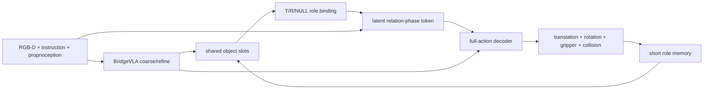

# BridgeVLA：Object-conditioned Latent Phase

[文档索引](../README.md) · [详细设计](role-relation-details.md) · [真实机器人设计](real-world-deployment.md) · [Internal Slots](../experiments/internal-object-slots.md)

> 更新：2026-09-17。本文定义当前推荐 MVP；显式 phase、relation graph、pair search 和 object-local views 均为可选扩展。

## 结论

当前方案应保持简单：从 BridgeVLA 共享特征预测 task-relevant objects，以 Target/Reference 角色、
instruction、proprioception 和极短历史为条件，隐式推断 relation-phase token，再预测完整动作。



不建立显式 phase state machine，也不把 phase 当作只能向前递增的标签。每个 control query 都根据
当前 object state 重新推断 `z_phase`。例如 stack blocks 中途坍塌后，object geometry 改变，策略
应自然回到抓取或重建动作，而不是调用单独的 rollback 模块。

## 1. 最小状态

每个角色只维护一个短时 belief：

```text
RoleBelief = {
  token,
  center_mean,
  center_covariance,
  present_probability,
  visible_probability,
  confidence,
  age
}
```

- Target 必须存在；Reference 可以为 NULL。
- `present=True, visible=False` 表示遮挡，不等于 NULL。
- memory 只保持 T/R identity 和不确定性，不补全不可见表面，也不存长期 scene graph。
- episode reset 时清空 memory；同一 query 的 coarse/refine 只更新一次。

训练数据必须分开提供：

```text
oracle_{target,reference}_present
oracle_{target,reference}_visible
oracle_object_valid
```

`valid` 表示几何监督是否可用，不能同时承担 presence 和 visibility。

## 2. 单步前向

### 2.1 Object slots 与角色

复用 `InternalObjectSlotPredictor` 产生少量无序 slots，再用 instruction 和 scene feature 得到：

```text
target/reference role maps
target/reference tokens
present / visible / confidence
reference_is_null
```

训练和默认推理都使用 soft role posterior，不用 hard top-2 决定动作。低置信时再观测或停止；
top-k pair 只作为独立消融。

### 2.2 隐式 relation-phase

```text
z_phase = PhaseEncoder(
  scene_feature,
  instruction,
  target_token,
  reference_or_null_token,
  relative_geometry,
  proprioception,
  short_history
)
```

这里的 `short_history` 可以只包含上一动作、gripper state 和 T/R memory。它用于处理短遮挡和
单帧歧义，不负责保存符号化任务进度。

不要求 APPROACH、CONNECT、TRANSFER 等 phase 标签，也不要求 `inside/on/attached` 分类头。
`z_phase` 由完整动作 loss 和短序列一致性共同学习。为确认它没有退化成时间步编码，必须随机化
执行速度与停顿，并做 T/R swap、Reference→NULL、history reset 等干预测试。

### 2.3 完整动作

T/R role maps 调制共享多视角 feature，`z_phase` 条件化同一个 action decoder。translation、
rotation、gripper 和 collision 必须来自同一最终 feature，不能只改 translation 后继续使用旧位置
产生的 R/G/C。

当前 `ignore_collisions` 仍是动作标签，不是安全概率；workspace、IK 和碰撞限制由独立控制器检查。

## 3. Phase 如何切换

不保存 phase index。每一步重新计算 `z_phase`：

```text
current objects + instruction + proprioception + short history
→ current latent phase
→ current full action
```

因此：

- 正常执行时，object relation 的变化使策略逐步进入下一动作模式；
- stack collapse 时，可见几何回到较早状态，策略自然重新抓取或重建；
- object 被遮挡时，短时 memory 保持 identity，同时提高 uncertainty；
- 证据不足时输出低 confidence，并再观测或停止，不猜测 phase。

只有实验发现“相同可见 object state 需要不同动作”的 observation aliasing，才考虑增加更长 history
或小型 progress state。显式 ledger/rollback 不进入当前 MVP。

## 4. 训练

```text
Stage 0  Oracle role + adapter/residual diagnostic
Stage 1  predicted slots + T/R/NULL + present/visible
Stage 2  latent relation-phase + full-action joint training
Stage 3  short-sequence role memory
Stage 4  predicted-only sim/real adaptation
```

主损失保持紧凑：

\[
L = L_{action}
  + \lambda_{role}L_{role}
  + \lambda_{pv}L_{present/visible}
  + \lambda_{temp}L_{temporal}.
\]

Oracle object 只作 teacher/label，不能进入部署 forward。adapter 是 Stage-0 诊断和初始化接口，
最终应联合解冻 action decoder、multimodal projector 和必要的 backbone 层。

## 5. 计算与扩展

默认仍使用 BridgeVLA coarse/refine 的 `top/front/right` 三视角，即 `3 × 2`，不为每个 object
重复运行 VLM。新增成本主要来自少量 slots、两个 role tokens 和一个小型 phase encoder。

仅在对应瓶颈被实验证实时增加扩展：

| 瓶颈 | 可选扩展 |
| --- | --- |
| 小物体局部分辨率不足 | committed T/R local refine |
| 同类物体绑定歧义 | bounded multi-hypothesis pair search |
| 单帧状态历史混淆 | longer recurrent state / explicit progress |
| 真实执行安全不足 | calibrated execution-risk model |

## 6. 实施与验收

1. 修复 `present/visible/valid` 数据契约。
2. 验证 predicted slots 在无 Oracle policy 输入下学习 T/R heatmap。
3. 让同一 conditioned feature 预测完整动作并联合训练。
4. 加入短时 role memory，测试 visible→hidden→visible identity consistency。
5. 在 stack collapse、停顿和不同速度下检查 latent phase 是否随当前 object state 正确改变。
6. 最后做 predicted-only 与真实 RGB-D 闭环。

首版报告 closed-loop success、T/R/NULL accuracy、visibility、identity switch、动作分量失败、延迟和
显存。辅助 loss 下降但闭环不提升，不足以证明模块有效。
