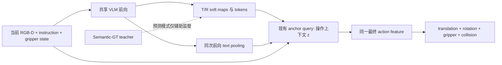

# Object-conditioned Action Policy

[文档索引](../README.md) · [实现细节](role-relation-details.md) · [联合训练与验收](../experiments/object-conditioned-joint.md)

> 更新：2026-09-20。代码提供 opt-in 单帧条件化；GT 闭环收益尚待验证。

## 主线

保留 BridgeVLA coarse/refine 与 top/front/right 三视角，增强原有 relation/anchor adapter：

GT 诊断直接提供 T/R prior；internal-slot 模式由网络预测，Oracle 点和 presence 不进入动作分支。
每步重新计算 `z`，不预测显式 phase index，也不要求 `z` 对应可解释的阶段。

## 已实现

- 两个默认关闭的开关：`object_conditioning.shared_action_features`、`use_context`。
- 共享模式从同一最终特征生成 translation、R/G/C 的 global 和 local feature；推理在最终 waypoint 处采样。
- instruction 复用同一次 VLM 前向，排除 image prefix、padding 和特殊 token。
- 内部 slots 返回 soft T/R tokens；新模式使用可微的可见点中心/spread，而非只依赖 hard top-k XYZ。
- presence 在读取旧 replay 时从角色 `kind` 派生；NULL 监督使用真实 posterior，不使用 `~valid`。
- GT 联合配置冻结 vision tower、projector 和 Gemma 前 6 层，训练 action decoder、O2 模块
  与其余 Gemma；internal-slot 联合配置保留更保守的 Gemma 前 18 层冻结并训练 projector。
- 旧配置的特征路由保持不变；旧 internal-slot 配置默认关闭 presence/NULL 辅助项，避免误用旧契约。

`current_state` 当前只有 gripper open 与两维 finger state；不包含时间进度、未来动作或当前 EE pose。
`ignore_collisions` 是动作标签，不是安全概率。

## 数据契约

| 字段 | 定义 | 当前来源 |
| --- | --- | --- |
| `oracle_target_present` / `oracle_reference_present` | 当前语义角色是否定义 | replay 审计中的 `kind`，只读派生 |
| `oracle_role_present_known[2]` | presence 标签是否可靠 | 缺少审计或终止占位时为 false |
| `oracle_object_valid` | 当前几何监督可用 | 现有点云字段，语义不变 |
| visibility | 真正的可见性 | 本轮不提供独立标签或 head |

`present=True, valid=False` 可能是遮挡或 grounding/几何失败，不是 NULL。
现有有效 replay、点云和 manifest 无需重新生成；缺少 presence 标签只屏蔽相关监督。

## 实验顺序

1. 同预算比较旧 GT anchor、共享完整动作特征、共享特征 + instruction，以及原 BridgeVLA 继续训练。
2. 固定评估 episodes，使用至少 3 个训练 seeds，检查 paired closed-loop success 差的 95% CI。
3. CI 下界为正才启动 internal-slot 联合实验；loss 下降不能替代闭环验证。
4. 记录 waypoint、预测 waypoint 下的 R/G/C、失败类型、延迟及显存。

训练仍保留 BridgeVLA 的 GT waypoint/crop teacher forcing，训练—推理差距需要单独诊断。
命令、对应函数和配对工具见[联合训练与验收](../experiments/object-conditioned-joint.md)。

## 后续扩展，不进入当前主结构

- memory：只有短遮挡或单帧歧义确认为瓶颈后，加入两角色短时状态。
- 恢复：需要失败状态与恢复数据；stack collapse 后自动恢复只是待验证假设。
- object-layered refine：只减少已有点云在虚拟投影中的遮挡，不补全真实 RGB-D 缺失表面。
- pair search、显式 relation/phase、执行风险 head：按证据增加，不作为默认方案。

细节见[可选扩展](role-relation-details.md#4-后续扩展)；真实机器人接口与安全控制仍见[部署设计](real-world-deployment.md)。
