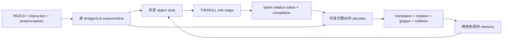

# BridgeVLA：Role-Memory Relation Policy

[文档索引](../README.md) · [真实机器人设计](real-world-deployment.md) · [详细设计与可选扩展](role-relation-details.md) · [当前 Internal Slots](../experiments/internal-object-slots.md)

> 更新：2026-09-17。本文给出当前推荐主方案；复杂 pair view、显式 operator、learned risk
> 和主动观测保留为后续消融，不属于首版依赖。

## 结论

最可靠的路线不是再叠加一套 object detector、per-object VLM 和显式 phase state machine，
而是在现有 BridgeVLA feature 上增加三个共享模块：

1. 当前已有的 task-relevant object slots 与 T/R/NULL role binding；
2. 只维护 committed Target/Reference 的短时 role memory；
3. 一个连续 relation token 和 completion head，共同条件化完整动作。



该路径不增加新的 VLM forward，不枚举全部 `K_T × K_R` 动作，也不重建隐藏表面。新增计算
主要是一个小 slot decoder、两个 role memory 状态和 relation conditioning。

### 简洁不等于自动稳定

这里的“稳定”必须分开定义，而不是凭模块少来推断：

| 稳定性 | 可检验定义 | 主要设计保证 |
| --- | --- | --- |
| 语义稳定 | NULL、遮挡、低置信不会互相误标 | `present/visible/confidence` 分离 |
| 时间稳定 | 短遮挡和单帧噪声不导致 T/R identity switch | 两角色 gated memory |
| 动作稳定 | translation 与 R/G/C 来自同一 pair/state | 共享完整动作 feature |
| 优化稳定 | 早期训练不会因 hard routing 丢失全部梯度 | soft role posterior + staged unfreezing |
| 系统稳定 | 未知输入不会静默产生无约束动作 | 有界状态、可验证 gate、停止/再观测 |

简化只减少潜在故障接口；它不能修复错误标定、严重 domain shift、容量不足或过度自信。每个
保留模块都必须对应一种已观察到的 failure mode，并通过上述指标证明收益，否则继续删除。

## 1. 为什么直接基于当前实现

当前仓库已经具备大部分正确接口：

| 当前模块 | 已有能力 | 建议保留方式 |
| --- | --- | --- |
| `InternalObjectSlotPredictor` | 共享无序 slots、T/R role mixing、NULL Reference、role heatmap | 作为唯一 object 主分支 |
| `OracleRelationGatedFeatureAdapter` | 用 T/R prior 与相对几何调制 feature | 作为 relation conditioning 初始化 |
| `OracleRelationAnchorFeatureAdapter` | 从 relation-conditioned feature 产生空间 anchor | 作为可选 translation 辅助，不单独决定动作 |
| `MVTSingle.forward()` | adapted feature 可同时进入 translation 与 R/G/C | 保证四类动作来自同一条件特征 |
| coarse/refine 两阶段 | 原始全局定位与 waypoint refine | 保留，不增加默认 per-object view bank |

当前最明显的问题不是模型太小，而是数据语义和时间状态不完整：

- `valid=False` 混合了“不存在”和“存在但不可见”；
- slot predictor 是单帧的，短遮挡后不能保持身份；
- `relation_state` 仍是很小的即时状态，没有学习长期操作进度；
- adapter-only 容量有限，不能作为最终训练方式。

## 2. 最小状态与数据契约

每个角色只维护一个 belief：

```text
RoleBelief = {
  slot_token,
  center_mean,
  center_covariance,
  present_probability,
  visible_probability,
  confidence,
  age
}
```

- Target 必须 `present=True`；Reference 可以为 NULL。
- `present=True, visible=False` 表示遮挡，继续保留 memory，但增大 covariance。
- `present=False` 才表示 NULL Reference。
- memory 不存储伪造的完整点云；重新观测后才更新几何。
- 只维护 T/R 两个 belief，不维护长期全场景 map。

训练 replay 必须将以下字段分开：

```text
oracle_target_present
oracle_reference_present
oracle_target_visible
oracle_reference_visible
oracle_object_valid          # 当前几何能否形成监督
```

现有 Semantic-GT 点仍可生成 role heatmap teacher，但不能再用
`~oracle_object_valid[:, 1]` 直接监督 NULL Reference。

## 3. 单步前向

### 3.1 Role slots

复用当前 `InternalObjectSlotPredictor` 的共享 slots，不先预测完整场景 object list。slot 数保持
小而可调，例如 4/6/8；role head 对 slots 做软 T/R binding，并输出：

```text
target_prior, reference_prior
target_present, reference_present / NULL
target_visible, reference_visible
role_confidence
target_token, reference_token
```

训练时保留软 role posterior；推理只在记录诊断或置信度不足时查看 top-2 slot，不默认构造
四组 pair action。这样不会出现固定 top-k 漏召回后下游完全无法恢复的问题。

### 3.2 Short role memory

为 T/R 各使用一个共享参数的 gated update：

```text
m_t^r = GRU([role_token_t^r, role_id^r], m_{t-1}^r),  r in {T, R}
```

更新 gate 由 visible/confidence 控制：可见时融合新证据，遮挡时传播旧 belief 并增加不确定性，
重新出现且身份冲突时降低 confidence、重新绑定。memory 在 episode reset 时清空，在 role 明确
切换后覆盖对应角色，不缓存所有历史候选。

### 3.3 Latent relation state

不要求网络显式预测 APPROACH/CONNECT/TRANSFER 等类别。使用：

```text
relation_token = MLP(
  target_token,
  reference_or_null_token,
  relative_geometry,
  gripper/proprioception,
  short_history
)
```

显式 operator 只可作为可选 auxiliary label。核心输出只有连续 relation token、
`completion_probability` 和 `failure_or_unknown`；phase 是该连续状态随时间的变化，不再建立
独立 phase classifier。

### 3.4 完整动作

T/R role maps 直接调制已有多视角 feature；role tokens、相对几何和 memory 生成 relation
conditioning。最终同一 feature 同时预测 translation、rotation、gripper 和 collision。

这里的当前 `ignore_collisions` 输出仍只是动作标签，不是碰撞安全概率；真实安全继续由独立
可核验 controller/workspace gate 负责。

为兼容当前代码，可以暂时从 role heatmap 提取少量 XYZ 供现有 relation adapter 使用，但不应
再次渲染或新增 VLM forward。后续可直接用 role token + 几何统计替代 sparse XYZ compatibility
层，避免 top-k point sampling 带来的信息损失。

## 4. Temporal transition 与可靠性

正常 relation 切换只依赖稳定完成证据：

```text
completion_probability > threshold
for N consecutive control queries
and required proprioceptive evidence is consistent
```

例如抓取需要视觉相对运动与 gripper 状态一致；放置需要 T/R 相对关系稳定且释放事件成立。
轨迹百分比、固定时间步和“当前不可见”都不能单独触发完成。

首版不训练 learned execution-risk head。执行前仅保留可核验 gate：

- waypoint 在 workspace 和有效 depth support 内；
- role confidence 没有在动作生成后突变；
- controller 的 joint/collision/gripper 限制满足；
- 不确定性过高时执行已验证的真实再观测动作，否则停止并计为失败。

原 BridgeVLA action 可以作为同规则下的 baseline proposal，但不能称为天然安全 fallback。

## 5. 训练方式：adapter 只是 Stage 0

```text
Stage 0  Oracle role + adapter/residual diagnostic
Stage 1  train slot/role/presence-visible heads + relation token
Stage 2  train short memory + completion on short sequences
Stage 3  unfreeze action decoder, multimodal projector, upper backbone blocks
Stage 4  predicted-only sim/real adaptation and independent calibration
```

主损失保持紧凑：

\[
L = L_{action}
  + \lambda_{role}L_{role}
  + \lambda_{pv}L_{present/visible}
  + \lambda_{temp}L_{temporal}
  + \lambda_{done}L_{completion}.
\]

- `L_action` 包含 translation、rotation、gripper 和现有 ignore-collision action label，并更新联合解冻的 policy。
- `L_role` 监督 T/R heatmap 与 slot-role binding。
- `L_present/visible` 解决 NULL 与遮挡混淆。
- `L_temporal` 只在有跨帧对应或可靠运动证据时计算。
- `L_completion` 监督已经完成，不用 future hazard 替代。

slot diversity、显式 operator、execution risk 和 keep ledger loss 都不是首版必需项；只有观察到
对应 failure mode 后再加入。

## 6. 计算与 scaling

默认只做原 BridgeVLA coarse/refine 的六张投影，不额外创建每物体三视角。新增复杂度近似为：

\[
O(SVHWd) + O(d_m^2),
\]

其中 `S` 是少量 slots，`V=3`，`d_m` 是两角色 memory 宽度。它不随 pair 笛卡尔积增长。

可扩展容量来自共享 slot/edit/memory width、action decoder 和 backbone 解冻深度，而不是增加
手写 phase 或 pair experts。若后续证明小物体分辨率是实际瓶颈，再只对 committed T/R 增加
一次可选 local refine，并单独报告额外延迟。

## 7. 实施顺序与 Go/No-Go

1. 修复 `present/visible/valid` 数据契约，关闭错误的 NULL supervision。
2. 验证现有 internal slots 在无 Oracle policy 输入下能学习 T/R heatmap。
3. 让 adapted feature 联合训练完整动作，比较 adapter-only 与 joint tuning。
4. 加入两角色短时 memory，测试 visible→hidden→visible 的 identity switch。
5. 加入 completion head，测试不同执行速度、停顿与扰动下的过早/延迟切换。
6. 最后进行 predicted-only 与真实 RGB-D 闭环；再决定是否需要 local views、显式 pair search、
   learned risk 或更长 memory。

首版必须报告 closed-loop success、T/R grounding、NULL/visibility、identity switch、completion
误差、动作分量失败、延迟和显存。若单帧 slots 没有提供动作收益，不应使用 memory 或更复杂
ARE 表示掩盖；若 memory 只降低辅助 loss 而不改善遮挡闭环，也不保留为主贡献。

公式、替代设计与验收反例见[详细设计](role-relation-details.md)；真实传感器和安全边界见
[真实机器人落地设计](real-world-deployment.md)。
