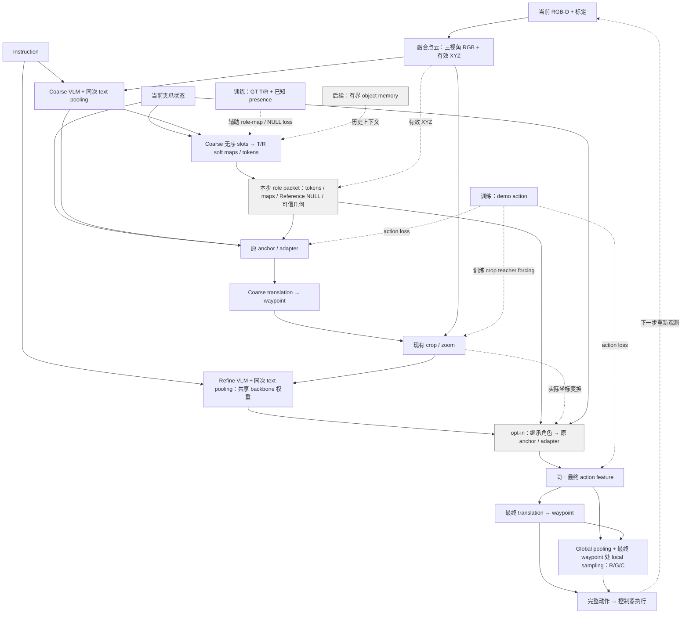
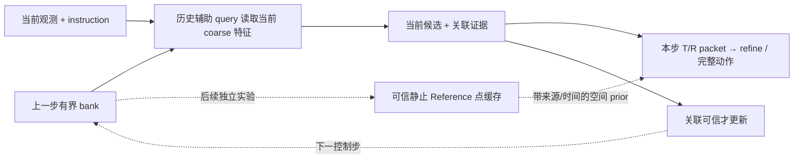

# Object-centric Policy：整体设计与实现契约

[文档索引](../README.md) · [论文 survey](../research/object-centric-policy-memory.md) · [实验与命令](../guides/object-conditioning.md#gt-联合对照) · [代码索引](../reference/code-map.md)

> 更新：2026-09-29。设计与接口统一在本文维护。实现状态见下表；memory 与真机部署为后续方案，不代表当前代码能力。

阅读导航：[架构](#整体架构) → [当前实现与数据](#当前实现与数据契约) → [本轮调整](#本轮设计未实现) → [实验](#实验顺序)；后续查[Memory](#object-centric-memory后续未实现)、[真机部署](#真实机器人部署后续规划)、[投影扩展](#其他可选扩展未实现)。

## 整体架构

保留 BridgeVLA 的 coarse/refine、每级三视角、共享 VLM 权重和 translation heatmap。
推荐调整是：**coarse 选本步对象，refine 继承角色并细定位，完整动作使用同一最终特征。**


```mermaid
flowchart TB
    O["当前 RGB-D + 标定"] --> P["融合点云：三视角 RGB + 有效 XYZ"]
    I["Instruction"] --> VC
    I --> VF
    ST["当前夹爪状态"] --> Q
    ST --> AC
    P --> VC["Coarse VLM + 同次 text pooling"]
    VC --> Q["Coarse 无序 slots → T/R soft maps / tokens"]
    Q --> K["本步 role packet：tokens / maps / Reference NULL / 可信几何"]
    P -.有效 XYZ.-> K
    VC --> AC["原 anchor / adapter"]
    K --> AC
    AC --> WC["Coarse translation → waypoint"]
    WC --> C["现有 crop / zoom"]
    P --> C
    C --> VF["Refine VLM + 同次 text pooling：共享 backbone 权重"]
    VF --> AR["opt-in：继承角色 → 原 anchor / adapter"]
    K --> AR
    C -.实际坐标变换.-> AR
    ST --> AR
    AR --> F["同一最终 action feature"]
    F --> WT["最终 translation → waypoint"]
    F --> RGC["Global pooling + 最终 waypoint 处 local sampling：R/G/C"]
    WT --> RGC
    WT --> A["完整动作 → 控制器执行"]
    RGC --> A
    A -.下一步重新观测.-> O
    GT["训练：GT T/R + 已知 presence"] -.辅助 role-map / NULL loss.-> Q
    D["训练：demo action"] -.action loss.-> AC
    D -.action loss.-> F
    D -.训练 crop teacher forcing.-> C
    M["后续：有界 object memory"] -.历史上下文.-> Q

    classDef optional fill:#f0f0f0,stroke:#888;
    class K,AR,M optional;
```

每步仍是现有两次 VLM 前向（`3 × 2` 视角），text context 来自同次 hidden states。
预测模式的 GT 只进入辅助监督；推理 crop 来自 coarse waypoint。refine 首版继承 tokens、NULL 与变换后的可信几何，不要求新增局部 mask decoder。

本步继承不是跨步锁定：下一控制步重新选择。完整场景特征始终进入动作分支，T/R maps 不把 waypoint 限制在物体表面。
角色与坐标接口见下文[跨尺度继承](#跨尺度角色继承计划未实现)，函数见[代码索引](../reference/code-map.md)。

## 实现状态

| 状态 | 内容 |
| --- | --- |
| 已实现，默认关闭 | `shared_action_features`：translation 与 R/G/C 使用同一最终特征；`use_context`：同次 VLM 的 instruction 条件 |
| 已实现，预测路线 | 无序 slots → role head/soft mixture → T/R maps、tokens、Reference NULL；soft geometry；GT teacher 隔离 |
| 已实现，数据兼容 | 从旧 replay 的角色 `kind` 只读派生 presence/known；NULL loss 监督实际 posterior |
| 已实现，三个独立开关 | 混合 role-map 监督、coarse→refine 角色继承、几何 unknown 时保留可信 token；默认关闭 |
| 后续结构对照 | 两个固定语义 queries，尚未实现 |
| 后续可选 | temporal memory、可信历史点、局部 mask 读出、渲染改进；各自单独验收 |

当前普通 internal-slot 配置为 **2 个无序 slots**，joint 为 **6 个**；都不是两个固定语义 queries。
旧配置两级独立预测；新 `internal_slots_cross_scale` 配置显式启用三个开关，不自动改变旧配置。
旧配置保留旧动作路由；冻结范围见[训练设置](#训练设置)。当前 YAML 不会自动切换到图中的计划架构。

## 当前实现与数据契约

### 核心定义

| 概念 | 定义与边界 |
| --- | --- |
| Target / Reference | 当前操作的任务角色，可随动作与观测切换；固定角色 query 不代表固定物体 ID |
| Reference NULL | 语义上没有 Reference；物体存在但几何不可用是 unknown，不是 NULL |
| 可信几何 | 当前可见点的中心/spread；spread 不是完整物体尺寸 |
| `current_state[B,3]` | gripper open + 两维 finger state；不是 phase GT，也不含当前 EE pose |
| 操作上下文 `z` | 原 anchor query 学到的动作条件，不要求显式 relation/phase 标签 |
| Action anchor | heatmap 解码的 waypoint，可在 T、R、接触点或自由空间，不能反向定义角色 GT |

### Feature 路由

`OracleRelationAnchorFeatureAdapter.forward_with_anchor()` 返回
`translation_features, shared_features, anchor`：

| 路由 | Translation | R/G/C local | R/G/C global |
| --- | --- | --- | --- |
| 默认旧模式 | anchor-enhanced feature | 旧 shared feature | 原始 feature |
| 新共享模式 | anchor-enhanced feature | 同一最终 feature | 从同一最终 feature 重新池化 |
| base diagnostic | 原始特征的独立对照 | 原始 feature | 原始 feature |

推理先解码最终 translation，再在最终 waypoint 处采样 R/G/C；不恢复 post-hoc fusion。
仅切换 shared flag 的 GT 对照不改变角色机制；internal-slot 新共享模式才启用 soft role conditioning。

### Semantic roles 与 action anchor

T/R 是任务角色，heatmap waypoint 是动作锚点，可在物体、接触点或自由空间，不能反向定义角色 GT。
纯诊断报告 `base` 与实际执行的 `final` waypoint，不覆盖 policy 输入；`phase=-1` 干扰对象不能成为有效语义 Target。

可选两次前向模式使 simulator residual 跟随 `trans_base` 的 Target，并使用 gripper 周期锁定；这是预测条件，不是 Oracle GT。
字段与命令见[测试期归因](../guides/object-conditioning.md#测试期-heatmap-action-anchor-归因)。

### Instruction 与当前状态

`pool_instruction_context()` 池化同次 VLM 的非图像有效 tokens，排除特殊 tokens，兼容左右 padding。
`current_state[B,3]` 是 gripper open + 两维 finger state。
旧 `oracle_relation_state` / `relation_state` 名称兼容，但不能与新名称同时传入。

目标 `gripper_pose` 仅用于动作监督，不能替代当前 proprioception；当前接口没有 EE pose 或时间进度。

### Soft geometry

`soft_role_geometry()` 使用本 stage 有效 rendered XYZ 和 role maps，计算可微加权中心与标准差 spread：

- 屏蔽背景、非有限 XYZ 与不可用角色；hard top-k 点用于兼容/可视化与 opt-in 继承的局部提示，不是唯一条件路径。
- spread 描述可见支持，不是完整物体 bbox/size。
- coarse/refine 使用各自坐标系，不混用几何。
- 新模式下 Reference 不可靠不连带关闭有效 Target；geometry unknown 与语义 NULL 分开。

没有历史或新观测，该分支不能可靠定位全遮挡物体。
默认 anchor 仍用 geometry valid 屏蔽 token。开启 `preserve_role_tokens` 后使用独立的角色可靠性，
局部支持消失只关闭空间条件；不构成历史 memory，也不伪造遮挡期间的位姿。

### Teacher 与数据

Schema 入口为 `dataset.py::create_replay()`，loader 为 `utils/get_dataset.py::get_dataset()`；
完整路径见[代码索引](../reference/code-map.md#semantic-gt-数据流)。

| 字段 | 含义 | 监督规则 |
| --- | --- | --- |
| `oracle_target_present` / `oracle_reference_present` | 语义角色是否定义 | 从已有 `kind` 只读派生：object/site 存在，Reference none 为 absence |
| `oracle_role_present_known[2]` | presence 标签是否可靠 | 无审计或终止占位时为 false |
| `oracle_object_valid` | 当前几何监督可用 | 不等价于 presence；不可用不监督为 NULL |
| visibility | 真正可见性 | 当前不提供独立标签/head |

`_derive_role_presence()` 不改写 replay；Target none 的终止占位不参与角色监督。
预测模式的 GT maps/valid/points 在 `mvt_single.MVT` policy 入口隔离，teacher maps 仅作辅助 loss；
presence 只在 `RVTAgent._object_slot_auxiliary_losses()` 使用。NULL loss 监督推理实际 posterior。

当前 replay 只标已选 T/R，不是全实例发现/跟踪数据。可见支持可训练 objectness 正例，但不能称其为语义存在概率。
GT site 体积、点投影 prior 与当前可见实例轮廓不同，role-map 指标必须按监督定义解释。
当前 teacher 经点投影、Gaussian blur 和峰值归一化生成，未与虚拟视角的深度遮挡逐点核验；它监督角色空间 prior，不能当作严格实例分割 GT。
有效 replay、点云与 manifest 无需重写。

<a id="本轮设计未实现"></a>

## 角色预测与跨尺度调整

三个开关位于 `object_conditioning`，均默认 `False`，只用于 internal slots：

| 开关 | 实现行为 |
| --- | --- |
| `supervise_mixed_role_maps` | 概率空间 BCE/Dice 监督实际混合 T/R maps；保留原 slot loss |
| `inherit_coarse_roles` | refine 跳过 slot selector，继承 tokens/NULL/变换后的几何；预测点只作局部重投影提示 |
| `preserve_role_tokens` | token 与局部 geometry valid 解耦；可信 Target 还可启用全局 anchor 条件 |

继承要求 coarse/refine、shared action features、anchor 和 XYZ correlation channels；token 保留要求 shared + anchor。
继承不依赖 token 保留开关，但只开继承仍可能屏蔽 crop 外 token，需单独消融。
实现与训练命令见[操作指南](../guides/object-conditioning.md#角色一致性开关)。

### 最小角色预测（计划，未实现）

**当前差距。** `InternalObjectSlotPredictor.forward()` 用无序 queries 提取 masks，再经 objectness/role 分数混合成 T/R。
`hungarian_role_slot_losses()` 按总代价做一对一匹配，没有 IoU/代价拒配阈值。
BCE/Dice、role CE 与 objectness 正例原本只监督匹配 slots，未匹配 slots 仍没有对象负例。

**已实现监督对齐。** 开启 `supervise_mixed_role_maps`，使用同 stage GT maps、有效性和已知 presence；
`role_supervision_mask()` 统一 replay 几何有效性、当前 stage 支持、已知 presence 与有限非空 teacher views。
该 mask 同时用于 mixed-map loss 和原匹配 loss 的代价/梯度：空 view 不监督为空图；整角色无支持时不匹配 slot、不产生 objectness 正例。absence 仍只监督 NULL posterior。
关闭继承时两级监督；开启继承时仅 coarse 是学习式角色预测，refine 的离散提示不重复计算角色 loss。

**再验证两-query 简化。** 复用 feature/mask projection、Transformer decoder 与原 anchor：

```text
q_T / q_R + instruction + 当前状态
  → cross-attention 到 coarse 三视角特征
  → h_T / h_R、M_T / M_R、p(NULL_R)
  → 本步 packet → refine / anchor → 完整动作
```

固定的是角色，不是物体 ID。移除无序匹配、role 分类与 slot objectness，仍保留完整场景特征；
两个 queries 也可能混淆同类实例，不能称为通用 object discovery。

损失为 `L_action + λ_map(L_T + L_R) + λ_null L_NULL`：

- maps 使用 BCE/Dice 和有效 GT role maps；NULL 只用可靠 absence 标签。
- Reference token 按非 NULL 条件归一化，NULL mass 在 anchor 只应用一次。
- 没有可靠 Target absence 标签时不新增 Target NULL head；终止占位不参与角色 loss。
- 复用 text pooling、soft geometry 与共享动作路由，保留 action 到 queries/maps/anchor 的梯度。

新结构另设 opt-in 配置；当前 YAML 仍是无序 slots，架构变化用 init 而非 optimizer resume。
[SlotVLA](https://arxiv.org/html/2511.06754v1#S4)依赖更丰富的实例/时序监督；
[FocusPool](https://arxiv.org/html/2609.08408v1)支持状态条件 attention，
[SlotFlow](https://arxiv.org/abs/2609.24155)保留语义/空间/全局条件。
这些是机制参考，不证明两-query 优于 K slots；更多依据见[调研](../research/object-centric-policy-memory.md)。

<a id="跨尺度角色继承计划未实现"></a>

### 跨尺度角色继承（opt-in 已实现）

默认两级独立调用 slot predictor；开启继承后 **coarse 本步绑定一次角色，refine 只读；下一控制步重新选择**。
不依赖 temporal memory，不增加 VLM 前向、pair search 或 phase head。

#### 本步接口与条件路径

| `role_packet` 字段 | 用途 |
| --- | --- |
| `role_tokens[B,2,D]` | T/R 与任务上下文；不是纯身份特征 |
| `null_probability[B]` | 继承 coarse Reference posterior，不在 refine 重算 |
| `centers/spreads`、`geometry_valid` | 可见几何，经实际 crop 变换提供关系上下文 |
| 可选 `role_weights[B,2,K]` / `role_confidence[B,2]` | slots 对照与诊断；不当作校准正确率 |
| 可选 `points`、`frame` | 本步可靠点与坐标系；仅作重投影提示 |

packet 不含 GT 点、presence 或目标动作；Reference NULL 只应用一次。
anchor 分开读取全局角色条件与局部空间支持；同时开启 token 保留时，**局部 valid 不清空可信全局 token**。
所有动作仍使用同一最终特征，waypoint 不被角色 mask 强制裁到物体表面。

首版继承 tokens/NULL/可信几何，并重投影 coarse 预测点提示。逐点/视角要求当前 rendered XYZ 对应，
容差为 unit-cube 三个像素 pitch；背景、越界或被其他表面覆盖不作为本角色支持。量化容差不保证身份正确。
继承开启时 XYZ 使用干净的实际 crop 坐标，不受 `norm_corr` 或 RGB augmentation 污染；VLM RGB 路径不变。
若细定位仍是瓶颈，再试 `Q_r = W_r h_r + b_r` 的局部 mask readout：
复用 projection，不增加独立 role/objectness/NULL selector，也不覆盖全局 token。
VLM patch-grid 分辨率不会因新增 queries 自动提高。

#### 局部支持与坐标

| Reference 状态 | 全局条件 | 局部条件 |
| --- | --- | --- |
| 存在且局部可见 | 继承 coarse 角色 | 对同一条件对象细定位 |
| crop 外，coarse 几何可靠 | 保留 token 与关系 | 无支持视角为空，不改选/伪造 NULL |
| 被投影覆盖或难辨认 | 保留角色 | 降低局部注入，不用其他物体 XYZ 替代 |
| coarse 角色/几何不可靠 | 分别降低对应条件权重 | 可关闭对象空间注入，下一步重估 |
| 语义 NULL | 继承 NULL posterior | 不生成 Reference 空间条件 |

支持按 role/view 区分：单视角为空不代表全部为空。
非空 XYZ、高 confidence 或 soft mask 非零尾部不证明身份；已知点越界不证明完整物体不存在。
只有可核实的关联/几何冲突才降低条件强度；缺少局部支持本身不是身份冲突。
“不重选”不等于无条件信任 coarse，原网络旁路也不是安全 fallback。

沿用实际 crop：`x₂ = s(x₁-c)`。中心平移缩放、spread 按绝对尺度缩放、相对位移只缩放。
训练扰动 crop 与推理预测 crop 使用各自真实 `c`，反变换用同一 `rev_trans`。
越界中心保留为全局上下文，不夹到边界；只 rasterize 有效且落在对应投影内的点。
点提示不能绕过当前遮挡证据，空 mask 不提取背景/其他对象替代中心。

#### 训练、代码落点与验收

- 独立预测阶段监督同一 demo 角色；继承 refine 只承担 action loss，静态重投影提示不另算角色 loss。
- geometry unknown、映射未知或预测点越界不伪造全零负例，更不监督为 NULL。
- 不新增独立 identity loss，不对不同视域的两级二维 maps 强做逐像素一致性。
- tokens、soft posterior 与可微中心接受 action 梯度；离散 top-k/rasterization 仅作提示。
- 同时测试 GT crop 和预测/偏移 crop、coarse 正确与误选；不能只报告正确选择子集。
- 开关不增加 learned 参数；切换路由用 init，不沿用 optimizer resume。旧 replay 不重写；新旧路由初始数值不保证一致。

| 位置 | 当前落点 |
| --- | --- |
| `InternalObjectSlotPredictor.forward()` | 输出 geometry valid 与独立 role-token valid |
| `RVTAgent._object_slot_auxiliary_losses()` | opt-in 混合 map loss，跳过继承阶段的辅助重复 loss |
| `cross_scale_roles.inherit_coarse_roles()` | 实际 crop 变换、逐视角 XYZ 支持与预测提示重投影 |
| `mvt.MVT.forward()` / `mvt_single.MVT.forward()` | 传预测 packet，绕过 refine selector；teacher 单独隔离 |
| `OracleRelationAnchorFeatureAdapter.forward_with_anchor()` | opt-in token 保留，全局条件与局部几何分开 |

按主设计 A→A+M→B→C 对照，不同时改变渲染、分辨率或 memory。
测试覆盖 crop 外/部分支持/NULL/unknown/相似物体/误选/跨步切换/teacher-forcing gap，
以及全局 token 保留、坐标反变换、action 梯度、teacher 隔离、旧配置回归与 checkpoint 初始化。
报告 waypoint、预测 waypoint 下 R/G/C、闭环、时延和显存；前向次数不变不等于零开销。

继承仅约束条件来源，不保证局部 mask 或实际操作对象正确，也不证明时序身份、恢复或因果能力。
coarse/refine 分工已有[BridgeVLA++](https://arxiv.org/html/2608.05042#S4)先例，收益仍须本项目验证。

## 实验顺序

先验证 GT 收益，再推进预测对象；具体命令与统计工具放在[联合实验](../guides/object-conditioning.md#gt-联合对照)。

| 顺序 | 只改变什么 | 要回答的问题 |
| --- | --- | --- |
| GT 对照 | 旧 GT anchor → 共享动作特征 → 再加 instruction；另设同预算 BridgeVLA baseline | 对象条件是否改善完整动作与闭环？ |
| A | 当前独立 slots | 预测基线 |
| A+M | 只加最终混合 role-map 监督 | 监督与条件错位是否是瓶颈？ |
| B | A+M 加本步跨尺度继承 | crop 外 Reference 是否仍误切换？ |
| B+T | B 再启用 token 保留 | 不重选后，crop 外角色条件是否仍被屏蔽？ |
| C | B 的 coarse 改为两个语义 queries | 简化选择结构是否有效？ |

GT 准入采用同数据、初始化、解冻范围、训练步数和评估 episodes，至少 3 个训练 seeds；
配对闭环成功率差的 95% CI 下界为正才进入预测联合实验。
同时报告 decoded waypoint、预测 waypoint 下 R/G/C、失败类型、时延与显存；辅助 loss 下降不能替代闭环收益。

保持 RGB 渲染、mask 分辨率和 memory 不变来隔离 A→C 的作用；继承使用 clean XYZ，这是新增坐标契约的一部分。
GT waypoint/crop teacher forcing 与推理预测 crop 的差距另行诊断；当前 `16×16` role masks 不会因 query 简化自动变精细。

### 训练设置

| 配置 | 冻结 | 训练 |
| --- | --- | --- |
| semantic GT joint | vision tower、projector、Gemma 前 6 层 | 其余 Gemma、action decoder、O2 模块 |
| internal slots joint | vision tower、Gemma 前 18 层 | projector、其余 Gemma、action decoder、object 模块 |

沿用已有 embedding/lm_head 冻结；分组 LR 为非 Gemma `4e-5`、Gemma `1e-5`。
使用 `--init_checkpoint` 初始化已有参数，新增 residual 输出端零初始化，允许新增参数缺失。
架构/路由变化不能沿用旧 optimizer resume；同架构续训才用 resume，checkpoint 记录 conditioning 开关。

命令和统计工具见[联合实验](../guides/object-conditioning.md#gt-联合对照)。
base diagnostic loss 不等于独立训练 baseline；CI 工具不丢弃失败、不接受不匹配 episodes，也不替代训练预算核对。
工具只核对已有 journal 集合，不验证预定评估是否完整；先核对 summary 完成数与 episode 范围。
运行入口、resume 缓存与其他 benchmark 的审查发现见[代码索引](../reference/code-map.md#项目审查2026-09-29)。

对象交换、Reference→NULL、指令替换仅检验条件依赖，不能证明 causal reasoning。
成功 demos 不覆盖失败状态时，不承诺坍塌恢复。

## Object-centric memory（后续，未实现）

当前没有跨控制步 temporal memory；predictor 的 `memory` 只是当前 attention K/V。
先完成单帧与跨尺度验收，现有 replay loader 尚未支持本节的序列训练。
本步角色继承不跨步锁定；两个 role tokens 也不是持久实例 bank。

### 什么时候需要 memory

目标是保留**哪个物体、最近在哪里、发生过什么交互**的证据。
只有当前观测不足以决定动作时，历史才是必要条件；
单帧 mask 不准、分辨率低或 refine crop 丢失 Reference，先按[主线](#实验顺序)处理，不能直接归因于缺少 memory。

[MemoryBench](https://arxiv.org/html/2501.18564#S5.SS4)提供历史依赖任务，
[BridgeVLA++](https://arxiv.org/html/2608.05042#S4)已有 coarse temporal / refine spatial memory。
本方案的待验证点不是“加记忆”，而是**按对象保留交互证据，并分开使用身份与可能过期的几何**。

先比较最近可靠观测和同预算 scene/context 历史，再试 object bank。
token 改善关联不证明旧点可信，定位改善也不证明身份正确；不承诺因果推理、可解释 phase 或自动恢复。
论文的监督、指标与限制统一见[调研](../research/object-centric-policy-memory.md)：
SemanticSlots/RandSF.Q 不保证同类实例关联，SlotVLA/HistRISE 的身份前提不能由当前 T/R replay 替代，
SlotSSM/Embodied-SlotSSM 的时序算子也不解决身份问题。首版不加 SSM、视频生成或进展 head。

### 动态角色：目标、意图与实际效果

| 概念 | 保留什么 | 不能混同什么 |
| --- | --- | --- |
| 任务约束 `G` | instruction 要求 | 不一定指定唯一执行顺序/物体 ID |
| 当前 `q_t(T,R)` | 本步角色 posterior，R 可 NULL | 角色编号不是持久实例 ID |
| 变化证据 `e_t(i)` | 动作后可观测变化；不可观测为 unknown | 变化不是已证明的动作因果归属 |
| 关系证据 `r_t(T,R)` | 当前物体对关系是否成立 | 不是单调 phase index，移动/坍塌可使其失效 |

这些是概念区分，不要求四个输出 head。首版仍用 tokens、instruction 与当前状态学习 `z`；
没有可信逐对标签时，变化/关系只作诊断，不硬门控动作。

例如 stack_blocks：当前[demo 配置](../../finetune/RLBench/configs/rlbench_o2_semantic_roles.yaml)依次选 Target，
Reference 先为底座、再为前一 Target。
这是演示顺序，[任务成功条件](https://github.com/stepjam/RLBench/blob/master/rlbench/tasks/stack_blocks.py)不要求该 ID 顺序。
局部 Reference 可以是当前塔顶，任务级底座不必永远是局部 R；当前固定 pair loss 不支持所有合法替代顺序的集合监督。

若后续增加放置标志，应分为“曾观察到成立”与“当前仍成立”，绑定 `(T,R)` 而非只绑定 T。
换 Reference 不继承旧标志；松爪不代表放置成功，塔塌可使关系失效。标志本身不会产生恢复能力。

### 最小 memory：先 token，后空间缓存


```mermaid
flowchart LR
    M["上一步有界 bank"] --> Q["历史辅助 query 读取当前 coarse 特征"]
    O["当前观测 + instruction"] --> Q
    Q --> S["当前候选 + 关联证据"]
    S --> R["本步 T/R packet → refine / 完整动作"]
    S --> W["关联可信才更新"]
    W -.下一控制步.-> M
    M -.后续独立实验.-> P["可信静止 Reference 点缓存"]
    P -.带来源/时间的空间 prior.-> R
```

初版 entry 为 `m_i=(h_i,c_i,geometry_valid,last_seen,association_quality)`：

| 字段 | 约束 |
| --- | --- |
| `h_i` | 交互 token，含视觉/任务上下文，不是纯身份特征 |
| `c_i, geometry_valid` | 最近可见位置及有效性；不是遮挡期间的确认位姿 |
| `last_seen` | 最近真实证据时间；反复自写不刷新它 |
| `association_quality` | 关联诊断；不是存在概率、安全置信度或协方差 |

bank 容量独立于两个 role queries，按可信关联数据选择。
空间点、概率不确定度、presence/visibility 与逐对进展均不是首版必需状态，需对应标签后另验。

#### 读写与身份

- **读：** `q_i + W h_{t-1,i}` 查询当前 coarse 特征；无历史 query 仍可读取新候选。
- **写：** 只对可核实关联更新一次，refine 只读。弱观测可保留 token，不能写入虚假位置或把旧状态伪装成新证据。
- **切换：** 同一对象 T→R 使用同一 entry；T 从 A→C 不把 A 历史累积到 C。slot index 不是稳定 ID；两条 T/R 历史只能算便宜基线。
- **容量：** 不静默覆盖当前关联对象；使用经验证的淘汰规则并记录 overflow，容量不足单独报告。
- **重置：** episode、任务/instruction 切换清空或明确重绑定，不携带其他任务完成标志。

首轮只研究曾有可信角色/身份支持的对象。
非 T/R 候选仍可在当前步选择，但无关联证据不能称为长期 track；全候选 bank 需实例级序列监督。
历史事件地点与当前对象位置分开，不能靠冻结坐标保持身份。

先用最近可靠观测，再试学习式写门控；门控需 action/可信关联监督与独立校准。
新增 memory residual 只将输出端零初始化，不把门控与输出同时置零。

#### 空间缓存与过期几何（token 收益成立后）

只缓存少量**实际看过的表面点**，对象关联、坐标、来源和时间戳一致；不存完整场景或无界点并集。

| 状态 | 空间使用规则 |
| --- | --- |
| Reference 静止假设、关联、新鲜度均已验证 | 可在当前坐标下重投影历史点 |
| 有移动/接触变化、外参变化或位姿不可信 | 关闭旧几何注入；token 可独立保留 |
| 移动/夹持 Target | 首版只用当前重观测位置，不外推全遮挡位姿 |
| 从未观测的表面 | 不补全为 GT |

“没有看到移动”不是静止证明；用扰动实验测量旧点误导率。
历史点不是当前传感器 XYZ，须保留历史来源/age；按实际 crop 变换，越界不夹到边缘，不做 post-hoc heatmap fusion。
同一步的跨尺度点提示仍遵守当前局部支持，不能与跨时间缓存混为一谈。

### 数据门槛与验证顺序

**数据先行。** 审计 episode/frame 顺序、跨帧关联和坐标；随机 replay 单样本不是序列。
Oracle ID、GT roles/phase 和 simulator success 仅用于监督/评估；实际 proprio 与目标动作分开，命令不等于执行成功。
可行集合、all-instance ID、visibility、进展/效果需要独立标签，不从缺几何或释放边界伪造；成功 demos 不等于恢复轨迹。

**因果序列训练。** 从单帧 checkpoint 开始，只读过去状态/已发命令，新观测到来后写一次。
chunk 边界 reset 或过去 burn-in，训练/推理同容量与更新规则；短截断训练另测长遮挡。

**同预算消融。** 无 memory → 最近可靠观测 → scene/keyframes → object-token 读 → 选择性写 → 静止 Reference 点缓存。
固定跨尺度路线、解冻范围和预算，报告额外编码成本；简化 scene cache 不能称为完整 BridgeVLA++ 复现。

**验收。** 使用当前观测近似但历史不同的样本，检查相关/无关历史屏蔽或打乱。
报告 mask、identity switch/重现关联、错误写入、overflow、遮挡长度、旧点误差、waypoint、R/G/C、时延/显存及三-seed 配对闭环差/95% CI。
历史干预只是条件依赖诊断；对应指标无收益就停止加模块，GT memory 单报 Oracle 上限。

stack_blocks 单测正常切换、合法替代顺序、抓错、未放稳与坍塌；无失败/恢复数据不承诺恢复。
计划代码落点为 predictor 的历史 query、`mvt.MVT.forward()` 的 coarse 写/refine 读、
`RVTAgent.act()/reset()` 的 episode 状态；均未实现。

## 真实机器人部署（后续规划）

尚未真机验收；跨尺度继承已有 opt-in 实现，memory 与再观测控制器仍未实现，规划器检查不是安全认证。
真实动作前向不读 simulator ID、GT T/R、GT phase 或 success conditions；Oracle 仅作监督/评估。
RGB-D、标定、当前 proprio 与时间戳必须同步，更新观测后不执行旧 packet；目标 `gripper_pose` 不当作实际 EE pose。
训练/部署渲染一致，RGB 填色不增加真实 XYZ；simulator grasp 确认也不能替代无 GT 身份识别。

### 证据不足时怎么办

| 情况 | 处理边界 |
| --- | --- |
| Reference 在 refine crop 外 | 保留 coarse 全局条件，关闭无支持的局部注入；不重选或伪造 NULL |
| 可核实的局部关联/几何冲突 | 降低对象条件强度，新观测后重估；不是永久锁定 |
| 短时缺观测 | 后续可保留可靠 token，不能确认旧坐标 |
| 可用再观测动作 | 必须先经控制器验证；相机移动后同步更新外参 |
| 关键位置不满足执行要求、无可验证动作 | 拒绝并记录失败 |

对同一旧点云换虚拟视角不是新观测。
等待、旁路对象模块或执行原 BridgeVLA 都不是自动安全 fallback。
历史空间缓存只有在静止假设、身份和新鲜度可信时启用；移动/坐标变化/关联不可信就关闭，见上文 memory 契约。

### 真机执行前置条件

从**第一次真机试验前**启用独立安全 gate，不依赖 learned object/action 模块。
场景与机器人状态需持续同步，可参考 [MoveIt Planning Scene Monitor](https://moveit.picknik.ai/main/doc/concepts/planning_scene_monitor.html)；
以下是工程验收要求，不是该工具的安全保证。

1. 拒绝过期或坐标不一致的 observation/action。
2. 检查 workspace、IK/关节范围、完整轨迹碰撞、速度/力与平台控制限制，而非只检查终点。
3. 对象相关操作具备所需角色/位置证据；高 confidence 不替代几何。pregrasp/lift/retreat 可以在自由空间。
4. `ignore_collisions` 是训练动作标签，不能关闭真实碰撞检查；急停、接管、异常中止由独立平台负责。

拒绝/再观测阈值用独立数据校准，不先宣称不确定度可靠。
拒绝试验仍计入总尝试数；任务成功率与接受动作后的条件成功率分开报告。

### 数据与实施顺序

已有 GT/预测对照和冻结范围以[联合实验](../guides/object-conditioning.md#gt-联合对照)为准；不是 adapter-only 部署方案。
有效旧 replay 不重写；GT presence 不进入预测动作前向。
真实少量 T/R 标注用于 grounding，可信关联才监督跨帧一致性；遮挡无标签不当作背景/不存在。

| 优先级 | 工作 | 验收 |
| --- | --- | --- |
| R0，前置 | RGB-D/标定/proprio/时间戳 + 独立执行 gate | 坐标一致，过期/不可达/违规动作被拒绝 |
| R1 | 无 Oracle 的单帧完整动作 | 去掉 GT 字段仍可推理；通过 GT 对照和预测闭环评估 |
| R2 | 本步 coarse 绑定、refine 继承 | crop 外不误切 Reference；waypoint、R/G/C 与闭环改善 |
| R3，可选 | token memory → 静止 Reference 点缓存 | 关联改善，不被错误历史/旧点误导 |
| R4 | sim-to-real 适配与多场景实测 | 同一 gate 下评估，不靠 Oracle 或放宽拒绝条件 |

memory 不是真机基本执行的前提。
深度/外参扰动、视角缺失、遮挡和背景变化独立测试；有历史时采用一致空间增强。
checkpoint/阈值只在验证集选择，测试集作最终评估；滑落、坍塌与恢复需另外收集数据。

### 真机评估边界

报告所有尝试为分母的无 GT 成功率、T/R grounding/NULL、局部误匹配、预测 waypoint 下 R/G/C、
拒绝/再观测率、时延和显存。有可信标签才报告身份切换、visibility 与位置误差校准。

分组区分 crop 外、虚拟投影覆盖、真实遮挡、深度/外参扰动；移动旧 Reference 测过期几何误导。
恢复率需先定义失败事件与对应数据。真机使用预先定义的任务成功标准；
RLBench 仿真仍按标准任务 success condition 统计，不在真实策略前向读取它。

forward 成功、mask 好看或论文中的成功率，都不是本系统已经可部署的证明。

## 其他可选扩展（未实现）

### 投影稀疏与角色图分辨率（独立实验）

当前 masks 与 teacher maps 在每视角 `16×16` 特征上读出/监督；上采样不增加边界证据。
分别检查两级区域覆盖、map 质量、中心偏差和 waypoint，不只统计黑色像素比例。

renderer 已有 splatting；扩大半径会复制 RGB/XYZ、改变支持或粘连物体。
轻量候选是仅修补小范围、邻域深度一致的 RGB 空洞，保留独立的真实 XYZ 有效性；
填色不成为几何 GT，同深度邻近物体仍可能混淆。
RGB 修补、高分辨率读出和 query 简化分别消融，训练/测试渲染一致。

补洞、虚拟视角和 object crop 不恢复未观测表面。
额外 mask/depth channels 不会自动进入只读 RGB 的 VLM，须另定义 feature 接口。

### Object-layered Orthographic Refine

只针对**已有点云在虚拟投影中被其他点覆盖**：
按可信角色支持投影局部层，同时保留全局障碍/场景特征，做 feature-level 条件化；
不增加每物体 VLM，不做输出 heatmap fusion。

| 问题 | 能做什么 |
| --- | --- |
| 已观测点被虚拟投影覆盖 | 分层可减少覆盖，需正确归属 |
| 小物体/离散投影空洞 | 独立测试渲染与读出分辨率 |
| RGB-D 从未观测的表面 | 分层不能恢复；需历史或新观测 |

object-centered scale 设上下界并依赖可信几何；spread 不能当完整 extent。NULL 不渲染，unknown 不强制裁剪。
显式进展、pair search 与风险读出仅作有数据支持的后续实验，不进入本轮动作主线。
