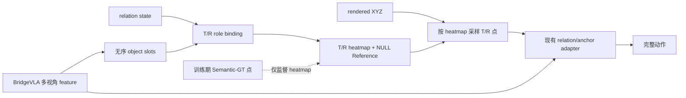

# 网络内部 Target/Reference slots

[文档索引](../README.md) · [推荐 Role-Memory 设计](../design/role-relation-prior.md) · [代码索引](../reference/code-map.md)

该实验在 BridgeVLA 内部从多视角 feature 预测无序 object slots，再按当前 relation state
隐式绑定 Target/Reference。Oracle 点仅在训练时生成监督 heatmap，不作为 policy 输入。



## 实现边界

- 当前是 role-centric、single-frame 实验，不是完整场景实体模型。
- 它输出当前 phase 的 T/R heatmap 与 XYZ，不保留未选中实体或跨帧轨迹。
- `MVT.forward()` 在调用 `MVTSingle` 前移除 Oracle prior、valid 和 geometry；adapter 只接收
  slot predictor 的结果。
- 三个正交虚拟视角来自同一份可见点云，不能单独解决真实遮挡。
- 该配置证明的是“policy 不接收 Oracle object”，不代表已完成真实 RGB-D、相机漂移、
  短时 memory 和控制安全适配；部署路线见[真实机器人设计](../design/real-world-deployment.md)。

## 配置与函数

配置文件：`finetune/RLBench/configs/rlbench_o2_internal_slots.yaml`。

| 配置 | 作用 |
| --- | --- |
| `object_slots.num_slots` | 无序候选数，默认 6 |
| `object_slots.slot_dim` | slot decoder 宽度，默认 128 |
| `object_slots.point_samples` | 每个预测角色采样的 XYZ 数，默认 128 |
| `rvt.object_prediction_confidence_threshold` | 低于阈值时关闭 object residual |
| `rvt.object_slot_mask_loss_weight` | T/R heatmap 监督权重 |
| `rvt.object_slot_null_loss_weight` | presence / NULL 监督权重 |
| `rvt.object_slot_diversity_loss_weight` | slot anti-collapse 权重 |

| 阶段 | 关键函数 |
| --- | --- |
| slots、role mixing 与 NULL | `InternalObjectSlotPredictor.forward()` |
| heatmap → XYZ | `InternalObjectSlotPredictor._extract_points()` |
| GT heatmap 与 auxiliary loss | `RVTAgent._object_slot_auxiliary_losses()` |
| policy-side 隔离 | `MVT.forward()` |
| relation/anchor 注入 | `OracleRelationGatedFeatureAdapter` / `OracleRelationAnchorFeatureAdapter` |

## 训练

```bash
cd finetune/RLBench
bash train.sh \
    --exp_cfg_path configs/rlbench_o2_internal_slots.yaml \
    --train_replay_storage_dir /path/to/semantic_gt_buffer \
    --init_checkpoint /path/to/model_last.pth \
    --train_object_adapter_only
```

该开关冻结原 BridgeVLA，并训练 `object_slot_predictor*` 与
`oracle_prior_feature_adapter*`。它只用于首轮可辨识消融，不是最终训练方式。确认 slots、
T/R binding 和梯度路径有效后，应去掉该开关，并分阶段解冻完整动作 decoder、multimodal
projector 与上层 backbone；联合训练仍必须保证 Oracle 点只生成监督，不进入 policy adapter。

<a id=dataset-fit></a>

## Semantic-GT buffer 适配性

[Semantic-GT 重写命令](../guides/semantic-gt.md#2-只重写-oracle-字段生成-semantic-gt-buffer)
生成的 slot 0/1 点云适合 T/R heatmap 监督；`num_points=512` 与当前配置一致。它只包含
当前已选 T/R，因此不能监督通用 object discovery 或所有六个候选 slot 的实体身份。

更重要的是，当前 batch 中的 `oracle_object_valid` 表示几何是否可用：

```text
valid = false 可能是：角色不存在，或角色存在但当前四相机均不可见
```

而当前 `_object_slot_auxiliary_losses()` 直接用 `~valid[:, 1]` 监督 NULL Reference，二者会
被混淆。进行现有 buffer 的 heatmap-only 消融时，建议先设置：

```yaml
rvt:
  object_slot_null_loss_weight: 0.0
```

若要启用可靠 presence/NULL loss，应先让 replay 与 `dataset.py` 分别提供
`oracle_{target,reference}_present` 和 `oracle_object_valid`：前者来自 manifest 是否定义该
角色，后者继续表示当前几何可见/可用。`present=True, valid=False` 应视为遮挡或 grounding
失败，而不是 NULL。

## 需要观察的指标

同时记录 `object_slot_mask_loss`、`object_slot_presence_loss`、
`object_slot_diversity_loss`、T/R confidence/valid rate、translation argmax、各动作 loss 与
closed-loop success。Auxiliary loss 下降本身不能证明 object prior 改善了控制。
