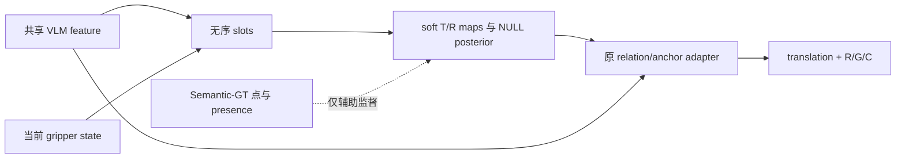

# 网络内部 Target/Reference Slots

[文档索引](../README.md) · [主设计](../design/role-relation-prior.md) · [联合训练](object-conditioned-joint.md)

当前是单帧 role-centric 模型，不是全场景实体发现或 tracking。
Oracle 点只生成训练 teacher heatmap，不进入预测模式 adapter。



## 两个配置，不混合汇报

| 配置 | 用途 |
| --- | --- |
| `rlbench_o2_internal_slots.yaml` | 2-slot Hungarian warm-up；NULL/presence 0.25，旧 cosine diversity 关闭 |
| `rlbench_o2_internal_slots_joint.yaml` | GT gate 后的 opt-in 联合实验；instruction、soft tokens/geometry、完整动作共享 |

两项新开关默认关闭，因此旧 feature 路由保持不变；NULL 监督契约已修正，不再用 `~valid`。
新模式的 Target 不因 Reference 几何不可用而一起关闭。Reference 的 semantic NULL 用 posterior，
unknown geometry 单独屏蔽。没有 memory 时不能定位完全遮挡物体。

## 2-slot adapter-only warm-up

```bash
cd finetune/RLBench
bash train.sh \
  --exp_cfg_path configs/rlbench_o2_internal_slots.yaml \
  --train_replay_storage_dir /path/to/semantic_gt_buffer \
  --init_checkpoint /path/to/model_last.pth \
  --train_object_adapter_only
```

该开关冻结原 BridgeVLA，仅训练 `object_slot_predictor*` 与 `oracle_prior_feature_adapter*`。
它不是最终训练方式。联合配置不用该开关，解冻 action decoder、projector 与上层 Gemma。
新联合实验的四组 GT 控制、训练/评估命令和 CI 工具见[联合训练](object-conditioned-joint.md)。

<a id=dataset-fit></a>

## Semantic-GT 数据是否合适

`max_objects=32,num_points=512` 的旧 buffer 可直接使用；rewriter 实际仅填当前 T/R 的 slot 0/1。
它监督两个 role maps，不提供全部六个 slot 的真实实体身份或 distractor masks。

新 loader 从已保存的 T/R `kind` 只读派生：

```text
oracle_target_present / oracle_reference_present
oracle_role_present_known[2]
oracle_object_valid：仍表示几何可用
```

缺少审计和终止占位不训练 presence/NULL。present=true、valid=false 不是 NULL，也不能直接
当 visible=false 标签；visibility head 本轮不训练。两份当前配置均以 NULL weight 0.25
直接监督与推理一致的 `reference_null_probability`。没有有效 labels 时 NULL 部分为零；
几何可用的正向支持仍可监督 objectness，不代表独立的 presence head。

三视角投影仍来自同一可见点云，只能重排已有证据，不能恢复真实相机没有看见的表面。
完整任务的 GT phase、ID 与 success condition 不进入部署 forward。

## 对应函数与指标

| 功能 | 函数 |
| --- | --- |
| maps、tokens、NULL | `InternalObjectSlotPredictor.forward()` |
| 可微中心/spread | `soft_role_geometry()`；hard top-k `_extract_points()` 保留作兼容 |
| teacher loss | `RVTAgent._object_slot_auxiliary_losses()`、`hungarian_role_slot_losses()`、`reference_null_loss()` |
| GT 隔离 | `MVT.forward()` |
| feature 条件化与动作 | `forward_with_anchor()`、`MVTSingle.forward()` |

报告 role-map quality、NULL accuracy、confidence、waypoint error、各动作分量、closed-loop success、
延迟和显存。辅助 loss 下降、单帧 slots 或结构上的隐式上下文不证明恢复/causal 能力。

## 无 GT 推理可视化

```bash
ORACLE_PROVIDER=none \
VISUALIZE=1 \
VISUALIZE_ROOT_DIR=exp/RLBench_internal_slots_vis \
EXP_CFG_PATH=configs/rlbench_o2_internal_slots.yaml \
bash eval.sh
```

每个 `stepN/` 保存一张 `internal_slots_montage.png`，其行覆盖 `mvt1/mvt2` 的全部视角，列为
Input、原始 slots、预测 Target/Reference、relation anchor 和最终 action heatmap。相同目录的
`internal_slots_metrics.json` 保存置信度、valid、objectness、role probability 与 Reference
NULL probability。这里没有 GT、IoU 或 Dice；图中的 `pred` 不能解释为正确标签。
