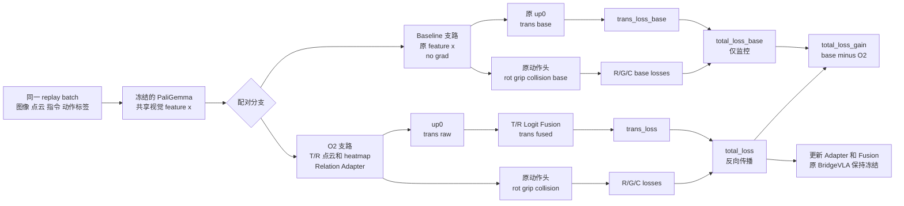

[文档索引](../README.md) · [项目首页](../../README.md)

> 命令不在 docs/ 下执行。带 cd 的独立示例从仓库根目录开始；其后命令沿用该目录。替换所有示例路径后再运行。

<a id=o2-training></a>

# O2：训练 Target/Reference 实例 GT

> 本节导航：[推荐 Adapter + Fusion](#o2-adapter-fusion) ·
> [仅 Fusion](#o2-fusion-only) · [完整动作网络](#o2-full-action) ·
> [开启 T/R relation](#o2-relation-switch) · [同 batch loss 对比](#o2-loss-comparison) ·
> [代码插入位置](#o2-code-path) ·
> [训练可视化](#o2-training-visualization) · [代码测试](#o2-tests)

O2 不把 GT heatmap 作为固定 mask 或手工 logit 约束。主配置会同时选择唯一的
Target 与 Reference，按固定顺序组成双通道三视角 prior `[P_T, P_R]`；两组点云经过
完全相同的增强、归一化和投影，因此通道间保留当前状态下的空间关系。双通道 prior
下采样后，通过低秩 feature adapter 注入 PaliGemma 的 2048 维视觉特征。主配置还会
用共享 PointNet-style MLP 编码 T/R 完整 3D 点集，并将 pooled feature、中心、尺度和
相对位移用于 gated FiLM；随后由多尺度 residual fusion 融合 translation logits、
两个 prior 及交互项。adapter
与 fusion 输出层均为零初始化，因此训练开始时与 baseline 完全一致；Oracle
任一角色缺失或不唯一时，relation residual 整体关闭并强制回退原始路径。
推荐配置中 Adapter 输出同时进入 translation、rotation、gripper 和 collision 分支；
六项动作 loss 联合更新新增 Adapter，translation 的 logit Fusion 仍只接收 translation
梯度。原 BridgeVLA（包括原动作头）保持冻结，因此可训练规模仍约 22.4 万参数。

<a id=o2-adapter-fusion></a>

## 推荐主实验：Relation-gated Adapter + Fusion 联合动作 loss（约 22.4 万参数）

冻结整个原 BridgeVLA，只训练新增 feature adapter 和 fusion：

```bash
bash train.sh \
    --exp_cfg_path configs/rlbench_o2_semantic_gt.yaml \
    --train_replay_storage_dir /home/yiwei/project/BridgeVLA/LPY/BridgeVLA_RLBench_SEMANTIC_GT_Buffer \
    --init_checkpoint /home/yiwei/project/BridgeVLA/LPY/BridgeVLA/checkpoints/RLBench/model_80.pth \
    --train_oracle_adapter_only
```

该配置使用双通道 Target/Reference prior、rank=16、hidden=64，并显式编码 3D
T/R relation；两阶段模型精确训练 223,878 个参数。关闭 relation-gated adapter 后，
旧 Adapter + Fusion 仍为 220,548 个参数。
主配置设置 `oracle_adapter_translation_only=False` 和 `peract.add_rgc_loss=True`：
T/R-adapted feature 同时供 translation 与 R/G/C 动作头使用，`trans_loss`、三个
rotation loss、`grip_loss` 和 `collision_loss` 都参与反向传播。原动作头虽被冻结，
梯度仍可穿过它们更新 Adapter；Fusion 只位于 translation logits 路径上。
启动时应看到 `Enable joint Oracle action losses...` 和
`Total trainable parameters: 223,878`，且 R/G/C loss 不再为零。
本次主配置已从 translation-only 改为联合动作目标；旧 O2 checkpoint 若直接 resume，
会在中途改变优化目标，不应与原曲线视为同一实验。主实验请从 baseline checkpoint
重新 `--init_checkpoint`。专用 YAML 已改用新的
`exp_id: rlbench_o2_gt_instance_joint_action`，避免日志目录混合。

如需恢复旧的 translation-only 消融，可覆盖：

```bash
--exp_cfg_opts 'oracle_adapter_translation_only True peract.add_rgc_loss False'
```

<a id=o2-fusion-only></a>

## 最小消融：仅 Fusion

该设置只训练 logit fusion，不训练 feature adapter，不作为推荐主实验：

```bash
bash train.sh \
    --exp_cfg_path configs/rlbench_o2_semantic_gt.yaml \
    --train_replay_storage_dir /home/yiwei/project/BridgeVLA/LPY/BridgeVLA_RLBench_SEMANTIC_GT_Buffer \
    --init_checkpoint /home/yiwei/project/BridgeVLA/LPY/BridgeVLA/checkpoints/RLBench/model_80.pth \
    --train_oracle_fusion_only
```

<a id=o2-full-action></a>

## 补充实验：完整动作网络联合训练（约 0.54B 参数）

只有确实需要完整微调动作网络、但不 fine-tune Gemma 和视觉塔时才使用：

```bash
bash train.sh \
    --exp_cfg_path configs/rlbench_o2_semantic_gt.yaml \
    --train_replay_storage_dir /home/yiwei/project/BridgeVLA/LPY/BridgeVLA_RLBench_SEMANTIC_GT_Buffer \
    --init_checkpoint /home/yiwei/project/BridgeVLA/LPY/BridgeVLA/checkpoints/RLBench/model_80.pth \
    --freeze_language_model \
    --freeze_vision_tower
```

正式配置文件为 `finetune/RLBench/configs/rlbench_o2_semantic_gt.yaml`，集中配置 semantic
audit schema、Oracle replay
shape、adapter rank、多尺度 fusion、relation 模式和 heatmap sigma。checkpoint
路径以及 `--train_oracle_adapter_only` / `--train_oracle_fusion_only` /
`--freeze_language_model` 属于单次运行策略，
仍通过命令行指定。临时修改单个值时，仍可在配置文件之后使用
`--exp_cfg_opts 'tasks stack_blocks rvt.oracle_prior_strict True'` 覆盖。

<a id=o2-relation-switch></a>

## 开启 Target/Reference relation 输入

O2 专用配置已经默认开启双通道输入，因此使用该 YAML 时不需要额外添加命令行参数：

```yaml
oracle_relation_gated_adapter: True
oracle_adapter_translation_only: False

peract:
  add_rgc_loss: True

rvt:
  oracle_prior_relation: True
  oracle_log_base_loss: True
  oracle_valid_only_loss: False
```

如果使用其他实验配置，可在命令行显式开启：

```bash
bash train.sh \
    --exp_cfg_path configs/rlbench_config.yaml \
    --exp_cfg_opts 'oracle_relation_gated_adapter True oracle_adapter_translation_only False peract.add_rgc_loss True rvt.oracle_prior_relation True' \
    [其他训练参数]
```

如需保留双通道 heatmap、但恢复旧的无显式 3D relation Adapter，可覆盖为：

```bash
--exp_cfg_opts 'oracle_relation_gated_adapter False'
```

如需进一步恢复 Target/Reference 二选一单 prior，必须同时关闭 gated adapter：

    --exp_cfg_opts 'oracle_relation_gated_adapter False rvt.oracle_prior_relation False'

`rvt.oracle_prior_relation` 决定 Oracle 输入采用双通道 T/R 还是旧单 prior；
`oracle_relation_gated_adapter` 决定 feature adapter 是否显式编码 3D T/R relation；
`oracle_adapter_translation_only` 决定 Adapter 输出是否只进入 translation decoder；
`peract.add_rgc_loss` 决定 rotation、gripper、collision loss 是否加入总目标；
`rvt.oracle_valid_only_loss` 决定 translation 优化是否忽略不完整 T/R pair。
`--train_oracle_adapter_only` 决定冻结范围和可训练模块。这些开关作用不同，推荐主实验
同时使用 O2 专用 YAML 和 `--train_oracle_adapter_only`。

<a id=o2-loss-comparison></a>

## Object prior 与原方法的同 batch loss 对比

O2 专用配置默认启用 `rvt.oracle_log_base_loss=True`。一次 PaliGemma 前向后，代码
复用同一组视觉 feature、GT waypoint、数据增强和动作标签，构造无梯度 baseline 支路与
可训练 O2 支路；不会为了对比重复运行 PaliGemma。`total_loss_base` 与 `total_loss`
因而是逐 batch 配对指标：



主配置采用相同的六项等权交叉熵：

```text
total_loss_base = trans_loss_base
                + rot_loss_x_base + rot_loss_y_base + rot_loss_z_base
                + grip_loss_base + collision_loss_base

total_loss = trans_loss
           + rot_loss_x + rot_loss_y + rot_loss_z
           + grip_loss + collision_loss

total_loss_gain = total_loss_base - total_loss
```

`total_loss_gain > 0` 表示加入 object prior 后当前 batch 的完整动作 loss 更低；
`total_loss_gain_pct` 是相对于 `total_loss_base` 的百分比。TensorBoard 会记录所有
base/O2 分量，tqdm 实时显示 `total_loss`、`total_loss_base`、gain 和 gain percentage。
总 loss 容易受三项 rotation loss 主导，因此报告结果时还应逐项对比，而不能只看总和。
这里的 `total_loss_base` 表示同一 batch 上“冻结 baseline checkpoint、不使用 object
prior”的配对诊断，不代表 baseline 又训练了相同步数。正式结果至少还要在固定验证集和
closed-loop evaluation 上比较原始 baseline checkpoint 与 O2 checkpoint；如果要进一步
排除“额外训练步数/新增参数”本身的影响，还需另设相同可训练预算的无 prior control。
当前配对指标主要用于降低训练期 batch 波动和定位收益来自哪项 loss。

完整指标如下：

| 指标 | 位置 | 是否参与反向传播 |
| --- | --- | --- |
| `total_loss_base` | Adapter 前六项动作 loss 之和 | 否，仅监控 |
| `total_loss` | O2 六项动作 loss 之和 | 是，主优化目标 |
| `total_loss_gain` / `total_loss_gain_pct` | baseline 减 O2 | 否，派生对比指标 |
| `trans_loss_base` | Adapter 前、全 batch | 否，仅监控 |
| `trans_loss_raw` | Adapter 后、Fusion 前、全 batch | 否，仅监控 |
| `trans_loss` | Adapter + Fusion 后、全 batch | 是，总目标的一部分 |
| `rot_loss_x/y/z_base` | Adapter 前的三个旋转 loss | 否，仅监控 |
| `rot_loss_x/y/z` | Adapter 后的三个旋转 loss | 是，总目标的一部分 |
| `grip_loss_base` / `collision_loss_base` | Adapter 前的离散动作 loss | 否，仅监控 |
| `grip_loss` / `collision_loss` | Adapter 后的离散动作 loss | 是，总目标的一部分 |
| `trans_loss_base_valid` | Adapter 前、仅完整 T/R pair | 否，仅监控 |
| `trans_loss_raw_valid` | Adapter 后、Fusion 前、仅完整 T/R pair | 否，仅监控 |
| `trans_loss_valid` | Adapter + Fusion 后、仅完整 T/R pair | 仅 `oracle_valid_only_loss=True` 时作为优化目标 |

Base 对比只额外执行无梯度的 `up0` 和小型动作头前向；代码在计算 base rotation
时保存并恢复 BatchNorm buffer，避免诊断支路改变训练状态。它不会建立反向图、不会
重复 PaliGemma，也不会改变模型参数。Adapter-only 下冻结动作头的 BatchNorm 还会固定
使用 checkpoint running statistics，不再因联合 loss 前向而悄悄更新 buffer。如果更重视
吞吐量、暂时不需要该诊断，可关闭：

```bash
--exp_cfg_opts 'rvt.oracle_log_base_loss False'
```

主配置使用 `rvt.oracle_valid_only_loss=False`。因为无效 pair 的 residual 已被
mask 为零，它们不会给 Adapter/Fusion 产生错误梯度；固定 batch 分母还能避免低
coverage micro-batch 被过度放大，适合当前 8-GPU + gradient accumulation 设置。
`trans_loss_valid` 仍会输出用于诊断。只有做高 coverage 的 valid-only 消融时才建议：

    --exp_cfg_opts 'rvt.oracle_valid_only_loss True'

该可选路径已按所有 DDP rank 的有效样本总数修正单个 micro-batch 的梯度归一化；
但多个 accumulation micro-batch 的有效数仍可能不同，因此不作为主实验默认值。

init_checkpoint 只初始化模型权重，adapter/fusion 保持零初始化，epoch 和 optimizer 从头开始；
继续已开始的 O2 训练则使用 resume_checkpoint。两者不能同时指定。
旧版 fusion-only checkpoint 不含 adapter/multiscale 权重，不能直接作为新版配置的
resume_checkpoint；请重新从 baseline 使用 init_checkpoint，或将 adapter rank 设为
0、关闭 multiscale fusion 后继续旧结构。

主配置中的 `rvt.oracle_prior_relation=True` 会同时输入唯一 T/R，
`oracle_prior_active_role` 在该模式下不参与选择；它仅用于兼容旧的单 prior 模式。
在线评估器可直接同时提供 `oracle_target_object_points [B,P,3]`、
`oracle_reference_object_points [B,P,3]` 及对应可选 valid，或提供完整的
`oracle_object_points/valid/roles`。relation 模式不接受旧的单个
`oracle_active_object_points` 作为有效 O2 输入，因为它无法表达 T/R 关系。训练日志同时记录
全 batch 的 trans_loss_base/trans_loss_raw/trans_loss，以及完整 pair 对应的
trans_loss_base_valid/trans_loss_raw_valid/trans_loss_valid；
fusion-only 模式下 trans_loss_raw 就是原 heatmap。oracle_prior_strict 默认为
False：T/R 任一缺失或存在多个候选时，该样本回退 trans_raw；
`oracle_target_coverage`、`oracle_reference_coverage` 和 `oracle_prior_coverage`
分别监控两个角色及完整 pair 的有效比例。数据审计时可
显式设置 rvt.oracle_prior_strict True，使异常样本直接报错。

use_oracle_objects=False、rvt.oracle_prior_mode=none 均为默认值；此时不创建
adapter/fusion 参数、不要求 Oracle 字段，旧 replay、旧 checkpoint 和原始前向路径保持
不变。O2 在训练和评估时均使用 GT 实例，属于 privileged Oracle 上界，不应作为
无 GT 的部署结果报告。

<a id=o2-code-path></a>

## O2 代码插入位置

O2 不修改 Gemma 或视觉塔权重。feature adapter 插在 PaliGemma 视觉特征与
`up0` translation decoder 之间；多尺度 fusion 插在 translation logits 输出之后、
translation loss 和坐标 decode 之前。核心实现位于
`finetune/bridgevla/mvt/mvt_single.py::forward` 和
`finetune/bridgevla/mvt/mvt.py::_apply_oracle_instance_prior`：

    x_base = x
    x_o2 = oracle_feature_adapter(x, prior, valid, relation_points)
    trans_base = up0(x_base)                 # no grad，仅对比
    action_base = action_head(x_base)         # no grad，仅对比
    trans = up0(x_o2)
    action = action_head(x_o2)                # R/G/C loss 更新 Adapter
    raw_logits = stage_out['trans']
    stage_out['trans_raw'] = raw_logits.detach()
    stage_out['trans'] = fusion(raw_logits, prior, valid)

完整执行路径如下：

1. `finetune/RLBench/utils/dataset.py::create_replay` 注册 Oracle points、
   valid、roles 等 replay 字段；
2. `finetune/bridgevla/models/bridgevla_agent.py::_select_oracle_prior_points`
   同时选择唯一 Target 和 Reference，并固定输出顺序为 `[T,R]`；
3. `bridgevla_agent.py::update` 临时把两组 instance points 展平并拼入场景点云，使其和
   场景及动作标签执行相同 SE(3) augmentation，完成后立即拆开；
4. `mvt.py::_build_oracle_instance_prior` 将两组完整实例点分别投影成对应 stage
   坐标系的三视图 prior `[B,V,2,H,W]`；Stage 2 的 relation descriptor 也使用同一
   局部平移和缩放坐标系；
5. MVT1/MVT2 分别先由 `OracleRelationGatedFeatureAdapter` 编码完整 T/R 点集，
   以 pooled point feature、中心、尺度及相对位移生成 gated FiLM；主配置将 adapted
   feature 同时送入 translation 与 R/G/C 分支，再由 `OraclePriorFusion` 对 translation
   logits 做多尺度 residual 融合；
6. 同一 forward 内，原 feature 经过无梯度的 base decoder/action heads，adapted feature
   经过可训练 O2 路径；`bridgevla_agent.py::update` 分别计算 `total_loss_base` 和
   `total_loss`。主配置联合优化六项动作 loss，完整 T/R pair 的 `trans_loss_valid`
   仍仅作 coverage 对齐后的诊断指标。

Fusion head 定义在
`finetune/bridgevla/models/oracle_prior.py::OraclePriorFusion`。双通道主配置的
基础输入为 `[L_raw,P_T,P_R]`，多尺度分支额外接收
`[L_raw*P_T,L_raw*P_R,P_T*P_R]`；最后一层零初始化。因此启用 O2
后的初始 translation 输出与 baseline 完全相同。

正式 closed-loop 评测仍使用 `finetune/RLBench/eval.sh`。三组必须使用相同 task、demo
编号和 episode 数：

```bash
# 1. 原始 baseline checkpoint
TASKS="place_cups" MODEL_FOLDER=/path/to/baseline MODEL_NAME=model_80.pth \
EXP_CFG_PATH=configs/rlbench_config.yaml ORACLE_PROVIDER=none bash eval.sh

# 2. O2 checkpoint，但关闭 prior，测同一 checkpoint 的 raw 分支
TASKS="place_cups" MODEL_FOLDER=/path/to/o2 MODEL_NAME=model_50.pth \
EXP_CFG_PATH=configs/rlbench_o2_semantic_gt.yaml ORACLE_PROVIDER=none bash eval.sh

# 3. O2 checkpoint + simulator semantic-GT T/R fusion
TASKS="place_cups" MODEL_FOLDER=/home/yiwei/project/BridgeVLA/finetune/RLBench/train/rlbench_o2_gt_instance_joint_action/08_28_17_12 MODEL_NAME=model_last.pth \
EXP_CFG_PATH=configs/rlbench_o2_semantic_gt.yaml \
ORACLE_PROVIDER=rlbench_gt ORACLE_STRICT=1 ORACLE_DEBUG=1 bash eval.sh
```

也可以使用 O2 专用包装脚本；它默认加载 semantic-GT 配置并启用 strict/debug：

```bash
TASKS="place_cups" \
MODEL_FOLDER=/path/to/o2 MODEL_NAME=model_50.pth \
EVAL_DATAFOLDER=/path/to/BridgeVLA_RLBench_EVAL_DATA \
bash eval_o2.sh

# 同一个 O2 checkpoint 的 raw 分支对照
ORACLE_PROVIDER=none TASKS="place_cups" \
MODEL_FOLDER=/path/to/o2 MODEL_NAME=model_50.pth bash eval_o2.sh
```

`ORACLE_PROVIDER=none` 会显式关闭 O2 prior 选择，而不是依赖“字段缺失后自动回退”；
`ORACLE_PROVIDER=rlbench_gt` 会让 CoppeliaSim 直接输出四视角 one-channel handle mask，
provider 提取点云后立刻移除 mask，mask 不进入 BridgeVLA policy。O2 config 加载 checkpoint
时使用严格 `state_dict`，缺失 adapter/fusion 权重会报错，不再 `strict=False` 静默继续。
评测入口会兼容 NumPy 2 对 `uint8 * 256` 的严格溢出检查，并在解码保存的 RLBench
RGB handle mask 前转换到安全整数类型；`eval.sh` 遇到 Python 异常会立即返回非零状态，
不会再把失败任务打印为 `Completed` 或生成误导性的空汇总结果。

若同时需要模型 heatmap 可视化，运行 `eval.sh` 时设置
`VISUALIZE=1 VISUALIZE_ROOT_DIR=exp/RLBench_O2_vis`。

每个 step 的 `mvt1/` 和 `mvt2/` 目录会保存：

- `original_N.png`、`gray_N.png`、`overlay_N.png`：输入视图、最终 fused
  translation heatmap 和其最大值位置；
- `o2_target_prior_N.png`、`o2_target_prior_overlay_N.png`：GT Target prior；
- `o2_reference_prior_N.png`、`o2_reference_prior_overlay_N.png`：GT Reference prior；
- `o2_prior_N.png`、`o2_prior_overlay_N.png`：两者逐像素最大值的合并检查图；
- `o2_raw_N.png`、`o2_raw_overlay_N.png`：原始 BridgeVLA heatmap；
- `o2_fused_N.png`、`o2_fused_overlay_N.png`：融合后 heatmap。

完整路径为
`<visualize_root_dir>/<task>/episode_<N>/<language_goal>/step<N>/{mvt1,mvt2}/`。
只设置 `--visualize_root_dir` 不会启用模型可视化。semantic role 首帧 audit 由
`ORACLE_DEBUG=1` 单独控制；provider 统计和 manifest 无论是否启用图片都会写入
`<eval_log>/semantic_oracle/`。`ORACLE_STRICT=1` 约束的是 task/variation/handle 映射错误；
正确实体暂时不可见会记录 `valid=False`，无 Reference 的任务则记录 `no_reference`。

<a id=o2-training-visualization></a>

## O2 训练中间可视化

训练样本可视化由实验 YAML 控制，默认配置关闭；O2 配置示例已开启：

    train_visualization:
      enabled: True
      interval: 500
      save_png: True
      tensorboard: True
      output_dir: train_visualizations

interval 使用 optimizer step，而不是梯度累积的 micro-step。每次只采集 rank 0
最后一个 micro-batch 的第一个样本，并分别生成 MVT1/MVT2 拼图。每张拼图包含
Input、经过当前 SE(3) 增强和投影后的 GT translation heatmap、
Target prior、Reference prior、合并 prior、Raw pred 和 Fused pred。

当 save_png=True 时，图片保存到
`<log_dir>/<output_dir>/step_XXXXXXXX/{mvt1,mvt2}.png`。当
tensorboard=True 时，必须同时使用 --log_backend tensorboard，图片显示在
TensorBoard 的 train_visualization/mvt1 和 train_visualization/mvt2 下。
两种输出可以独立关闭；可视化未命中的 step 不会拷贝训练张量到 CPU。

<a id=o2-tests></a>

## O2 训练代码测试

在服务器的 `bridgevla` 环境、仓库根目录运行：

    python -m unittest tests.test_oracle_prior tests.test_o2_joint_action_loss tests.test_rlbench_training_utils tests.test_rlbench_training_visualization -v
    python -m pytest tests/test_o2_semantic_roles.py tests/test_replay_extra_fields.py tests/test_rollout_generator_ground_truth.py -q

`tests.test_oracle_prior` 检查固定 `[T,R]` 选择、缺失角色回退、双通道实例点投影、adapter/fusion
零初始化 identity、无效 prior 回退、反向梯度和训练 GT/pred 张量拆分；
`tests.test_o2_joint_action_loss` 检查联合动作配置，以及无梯度 base 动作支路不会改变
BatchNorm 状态；
`tests.test_rlbench_training_utils` 检查 fusion-only、adapter-only 冻结范围和
batch/optimizer-step 规划；`tests.test_rlbench_training_visualization` 检查
PNG 与 TensorBoard 拼图输出。
`tests/test_o2_semantic_roles.py` 检查 18 任务配置覆盖、只读 RGB handle mask 解码、
多 handle 实体合并、顺序 phase 的完成/释放门控、place_cups stored-demo event phase、
`no_reference` 与 strict selector 错误。
`tests/test_replay_extra_fields.py` 检查 semantic audit metadata 保留在磁盘 replay 中但不会
进入训练 batch，同时缺失训练必需字段仍会立即报错。
`tests/test_rollout_generator_ground_truth.py` 检查 expert action 用尽后的失败统计、空 action
报错和同一 demo 的整 episode 重试标记。

确认专用 YAML 能被项目 YACS 配置系统加载：

    PYTHONPATH=finetune python -c "from bridgevla.config import get_cfg_defaults; c=get_cfg_defaults(); c.merge_from_file('finetune/RLBench/configs/rlbench_o2_semantic_gt.yaml'); assert c.use_oracle_objects and c.oracle_semantic_audit and c.rvt.oracle_prior_mode == 'o2_gt_instance'; print(c)"

配置打印结果还应包含 `rvt.oracle_prior_relation: True`、
`oracle_adapter_translation_only: False` 和 `peract.add_rgc_loss: True`。上述测试属于代码级检查；
正式训练前仍应在 GPU 上运行一个真实 replay batch 的 forward/backward，并确认
T/R 两项 coverage、`oracle_prior_coverage`、`total_loss_base`、`total_loss` 和
`total_loss_gain` 均能正常输出。

训练默认只在 `model_*.pth` 中保存 `epoch` 和 `model_state`，适用于评估与
推理，不保存体积较大的 Adam optimizer state。如果需要完整恢复优化器以继续
训练，启动训练时显式添加 `--save_optimizer_state`。轻量 checkpoint 仍可直接
传给 RLBench `eval.py`；使用轻量 checkpoint 执行 `--resume` 时只恢复模型
权重，优化器会重新初始化。
