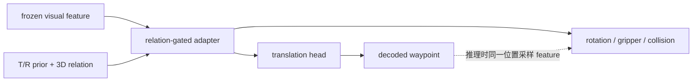

[文档索引](../README.md) · [Object-prior 模式](object-prior-modes.md) · [代码索引](../reference/code-map.md)

> 命令从 `finetune/RLBench` 执行；请先替换示例路径。

<a id=o2-training></a>

# O2：训练 Target/Reference GT Adapter

O2 选择当前状态下唯一的 Target 与 Reference，将两者的固定大小 XYZ 集合按 `[T,R]`
投影为双通道三视角 prior，再通过低秩 relation-gated adapter 注入 PaliGemma 视觉特征。
`object` 使用完整可见表面点云；`site` 使用 OBB（或显式 2 cm fallback box）的定向
区域点集，表示边界见
[Semantic-GT: 交互实体几何表示](../guides/semantic-gt.md#semantic-gt-entity-geometry)。
adapted feature 同时供 translation、rotation、gripper、collision 使用。

正式 GT 对照接受全量验证的 `demo_events` semantic buffer，不重放 simulator expert
actions。在线测试由 live success conditions 选择当前角色；两侧的 role YAML、T/R 语义、
点数和输入格式一致。Reference 始终是 `[N,3]` 点集：object 为当前可见表面点，site 为
OBB/fallback box 的确定性采样点，NULL 才是零点集加 invalid。训练 handle 经多视角证书
转换到 stored mask namespace，测试使用 live handles。14 个单 phase 任务没有中间 phase
差异；4 个多 phase 任务需额外报告切换时序造成的失败。

当前结构不包含 post-hoc translation fusion：



O2 只有一份 translation 输出 `trans`。推理时 translation 最终位置与
R/G/C 的 feature 采样位置一致；训练时仍沿用 BridgeVLA 的 teacher forcing，在 GT
`wpt_local` 处训练 R/G/C。

<a id=o2-adapter-only></a>

## 推荐训练：Adapter-only 联合动作 loss（139,138 参数）

```bash
bash train.sh \
    --exp_cfg_path configs/rlbench_o2_semantic_gt.yaml \
    --train_replay_storage_dir /path/to/BridgeVLA_RLBench_SEMANTIC_GT_Buffer \
    --init_checkpoint /path/to/baseline/model_80.pth \
    --train_oracle_adapter_only
```

主配置使用双通道 T/R prior、rank-16 adapter 和显式 3D relation；两阶段共训练
139,138 个参数。原 BridgeVLA（包括动作头）保持冻结，但六项动作 loss 的梯度会穿过
冻结头更新 adapter：

```text
total_loss = trans_loss
           + rot_loss_x + rot_loss_y + rot_loss_z
           + grip_loss + collision_loss
```

如需 translation-only 消融：

```bash
--exp_cfg_opts 'oracle_adapter_translation_only True peract.add_rgc_loss False'
```

<a id=o2-full-action></a>

## 补充实验：完整动作网络联合训练

仅在确实需要微调动作网络时使用：

```bash
bash train.sh \
    --exp_cfg_path configs/rlbench_o2_semantic_gt.yaml \
    --train_replay_storage_dir /path/to/semantic_gt_buffer \
    --init_checkpoint /path/to/baseline/model_80.pth \
    --freeze_language_model \
    --freeze_vision_tower
```

<a id=o2-relation-switch></a>

## 关键开关

主配置已经设置：

```yaml
oracle_prior_adapter_rank: 16
oracle_relation_gated_adapter: True
oracle_adapter_translation_only: False

peract:
  add_rgc_loss: True

rvt:
  oracle_prior_relation: True
  oracle_log_base_loss: True
  oracle_valid_only_loss: False
```

- `rvt.oracle_prior_relation`：使用双通道 T/R prior，而非旧的单角色 prior。
- `oracle_relation_gated_adapter`：用完整 T/R 点集显式编码相对几何。
- `oracle_adapter_translation_only`：adapter 是否只影响 translation 分支。
- `peract.add_rgc_loss`：R/G/C loss 是否加入总目标。
- `rvt.oracle_valid_only_loss`：translation 优化是否只统计完整 T/R pair。

无 Reference 的 phase 是合法的 Target-only relation：Target 仍可产生 residual，Reference
由 learned NULL 表示。若 Reference 语义上存在但当前几何不可用，则不能把它当作 NULL；
外部预测路径会使整对 residual 无效。当前 Oracle tensor 路径只向网络传 `valid`，不能在
运行时区分“不存在”和“不可见”；详见
[Semantic-GT buffer 适配性](../guides/semantic-gt.md#这份-buffer-是否适合当前-design)。

<a id=o2-loss-comparison></a>

## 同 batch baseline 对比

`rvt.oracle_log_base_loss=True` 时，一次 PaliGemma 前向产生共享 feature；代码额外执行
无梯度 baseline action heads，并与 adapter 支路使用同一 batch、增强和标签：

| 指标 | 含义 | 反向传播 |
| --- | --- | --- |
| `total_loss_base` | adapter 前六项 loss 之和 | 否 |
| `total_loss` | adapter 后六项 loss 之和 | 是 |
| `total_loss_gain(_pct)` | baseline 减 adapter | 否 |
| `trans_loss_base` | adapter 前 translation loss | 否 |
| `trans_loss` | adapter 后且最终执行的 translation loss | 是 |
| `*_base` / 对应动作 loss | R/G/C 的配对分量 | 仅非 base 项 |
| `trans_loss_base_valid` / `trans_loss_valid` | 完整 T/R pair 子集 | 后者仅在 valid-only 模式优化 |

`trans_loss_raw` 与 `trans_loss_raw_valid` 已删除；它们在 adapter-only 结构中会与
`trans_loss` 和 `trans_loss_valid` 重复。

训练期配对 loss 用于定位收益，不能替代固定验证集与 closed-loop success。正式报告还应
包含等训练步数、等可训练参数预算的 no-prior control。

<a id=o2-checkpoints></a>

## Checkpoint

- baseline → O2：使用 `--init_checkpoint`，adapter 零初始化，epoch/optimizer 从头开始。
- adapter-only O2 → 继续训练：使用 `--resume_checkpoint`。
- semantic checkpoint 保存 schema、phase source、点数、Reference 几何版本和 role YAML
  SHA-256；resume 与 GT closed-loop 都必须完全匹配。旧 checkpoint 没有 contract 时拒绝加载。
- 旧 Adapter+Fusion checkpoint → 当前结构：使用 `--init_checkpoint`；加载器忽略
  已废弃的 fusion tensors 并保留 adapter 权重。
- 旧 Adapter+Fusion checkpoint 不能直接 `--resume_checkpoint`，因为
  optimizer 参数组不同；代码会明确报错。

评估加载会过滤已废弃的 fusion keys，其他缺失或多余参数仍由 load 检查处理。

<a id=o2-code-path></a>

## 代码路径

1. `finetune/RLBench/utils/dataset.py` 注册 Oracle points、valid、roles。
2. `bridgevla_agent.py::_select_oracle_prior_points` 固定选择顺序 `[T,R]`。
3. `bridgevla_agent.py::update` 让实例点与场景、动作标签经历相同 SE(3) augmentation。
4. `mvt.py::_build_oracle_instance_prior` 为 coarse/refine 各生成三个正交视图的
   `[B,V,2,H,W]` prior。
5. `OracleRelationGatedFeatureAdapter` 修改 feature；`mvt_single.py::forward` 从该
   feature 同时预测 translation 与 R/G/C。外层只附加 prior 供诊断，不再改写 `trans`。
6. `bridgevla_agent.py::update` 计算 adapter loss 和无梯度 base loss。

| 目的 | 函数 |
| --- | --- |
| object 模式与输入选择 | `resolve_object_prior_mode()`、`RVTAgent._select_oracle_prior_points()` |
| XYZ 栅格化 | `MVT._build_oracle_instance_prior()`、`rasterize_instance_points()` |
| feature 注入 | `OracleRelationGatedFeatureAdapter.forward()` |
| 完整动作输出 | `MVTSingle.forward()` |
| loss 与训练日志 | `RVTAgent.update()` |

<a id=o2-evaluation></a>

## Closed-loop 评估

```bash
# baseline
TASKS=place_cups MODEL_FOLDER=/path/to/baseline MODEL_NAME=model_80.pth \
EXP_CFG_PATH=configs/rlbench_config.yaml ORACLE_PROVIDER=none bash eval.sh

# O2 + semantic GT
TASKS=place_cups MODEL_FOLDER=/path/to/o2 MODEL_NAME=model_last.pth \
EXP_CFG_PATH=configs/rlbench_o2_semantic_gt.yaml \
ORACLE_PROVIDER=rlbench_gt ORACLE_STRICT=1 ORACLE_DEBUG=0 bash eval.sh

# 逐 policy step 输出 Oracle T/R 审计图
ORACLE_PROVIDER=rlbench_gt ORACLE_STRICT=1 \
ORACLE_DEBUG=1 ORACLE_DEBUG_INTERVAL=1 \
TASKS=place_cups MODEL_FOLDER=/path/to/o2 MODEL_NAME=model_last.pth \
EXP_CFG_PATH=configs/rlbench_o2_semantic_gt.yaml bash eval.sh

# 同一 O2 checkpoint 的 no-prior control
ORACLE_PROVIDER=none TASKS=place_cups \
MODEL_FOLDER=/path/to/o2 MODEL_NAME=model_last.pth bash eval_o2.sh
```

`ORACLE_PROVIDER=none` 会显式关闭 prior。O2 训练和 GT-provider 评估属于 privileged
Oracle 上界，不应当作无 GT 的部署结果。
建议传入训练目录保存的 `exp_cfg.yaml`；加载器还会将 checkpoint contract 与运行时
`ORACLE_ROLE_CONFIG`、`ORACLE_NUM_POINTS` 核对。`ORACLE_DEBUG` 只控制审计输出，不应改变
动作；`ORACLE_DEBUG_INTERVAL=1` 表示每个 policy step 一张图，不是 simulator 内部每个
physics substep。Target/Reference 图使用 `30%` 原始 RGB 与 `70%` 角色颜色叠加。
正式比较固定 `ORACLE_DEBUG=0`；debug 与 resume 不能同时使用。

<a id=o2-training-visualization></a>

## 可视化

评估设置 `VISUALIZE=1 VISUALIZE_ROOT_DIR=exp/RLBench_O2_vis`。每个 stage 保存输入、
最终 `o2_adapted` heatmap、Target prior、Reference prior 与合并 prior；不再生成
`o2_pre_fusion` 或 `o2_fused`。

训练可视化由 YAML 的 `train_visualization` 控制，拼图展示 Input、GT、T/R prior、
合并 prior 和最终 Pred。

<a id=o2-tests></a>

## 验证

```bash
python -m unittest tests.test_oracle_prior tests.test_o2_joint_action_loss \
    tests.test_rlbench_training_utils tests.test_rlbench_training_visualization -v
python -m pytest tests/test_o2_semantic_roles.py tests/test_replay_extra_fields.py \
    tests/test_rollout_generator_ground_truth.py -q
```

正式训练前仍需用真实 replay batch 做 GPU forward/backward，并检查 coverage、
`total_loss_base`、`total_loss`、各动作分量和 adapter gradient。
