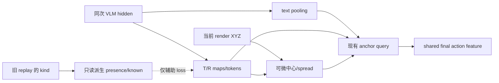

# Object-conditioned 联合训练：先 GT，后预测

[文档索引](../README.md) · [主设计](../design/role-relation-prior.md) · [代码索引](../reference/code-map.md)

> 两份配置是 opt-in 实验入口，不代表闭环收益已验证。输入必须是新 rewriter 生成并全量
> 验证的 `demo_events` semantic buffer；旧数据缺少 role YAML 摘要时需离线重写。

## 1. 数据与函数



| 功能 | 函数 |
| --- | --- |
| 读取时派生 presence | `_derive_role_presence()`、`_copy_required_disk_fields()` |
| 同次前向 instruction | `pool_instruction_context()` |
| T/R soft tokens 与 maps | `InternalObjectSlotPredictor.forward()` |
| 可见点中心/spread | `soft_role_geometry()` |
| anchor query | `OracleRelationAnchorFeatureAdapter.forward_with_anchor()` |
| global/local 完整动作路由 | `action_feature_routes()`、`MVTSingle.forward()` |
| teacher-only NULL posterior loss | `reference_null_loss()`、`RVTAgent._object_slot_auxiliary_losses()` |
| 配对闭环 CI | `tools/compare_paired_success.py::compare()` |

`current_state` 只有当前 gripper 三维状态。独立 visibility、EE pose 输入、memory 与显式 phase 未实现。
旧 GT anchor 无法从 `valid` 区分 absent/hidden Reference；GT 共享特征对照保留旧角色路径，
不要把它的 NULL 处理报告为已修复的预测 presence。新 internal-slot 分支使用预测 NULL posterior。

## 2. GT 同预算对照

从仓库根目录开始，所有组使用同一 `BASE_CHECKPOINT` 与 `SEMANTIC_BUFFER`。
每组运行 `SEED=0,1,2`，保持 optimizer steps、batch、augmentation 与评估 episodes 一致。
不要加 `--train_object_adapter_only`。

```bash
cd finetune/RLBench

# C: shared full action + instruction
bash train.sh \
  --exp_cfg_path configs/rlbench_o2_semantic_gt_joint.yaml \
  --train_replay_storage_dir "$SEMANTIC_BUFFER" \
  --init_checkpoint "$BASE_CHECKPOINT" \
  --exp_cfg_opts "seed 0 exp_id gt_shared_context"
```

仍使用同一新配置，通过 overrides 运行 A/B；每组重复三个 seeds：

| 组 | `--exp_cfg_opts` |
| --- | --- |
| A：旧 GT anchor 路由 | `seed 0 exp_id gt_anchor_control object_conditioning.shared_action_features False object_conditioning.use_context False` |
| B：仅共享完整动作 | `seed 0 exp_id gt_shared_only object_conditioning.use_context False` |
| C：共享 + instruction | `seed 0 exp_id gt_shared_context` |

D 使用同一配置、数据和训练预算，关闭 object 路径，作为独立继续训练的 BridgeVLA：

```bash
bash train.sh \
  --exp_cfg_path configs/rlbench_o2_semantic_gt_joint.yaml \
  --train_replay_storage_dir "$SEMANTIC_BUFFER" \
  --init_checkpoint "$BASE_CHECKPOINT" \
  --exp_cfg_opts "seed 0 exp_id base_joint_control use_oracle_objects False oracle_semantic_audit False oracle_prior_adapter_rank 0 oracle_relation_gated_adapter False oracle_relation_anchor_rank 0 object_conditioning.shared_action_features False object_conditioning.use_context False rvt.oracle_prior_mode none rvt.oracle_prior_relation False rvt.oracle_log_base_loss False"
```

评估使用与每组 overrides 一致的配置文件，不能只加载原始 joint YAML。
将训练目录的 `exp_cfg.yaml` 传给 `eval.sh` 的 `EXP_CFG_PATH`，并核对文件中的
两个 conditioning 开关。GT 组用 `ORACLE_PROVIDER=rlbench_gt`；D 和预测组用 `none`。
不要对 D 保留 `ORACLE_PROVIDER=rlbench_gt`，否则 checkpoint 消融与评估输入不一致。
GT checkpoint 会同时校验 `demo_events`、点数、Reference 点集版本和 role YAML SHA-256；
任一项不同都应重新生成/训练，而不是关闭校验继续比较。

GT joint 冻结 vision tower、multimodal projector 与 Gemma 前 6 层，训练其余 Gemma、
完整 action decoder 和 O2 模块。internal-slot joint 仍冻结 vision tower/Gemma 前 18 层，
并训练 projector；两者不要共用 optimizer resume。
LR 默认非 Gemma `4e-5`、Gemma `1e-5`。关闭 context 的旧 checkpoint 可以 init 到新模块，
但不能 optimizer-resume 到新路由。两项关闭时，原 feature 路由不变。

## 3. 闭环准入

普通评估开启 `EVAL_RESUME=1 SAVE_VIDEO=0 VISUALIZE=0`，产生逐 episode journal。
GT/source manifest coverage 不是 policy success。所有有效策略失败必须保留；缺失 episodes
先补齐，不以共同成功子集比较。环境初始化/数据异常另行报告。

从仓库根目录执行，对应目录必须是各 seed 的 `episode_results` 根目录，不是 manifest 目录：

```bash
python tools/compare_paired_success.py \
  --baseline "0=/path/to/A_seed0/episode_results" \
  --baseline "1=/path/to/A_seed1/episode_results" \
  --baseline "2=/path/to/A_seed2/episode_results" \
  --candidate "0=/path/to/C_seed0/episode_results" \
  --candidate "1=/path/to/C_seed1/episode_results" \
  --candidate "2=/path/to/C_seed2/episode_results"
```

工具按 seed 与同一 task/episode 配对，任务等权，分层重采样 seed 和任务内 episodes，
输出成功率差、95% bootstrap CI 与 `gt_gate_passed`。至少三个 seeds；CI 下界须大于 0。
同样对比 D；若 B 比 C 更好，使用 B 作为候选，而不是为了增加模块保留 context。
需报告样本量和逐 seed 结果；三 seeds 的 CI 只是首轮准入，不是普遍可靠性证明。

同时检查 decoded waypoint 的 3D error/argmax、预测 waypoint 下的 R/G/C、动作失败类型、
延迟与显存。训练仍使用 GT waypoint/crop teacher forcing；训练 loss 不能代表执行误差。
CI 没通过就诊断该差距，不启动预测 Objects 训练或 memory 扩展。

## 4. 通过 GT gate 后：预测 Objects

```bash
cd finetune/RLBench
bash train.sh \
  --exp_cfg_path configs/rlbench_o2_internal_slots_joint.yaml \
  --train_replay_storage_dir "$SEMANTIC_BUFFER" \
  --init_checkpoint "$BASE_CHECKPOINT" \
  --exp_cfg_opts "seed 0"
```

也可从已验收 GT 模型 init，须明确记录初始化来源，不与 baseline checkpoint 初始化混合汇报。
默认 6 slots / 128 dim，hard top-k XYZ 不再是唯一条件。Reference 不可用只屏蔽其几何条件，
不关闭可用 Target；NULL 用预测 posterior。GT presence/maps/points 只进入辅助监督。
训练没有 teacher forcing 的 object 输入替换，没有额外 VLM 或输出 fusion。

## 5. 最小验证

在安装完整项目依赖的环境，从仓库根目录运行：

```bash
python -m pytest -q tests/test_object_conditioning.py tests/test_object_conditioning_forward.py \
  tests/test_object_conditioning_config.py tests/test_replay_extra_fields.py \
  tests/test_oracle_prior.py tests/test_internal_object_slots_config.py tests/test_paired_success.py
```

单步训练 smoke：在相应训练命令的 `--exp_cfg_opts` 中加入 `max_optimizer_steps 1`，
确认 action/object 参数梯度与 checkpoint 保存。随后用该 checkpoint 做单 episode
`ORACLE_PROVIDER=none EVAL_EPISODES=1` 的预测-only smoke。GT 组仍用 GT provider。
smoke 只证明接口可运行，不能通过闭环收益 gate。

本次 Windows 本地仅执行无依赖单元/静态检查；PyTorch 数值、CUDA 单步训练与 RLBench 闭环需目标环境验收。
