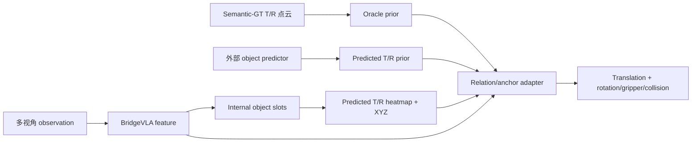

# Object-prior 三种实验模式

[文档索引](../README.md) · [代码与函数索引](../reference/code-map.md)

新 [GT/slots joint 配置](object-conditioned-joint.md) 提供完整动作特征共享、instruction 条件和可靠 NULL 监督；先运行 GT 闭环准入。

当前实现共享同一条 relation-aware action 路径，区别只在于 Target/Reference 几何从哪里来。

| 模式 | 配置 | T/R 来源 | 主要用途 |
| --- | --- | --- | --- |
| Oracle instance | `rlbench_o2_gt_instance.yaml` / semantic-GT 配置 | replay 中的 GT T/R 点云 | 测量 object prior 上界 |
| External prediction | `rlbench_o2_predicted_objects.yaml` | 外部 detector/segmentor 写入 replay 或 observation | 分离感知与控制误差 |
| Internal slots | `rlbench_o2_internal_slots.yaml` | BridgeVLA feature 内部预测 role slots | 无 Oracle 模型路线；仍需真实传感器适配与闭环验证 |

三种模式最终都调用现有 relation/anchor adapter，因此可以共用 action head、loss、可视化和
closed-loop 评估。模式之间不要只比较 auxiliary loss；至少同时比较 translation argmax、
rotation/gripper/collision 和 closed-loop success。

这是当前代码的统一接口，不是后续模型的训练限制。面向 scaling 与真实部署的设计会把
adapter-only 作为 diagnostic warm-up，随后联合训练 slots、完整动作 decoder 与选定 backbone 层；
memory 为后续独立实验，Oracle 在预测模式只保留为 teacher 和上界。

## 共享代码路径

1. `RVTAgent.update()` / `RVTAgent.act()` 组装当前模式的 object 输入。
2. `MVT.forward()` 构造 Oracle、external 或 internal-slot prior。
3. `MVT._build_oracle_instance_prior()` 将 XYZ 栅格化为多视角 T/R heatmap。
4. `OracleRelationGatedFeatureAdapter` 或 `OracleRelationAnchorFeatureAdapter` 调整 feature。
5. `MVTSingle.forward()` 从 adapted feature 预测完整动作。

完整函数定位见[代码与函数索引](../reference/code-map.md)。

## 共同边界

- 当前监督只绑定当前 phase 的 Target/Reference，不等价于完整场景 object discovery。
- BridgeVLA 的虚拟视角从同一份可见点云投影，不能恢复真实遮挡后的表面。
- `valid` 表示当前是否有可用几何；它不应与语义上的 `present` 混为一谈。
- 单帧 internal slots 还不是 temporal object memory。遮挡鲁棒性需要独立的跨帧状态与更新规则。
- simulator handle、GT phase 和 success condition 都不能成为真实部署输入；接口与验证顺序见
  [真实机器人落地设计](../design/real-world-deployment.md)。
