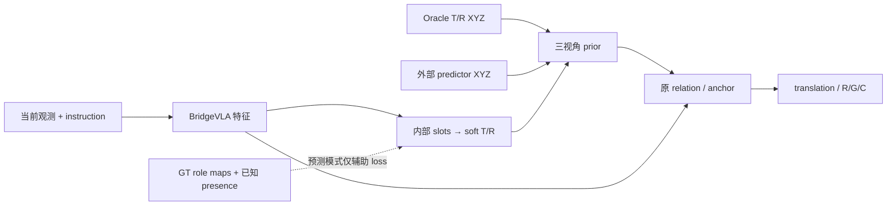

# O2 操作指南：配置、训练与闭环评估

[文档索引](../README.md) · [统一设计](../design/role-relation-prior.md) · [Semantic-GT 数据](semantic-gt.md) · [代码索引](../reference/code-map.md)

> 本页合并原 O2 模式、配置流程、GT/anchor、外部预测、internal slots 与 joint 实验说明。
> 描述现有代码，包含 opt-in 跨尺度继承；两-query 与 memory 仍未实现。除 CI/测试外，命令从仓库根目录先 `cd finetune/RLBench`；独立示例重新指定工作目录。

阅读路径：[配置](#配置选择) → [数据](#数据与角色契约) → [训练](#训练) → [Checkpoint](#loss与checkpoint) → [闭环](#closed-loop评估) → [诊断](#测试诊断与可视化) → [验证](#最小验证)。
baseline 的安装/预训练/其他 benchmark 命令仍见[训练](training.md)和[评估](evaluation.md)。

## 配置选择

三种 object 来源共用 prior → 原 relation/anchor → action decoder；差别是来源、特征路由与训练范围。
以下配置均在 `finetune/RLBench/configs/`，不是新的网络结构。

| 配置（省略 `rlbench_o2_` 前缀与 `.yaml`） | Object 来源 | 动作特征 | 评估 provider |
| --- | --- | --- | --- |
| `gt_instance` | 启发式 T/R replay | 原 relation 路由 | `rlbench_gt`，启发式上界，不能混为严格 GT |
| `semantic_gt` | 严格 Semantic-GT | 原 relation 路由 | `rlbench_gt` |
| `semantic_gt_relation_anchor` | 严格 Semantic-GT | anchor 额外增强 translation，R/G/C 保留原 shared 路由 | `rlbench_gt` |
| `predicted_objects` | 外部 predictor 的 T/R XYZ | 原 relation + anchor | `none`，须另接 predictor wrapper |
| `internal_slots` | 2 个无序 slots | 原 relation + anchor，无 instruction context | `none` |
| `semantic_gt_joint` | 严格 Semantic-GT | instruction + 完整动作共享 | `rlbench_gt` |
| `internal_slots_joint` | 6 个无序 slots，128 dim | soft tokens/geometry + instruction + 完整动作共享 | `none` |
| `internal_slots_cross_scale` | 同一 coarse 的 6 slots | joint + 混合 map 监督 + 本步继承 + token 保留 | `none` |

`rlbench_o2_semantic_roles.yaml` **不是训练配置**：它定义任务/variation 的 T/R、顺序与 NULL 语义，摘要进入数据/checkpoint contract。
摘要是整个 YAML 文件字节的 SHA-256，不是逐 task 语义摘要；修改注释/格式也会改变 contract。
旧 buffer 不会自动迁移，不能声称未改动的 task 仍满足新摘要；保留旧 YAML 配套运行，迁移时另行审计，不自动重写有效数据。



默认旧配置不切换新路由。所有模式保留 coarse/refine 的 `3 × 2` 视角，无 post-hoc translation fusion；
共享模式才保证 translation、R/G/C local 与 global pooling 都使用同一最终特征。

## 数据与角色契约

| 模式 | 训练数据要求 | 动作前向能否读取 Oracle |
| --- | --- | --- |
| GT / anchor / GT joint | 全量验证的 `demo_events` semantic buffer | 可以，结果单报 Oracle 上界 |
| Internal slots | 同一 buffer 提供 T/R teacher maps；旧 kind 只读派生 presence | 不可以，GT 仅进入辅助 loss |
| 外部预测 | replay/在线 wrapper 提供 `predicted_*` 字段 | 不可以，不回退到 Oracle |

数据生成、handle 证书与全量验证命令只在 [Semantic-GT](semantic-gt.md)维护。
已有有效 buffer 不因合并文档或改模型接口而重写；缺少必需 audit/摘要时按实际校验结果处理，不默认用 sim replay 重新训练。

- T/R 固定顺序为 `[T,R]`。object 是当前可见表面点；site 是 OBB/显式 fallback box 的定向区域点，均为 `[N,3]`，不是单个 Reference 中心。
- `max_objects=32, num_points=512` 的 semantic replay 只直接填/监督当前 T/R，不是 6-slot 全实例或 distractor masks 数据。
- `oracle_object_valid` 表示几何可用。存在但几何不可用是 unknown，不是 NULL，也不是可靠 visibility 标签。
- loader 从 kind 派生 `oracle_*_present` 和 `oracle_role_present_known[2]`；缺少审计/终止占位屏蔽 presence loss，不伪造标签。
- 新 internal-slot NULL loss 监督推理使用的 posterior；旧 GT tensor 路径仍只传 valid，无法可靠区分 absence/遮挡。只打开 shared GT flag 不会修复这一角色语义。
- 训练 demo 的释放边界与在线 live success conditions 不完全相同；角色 YAML、点数/格式一致不代表 phase 切换无 gap。多 phase 任务单独检查切换失败。
- 三视角来自同一可见点云，不恢复从未观测的表面。当前 slots 无跨步 ID/memory；GT phase、ID 和 success conditions 不进入无 GT 部署前向。

几何和输入隔离的详细定义见[统一设计](../design/role-relation-prior.md#当前实现与数据契约)。

旧配置两级各自选角色，token 仍受 geometry valid 屏蔽；新配置需显式开启下面的[角色一致性开关](#角色一致性开关)。
仅 shared flag 或 soft posterior 不会自动继承角色或保留 crop 外 token。

## 训练

先在可靠 GT 上验证完整动作收益，再推进预测；adapter-only 是诊断 warm-up，不是最终训练限制。
只改变一个因素，固定 checkpoint、optimizer steps、batch、augmentation、解冻范围和评估 episodes。

先按[训练入口说明](training.md#rlbench-fine-tuning)配置 simulator 环境。下例使用可移植的单节点
`train_8x40.sh`，`GPUS_PER_NODE=2` 仅示例；GPU 数变化后核对有效 batch 与 optimizer steps。

### GT adapter-only

```bash
cd finetune/RLBench
GPUS_PER_NODE=2 bash train_8x40.sh \
  --exp_cfg_path configs/rlbench_o2_semantic_gt.yaml \
  --train_replay_storage_dir /path/to/semantic_gt_buffer \
  --init_checkpoint /path/to/baseline/model_80.pth \
  --train_oracle_adapter_only
```

rank-16 原 relation adapter 两级共 139,138 个参数；BridgeVLA 与动作头冻结，但动作 loss 穿过冻结头更新 adapter：

```text
total_loss = trans_loss + rot_loss_x + rot_loss_y + rot_loss_z
           + grip_loss + collision_loss
```

| 开关 | 含义 |
| --- | --- |
| `oracle_prior_adapter_rank: 16` | 低秩 residual |
| `oracle_relation_gated_adapter: True` | T/R 相对几何条件 |
| `oracle_adapter_translation_only: False` | relation residual 不限 translation |
| `peract.add_rgc_loss: True` | R/G/C loss 加入训练目标 |
| `rvt.oracle_prior_relation: True` | 双通道 T/R prior |
| `rvt.oracle_log_base_loss: True` | 同 batch 无梯度 base diagnostic |
| `rvt.oracle_valid_only_loss: False` | 固定 batch 分母，不放大低 coverage 子集 |

translation-only 消融追加：

```bash
--exp_cfg_opts 'oracle_adapter_translation_only True peract.add_rgc_loss False'
```

#### 动作网络微调（补充）

补充实验若只微调动作网络，在同一训练命令移除 adapter-only，添加 `--freeze_language_model --freeze_vision_tower`。
不要将其与下面的分组解冻 joint 配置混为同一训练预算。

### Relation anchor 消融

```bash
cd finetune/RLBench
GPUS_PER_NODE=2 bash train_8x40.sh \
  --exp_cfg_path configs/rlbench_o2_semantic_gt_relation_anchor.yaml \
  --train_replay_storage_dir /path/to/semantic_gt_buffer \
  --init_checkpoint /path/to/current_o2/model_last.pth \
  --train_oracle_adapter_only
```

`oracle_relation_anchor_rank: 16` 在同一个 adapter 的 relation hidden 上加入空间 anchor；rank=0 使用原 relation adapter。
masked pooling、中心/spread、相对位移与当前夹爪状态构成 query，不用时间进度、phase/contact/anchor GT。
旧路由额外 residual 只增强 translation，基础 relation feature 仍供 R/G/C；新增 `anchor_*` 输出零初始化。
不改 replay、不串联第二个 adapter、不在输出 heatmap 后融合。

旧 valid 路径用 learned NULL 处理无效 Reference，无法区分真实 absence/遮挡；不要把它当作修复后的预测 NULL。
验收比较 argmax、1/2/5 voxel recall、3D waypoint 和闭环，不能只看 CE。

### GT 联合对照

每组运行 seeds 0/1/2，使用同一个 `BASE_CHECKPOINT` 与 `SEMANTIC_BUFFER`，**不用 adapter-only 开关**。

```bash
cd finetune/RLBench
GPUS_PER_NODE=2 bash train_8x40.sh \
  --exp_cfg_path configs/rlbench_o2_semantic_gt_joint.yaml \
  --train_replay_storage_dir "$SEMANTIC_BUFFER" \
  --init_checkpoint "$BASE_CHECKPOINT" \
  --exp_cfg_opts "seed 0 exp_id gt_shared_context"
```

同一命令仅替换 overrides：

| 组 | `--exp_cfg_opts` |
| --- | --- |
| A：旧 GT anchor | `seed 0 exp_id gt_anchor_control object_conditioning.shared_action_features False object_conditioning.use_context False` |
| B：仅完整动作共享 | `seed 0 exp_id gt_shared_only object_conditioning.use_context False` |
| C：共享 + instruction | `seed 0 exp_id gt_shared_context` |

D 是同预算独立继续训练的 BridgeVLA，无 object condition：

```bash
GPUS_PER_NODE=2 bash train_8x40.sh \
  --exp_cfg_path configs/rlbench_o2_semantic_gt_joint.yaml \
  --train_replay_storage_dir "$SEMANTIC_BUFFER" \
  --init_checkpoint "$BASE_CHECKPOINT" \
  --exp_cfg_opts "seed 0 exp_id base_joint_control use_oracle_objects False oracle_semantic_audit False oracle_prior_adapter_rank 0 oracle_relation_gated_adapter False oracle_relation_anchor_rank 0 object_conditioning.shared_action_features False object_conditioning.use_context False rvt.oracle_prior_mode none rvt.oracle_prior_relation False rvt.oracle_log_base_loss False"
```

| Joint 配置 | 冻结 | 训练 |
| --- | --- | --- |
| GT | vision tower、projector、Gemma 前 6 层 | 其余 Gemma、action decoder、O2 |
| Internal slots | vision tower、Gemma 前 18 层 | projector、其余 Gemma、action decoder、slots/adapter |

沿用已有 embedding/lm_head 冻结；非 Gemma LR `4e-5`、Gemma `1e-5`。
同预算比较 A/B/C 与 D；选择真正有效的较简方案，context 无收益不强留。
评估使用各训练目录保存的 `exp_cfg.yaml`，不能丢掉训练 overrides。

### 内部 slots

warm-up：

```bash
cd finetune/RLBench
GPUS_PER_NODE=2 bash train_8x40.sh \
  --exp_cfg_path configs/rlbench_o2_internal_slots.yaml \
  --train_replay_storage_dir /path/to/semantic_gt_buffer \
  --init_checkpoint /path/to/model_last.pth \
  --train_object_adapter_only
```

该开关只训练 `object_slot_predictor*` 与 `oracle_prior_feature_adapter*`。
当前 2 个无序 slots 经 Hungarian matching 学习 T/R，NULL loss weight=0.25、diversity=0；
这些是 loss 权重，不是匹配/可靠性阈值。NULL loss 直接监督推理使用的 `reference_null_probability`；GT teacher 只生成辅助 maps/presence。

通过 GT 闭环准入后：

```bash
cd finetune/RLBench
GPUS_PER_NODE=2 bash train_8x40.sh \
  --exp_cfg_path configs/rlbench_o2_internal_slots_joint.yaml \
  --train_replay_storage_dir "$SEMANTIC_BUFFER" \
  --init_checkpoint "$BASE_CHECKPOINT" \
  --exp_cfg_opts "seed 0"
```

joint 为 6 slots/128 dim，NULL weight=0.25、diversity=0.01，开启 instruction、soft roles/geometry、完整动作共享。
可从验收过的 GT checkpoint init，但与 baseline 初始化分开报告。
有效 Target 不因 Reference 几何不可用一起关闭；NULL posterior 与 geometry valid 分开。
hard top-k XYZ 用于兼容/可视化与 opt-in 继承的局部提示，不是唯一条件。无 object teacher-forcing 输入替换、额外 VLM 或输出 fusion。
未匹配 slots 无完整负例，不是通用 object discovery。

默认 BCE/Dice 只监督匹配 slots；可另外启用最终混合 T/R maps 的直接监督。
`rvt.object_prediction_confidence_threshold=0.25` 是预测有效性门限，
`rvt.object_slot_null_loss_weight=0.25` 是损失权重；
二者都不是 Hungarian 拒配阈值，当前匹配没有拒配门限。

### 角色一致性开关

三个独立开关默认关闭，仅支持 internal slots；GT/外部 predictor 不误启用。

```yaml
object_conditioning:
  supervise_mixed_role_maps: False
  inherit_coarse_roles: False
  preserve_role_tokens: False
rvt:
  object_slot_mixed_role_loss_weight: 1.0
```

| 开关 | 启用后 |
| --- | --- |
| `supervise_mixed_role_maps` | 匹配 slot 与 mixed-map BCE/Dice 共用 stage/role/view teacher 有效性；未知/无效角色和空 teacher views 跳过 |
| `inherit_coarse_roles` | refine 不调用 predictor2，复用 coarse tokens/NULL/几何；预测点作有 XYZ 支持的重投影提示 |
| `preserve_role_tokens` | 可信角色 token 不随局部 geometry valid 清空；不生成虚构局部 XYZ |

后两项要求 shared action features + anchor；继承还要求 stage_two 与 XYZ channels。
继承开启时自动使用未额外归一化、未受图像增强扰动的 XYZ，RGB/VLM 不变；可沿用默认 `rvt2.yaml`。
继承时 refine 提示为离散重投影，不另算角色/NULL/slot loss；学习式混合 map loss 只在 coarse。
global tokens/soft geometry 仍接受 refine action 梯度，没有新的局部 mask decoder 或跨步 memory。
有效性只读取 teacher，不由预测 confidence 决定。Reference 在 refine 全部视角没有投影支持时，两种 map loss 都跳过对应监督，也不产生该角色的 objectness 正例；presence/NULL 标签独立保留。
teacher 是模糊、峰值归一化的点投影 prior，未验证虚拟视角遮挡，不能按严格实例分割 GT 解释。

新独立配置启用全部三项，沿用 joint 的冻结范围、学习率、slots 和训练预算；已有 semantic buffer 不重写：

- 冻结 vision tower、Gemma 前 18 层及既有 embedding/lm_head；训练 projector、上层 Gemma、动作头和 object 模块。
- 非 Gemma 学习率 `4e-5`，Gemma `1e-5`；effective batch 192，50 epochs × 200 optimizer steps = 10,000 updates。
- `--epochs` 未指定时使用 YAML/overrides，显式指定时覆盖并保存实际值；joint 不传 `--train_object_adapter_only`。

```bash
cd finetune/RLBench
GPUS_PER_NODE=2 bash train_8x40.sh \
  --exp_cfg_path configs/rlbench_o2_internal_slots_cross_scale.yaml \
  --train_replay_storage_dir "$SEMANTIC_BUFFER" \
  --init_checkpoint "$BASE_CHECKPOINT" \
  --save_optimizer_state \
  --exp_cfg_opts "seed 0"
```

消融只替换 overrides，其他预算保持不变：

| 组 | `--exp_cfg_opts` |
| --- | --- |
| 旧 joint | `seed 0 object_conditioning.supervise_mixed_role_maps False object_conditioning.inherit_coarse_roles False object_conditioning.preserve_role_tokens False` |
| 监督对齐（mixed + 有效性修正） | `seed 0 object_conditioning.inherit_coarse_roles False object_conditioning.preserve_role_tokens False` |
| mixed + 继承 | `seed 0 object_conditioning.preserve_role_tokens False` |
| 三项全开 | `seed 0` |

要单独验证 teacher 有效性修正，可在监督对齐组追加 `rvt.object_slot_mixed_role_loss_weight 0.0`；此时不加 mixed 项，匹配 loss 仍使用修正后的有效性。
四个路由开关（shared/context/inherit/preserve）写入 checkpoint，改变路由用 `--init_checkpoint`；监督开关/权重改变可复用兼容 optimizer，但正式消融仍从相同初始化重新训练。
相同配置续训用 `--resume_checkpoint`，optimizer 连续性要求之前保存过 `--save_optimizer_state`。评估读取该 checkpoint 保存的 `exp_cfg.yaml` 与 `mvt_cfg.yaml`，四个路由设置不匹配会报错。
VISUALIZE 中 refine 显示继承的 T/R maps，不伪造 slot/head 分数；JSON 标记 `roles_inherited=true, role_source=coarse`。

正式训练前可先做一个 optimizer update：

```bash
cd finetune/RLBench
GPUS_PER_NODE=1 bash train_8x40.sh \
  --exp_cfg_path configs/rlbench_o2_internal_slots_cross_scale.yaml \
  --train_replay_storage_dir "$SEMANTIC_BUFFER" \
  --init_checkpoint "$BASE_CHECKPOINT" \
  --exp_cfg_opts "seed 0 tasks place_cups bs 1 global_batch_size 1 num_workers 0 max_optimizer_steps 1 exp_id o2_cross_scale_smoke"
```

将训练输出目录设为 `SLOT_RUN`，使用其保存配置做预测-only 单 episode 检查；正式实验恢复原 batch/预算，并按相同 episodes 做配对闭环评估。

```bash
cd finetune/RLBench
TASKS=place_cups MODEL_FOLDER="$SLOT_RUN" MODEL_NAME=model_last.pth \
EXP_CFG_PATH="$SLOT_RUN/exp_cfg.yaml" EVAL_DATAFOLDER=/path/to/raw_eval \
ORACLE_PROVIDER=none REPLAY_GROUND_TRUTH=0 EVAL_EPISODES=1 EVAL_RESUME=0 \
ORACLE_DEBUG=0 SAVE_VIDEO=0 VISUALIZE=0 bash eval.sh
```

### 外部预测对象

```bash
cd finetune/RLBench
GPUS_PER_NODE=2 bash train_8x40.sh \
  --exp_cfg_path configs/rlbench_o2_predicted_objects.yaml \
  --train_replay_storage_dir /path/to/predicted_object_buffer \
  --init_checkpoint /path/to/current_o2/model_last.pth \
  --train_object_adapter_only
```

外部 replay/在线 observation 每角色必须提供以下字段（T/R 各一组）：

| 字段 | 类型 |
| --- | --- |
| `predicted_target_object_points` / `predicted_reference_object_points` | float32 `[512,3]`，点数与配置一致 |
| `predicted_target_object_valid` / `predicted_reference_object_valid` | bool，几何可用 |
| `predicted_target_present` / `predicted_reference_present` | bool，语义角色存在 |
| `predicted_target_confidence` / `predicted_reference_confidence` | float32 |

`object_prior_mode: o2_predicted_relation` 与 `use_predicted_objects: True` 隔离 Oracle；
strict 模式缺字段直接报错。低于配置 confidence 阈值则无效；
存在但不可用的 Reference 不能变 NULL，**当前外部路径关闭整对 residual**，与新 soft internal 路径区分。

仓库不包含 detector/segmentor；闭环需要 wrapper 在 `agent.act()` 前注入同样字段，单换 YAML 不会自动预测对象。
点集应遵守[交互实体几何定义](semantic-gt.md#semantic-gt-entity-geometry)；
当前仅 XYZ，不保存 normal/weight 或未选候选。2 cm fallback box 是人为 kernel，不是真实边界。

## Loss与Checkpoint

`oracle_log_base_loss` 复用一次 VLM features，额外跑无梯度 base action heads：

| 指标 | 含义 |
| --- | --- |
| `total_loss_base` / `total_loss` | adapter 前/后完整动作 loss；只后者反传 |
| `total_loss_gain(_pct)` | base 减适配 loss，仅诊断 |
| `trans_loss_base` / `trans_loss` | base / 实际执行 heatmap 的 translation loss |
| 各 R/G/C 与 `*_base` | 同 batch 分量对照 |
| `trans_loss_base_valid` / `trans_loss_valid` | 完整 T/R 子集；仅 valid-only 模式按后者优化 |

重复的 `trans_loss_raw(_valid)` 已移除。base diagnostic 不是独立训练 baseline；
训练仍用 GT waypoint/crop teacher forcing，推理从最终 translation 解码再采样 R/G/C。

| 操作 | 使用方式 |
| --- | --- |
| baseline → O2 / 新结构 | `--init_checkpoint`；新增 residual 输出零初始化，epoch/optimizer 重新开始 |
| 同架构、同路由续训 | `--resume_checkpoint` |
| 改变路由、解冻范围或 fusion 参数组 | 不沿用旧 optimizer resume |
| 旧 Adapter+Fusion 初始化 | init 保留 adapter，忽略已废弃 fusion tensors；其他参数差异仍校验 |

有 embedded semantic contract 时核对 schema、phase source、点数、Reference 几何版本和 role YAML SHA-256。
**评估例外：**运行配置要求 `demo_events` 时，缺 embedded contract 的旧 demo checkpoint 可以加载，但记录
`legacy_demo_checkpoint` 警告，训练 provenance 不能独立验证；这不是允许忽略已有 contract 不匹配。
resume 的训练校验与这项评估例外分开，实际行为见 `train.py` / `eval.py`。
评估同样过滤已废弃 fusion keys；其他缺失/多余参数仍由加载校验处理。

## Closed-loop评估

以下所有命令从 `finetune/RLBench` 执行，并设置真实 `EVAL_DATAFOLDER`。
GT 用 `rlbench_gt`；独立 baseline 与 internal slots 用 `none`。

```bash
cd finetune/RLBench

# 普通 O2 GT / GT joint：使用训练保存的配置
TASKS=place_cups MODEL_FOLDER=/path/to/o2 MODEL_NAME=model_last.pth \
EXP_CFG_PATH=/path/to/o2/exp_cfg.yaml EVAL_DATAFOLDER=/path/to/raw_eval \
ORACLE_PROVIDER=rlbench_gt ORACLE_STRICT=1 ORACLE_DEBUG=0 \
EVAL_RESUME=1 SAVE_VIDEO=0 VISUALIZE=0 bash eval.sh

# Internal slots / D baseline：配置必须对应这个 checkpoint
TASKS=place_cups MODEL_FOLDER=/path/to/predicted MODEL_NAME=model_last.pth \
EXP_CFG_PATH=/path/to/predicted/exp_cfg.yaml EVAL_DATAFOLDER=/path/to/raw_eval \
ORACLE_PROVIDER=none ORACLE_DEBUG=0 EVAL_RESUME=1 SAVE_VIDEO=0 VISUALIZE=0 bash eval.sh

# 同一 O2 checkpoint 的 no-prior control，不是独立 baseline
ORACLE_PROVIDER=none TASKS=place_cups \
MODEL_FOLDER=/path/to/o2 MODEL_NAME=model_last.pth \
EXP_CFG_PATH=/path/to/o2/exp_cfg.yaml EVAL_DATAFOLDER=/path/to/raw_eval \
ORACLE_DEBUG=0 EVAL_RESUME=1 SAVE_VIDEO=0 VISUALIZE=0 bash eval_o2.sh
```

纯原始 BridgeVLA 可用 `EXP_CFG_PATH=configs/rlbench_config.yaml ORACLE_PROVIDER=none`。
D 不能保留 GT provider；外部模式需已接 predictor wrapper，缺字段不回退 Oracle。
GT 校验 role YAML、点数与训练配置；debug 仅用于审计，不应改变 policy。
Oracle 评估、BridgeVLA-aligned simulator conditioning 和无 GT slots 分开报告。

### 评估日志与最终统计

`eval.sh` 的命令行只输出每个任务的 `Success rate`；`eval_parallel.py` 另外输出
macro `Success rate`。模型加载、simulator 输出、警告和
异常堆栈写入当前模型评估目录的 `evaluation_runtime.log`；逐步的
`[HeatmapActionAnchor]`、`[BridgeVLAAlignedObjects]`、`[EffectiveTarget]`、候选列表、
episode 进度与重试信息写入同目录的 `evaluation_diagnostics.log`。评估失败时命令行只给出
失败任务和 runtime log 路径。

每个完成的 episode 写入
`episode_results/<task>/episode_N.json`；最终同时写入：

- `evaluation_summary.json`：本次请求的 episode、逐 episode reward/length、成功与失败数；
- `eval_results.csv`：当前进程的一行任务统计，启动新评估时重建，不追加历史运行；
- `*_merged_eval_results.csv`：`eval.sh` 汇总各任务的结果。

`success rate = 100 × successful episodes / completed episodes`。按照 RLBench/YARR 的
sparse terminal reward 约定，以 `reward > 0.99` 判定 episode 成功，不直接对 reward 数值
求平均；因此标准 `1/0` reward 与兼容的 `100/0` reward 统计一致，而任意小的正数不会被
误判为成功。只有 `completed episodes == requested episodes` 才生成最终结果；
中途异常不会被悄悄当作失败或缩小分母。分子、分母和 `total_transitions` 均显式写入
CSV/JSON，便于核对。

**代码变更后重新评估：**resume 签名包含配置、checkpoint 路径/size/mtime 和选定 runtime 文件，
但未覆盖 `mvt_single.py`、`object_conditioning.py`、`oracle_prior.py` 等全部策略依赖，也不哈希 raw 数据内容。
因此不是完整代码/数据 provenance。修改这些模块或原地替换数据后，不复用旧 episode journals。
`eval.sh` 固定日志目录，没有 `LOG_NAME` 环境变量；使用独立实验目录，或直接指定新的 `--log-name`：

```bash
cd finetune/RLBench
python eval.py --model-folder /path/to/o2 --model-name model_last.pth \
  --exp_cfg_path /path/to/o2/exp_cfg.yaml --eval-datafolder /path/to/raw_eval \
  --tasks place_cups --eval-episodes 25 --episode-length 25 --device 0 --headless \
  --oracle-provider rlbench_gt --oracle-strict --log-name fresh_code_review
```

新日志名需唯一；此直接入口没有 `eval.sh` 的命令行静默包装。无 GT 模式改为 `--oracle-provider none` 并移除 strict。

开启 `SAVE_VIDEO=1` 时，视频使用相同的 RLBench episode seed 命名为
`episode_N_success_<language_goal>.mp4` 或 `episode_N_fail_<language_goal>.mp4`。
这里的 `N` 与 `episode_results/<task>/episode_N.json`、`START_EPISODE` 完全一致；
success/fail 同样使用 `reward > 0.99`，不再使用独立的成功/失败视频计数。

### 闭环统计与准入

所有有效策略失败保留在分母；环境/数据异常另报，缺 episodes 先补齐，不只比较共同成功子集。
manifest coverage 不是 policy success，teacher-forcing loss 也不是执行误差。

从仓库根目录，使用每 seed 的 `episode_results` 根目录：

```bash
python tools/compare_paired_success.py \
  --baseline "0=/path/to/A_seed0/episode_results" \
  --baseline "1=/path/to/A_seed1/episode_results" \
  --baseline "2=/path/to/A_seed2/episode_results" \
  --candidate "0=/path/to/C_seed0/episode_results" \
  --candidate "1=/path/to/C_seed1/episode_results" \
  --candidate "2=/path/to/C_seed2/episode_results"
```

按相同 seed/task/episode 配对，任务等权，分层重采样 seed 与任务内 episodes。
运行前逐 task 核对 summary 的 `completed episodes == requested episodes`，并核对预定 episode 范围。
工具只检查已读 key 集合相等：双方同样少跑 episodes 仍可能通过，不能代替完整性验收。
当前工具只接受本项目 `100/0` reward journals，虽常规报告也支持 `1/0`，两者的输入契约不同。
任务集合固定，不重采样 tasks；CI 表示本次固定任务上的配对差，不是未知任务泛化保证。
至少 3 seeds，95% bootstrap CI 下界>0 才进入预测 joint；同样对比 D，报告样本量及逐 seed 结果。
同时记录 decoded waypoint 误差/argmax、预测 waypoint 下 R/G/C、失败类型、时延/显存。
CI 未通过就定位训练—推理差距，不追加 memory；首轮 CI 不代表普遍可靠性。

## 测试诊断与可视化

`EVAL_RESUME=1` 要求 `SAVE_VIDEO=0 VISUALIZE=0 ORACLE_DEBUG=0`；
需要 debug/video/viz 时显式 `EVAL_RESUME=0`，不可沿用批量准入设置。

```bash
cd finetune/RLBench
TASKS=place_cups MODEL_FOLDER=/path/to/o2 MODEL_NAME=model_last.pth \
EXP_CFG_PATH=/path/to/o2/exp_cfg.yaml EVAL_DATAFOLDER=/path/to/raw_eval \
ORACLE_PROVIDER=rlbench_gt ORACLE_STRICT=1 \
ORACLE_DEBUG=1 ORACLE_DEBUG_INTERVAL=1 EVAL_RESUME=0 bash eval.sh
```

interval=1 是每个 policy step，不是 simulator physics substep。
Oracle 图全层使用 30% 原 RGB + 70% 角色层：背景为暗原图，角色区域叠加颜色。
下文细分纯诊断与会改变条件/动作的 simulator alignment，不能混为 Oracle GT。

### Internal-slot 可视化

```bash
cd finetune/RLBench
TASKS=place_cups MODEL_FOLDER=/path/to/slots MODEL_NAME=model_last.pth \
EXP_CFG_PATH=/path/to/slots/exp_cfg.yaml EVAL_DATAFOLDER=/path/to/raw_eval \
ORACLE_PROVIDER=none VISUALIZE=1 EVAL_RESUME=0 bash eval.sh
```

默认输出为 checkpoint 同目录 `eval/visualizations/<provider>/<model>/`，可用 `VISUALIZE_ROOT_DIR` 覆盖。
language-goal 目录保存扁平 `step_0000.png` 与同名 JSON：两级全部视角，列为 Input、slots、
Target/Reference pred、anchor、action；JSON 含 confidence/valid/objectness/role probability/Reference NULL。
热图每视角独立归一化，叠加 30% 原 RGB；无 GT 时没有 IoU/Dice，pred 不是正确标签。
训练图为 `step_00000500_mvt1.png` / `mvt2.png`；`train_visualization` 控制输出。

GT 可视化保留 input、T/R prior、合并 prior、最终 `o2_adapted`；
不再输出 `o2_pre_fusion`/`o2_fused`。anchor 可见于 `relation_anchor`/`o2_relation_anchor`。

### 测试期 Heatmap Action Anchor 归因

标准 closed-loop 测试可选择输出 BridgeVLA translation heatmap 对应的动作锚点：

```bash
ORACLE_PROVIDER=rlbench_gt \
HEATMAP_ACTION_ANCHOR=1 \
bash eval.sh
```

旧的 `HEATMAP_TARGET_OBJECT=1` 仍作为兼容别名。该开关只在 policy evaluation 中
有效，不用于训练或 manifest 生成。provider 按需提供 YAML 中 Target
variation/sequence 的当前可见点云；agent 分别解码：

- `base`：Oracle adapter 之前的 BridgeVLA heatmap；
- `final`：实际用于执行 translation 的最终 heatmap。

若 checkpoint 没有保留 `trans_base`，`base_available=false`，此时 `base` 会回退为
`final`，不能用于判断 adapter 前后的变化。

两者都按 waypoint 到候选点云表面的最小距离输出 candidate、phase、距离和置信度，
并报告到当前 Reference 的距离。超过 0.20 m 为 UNKNOWN。日志前缀是
`[HeatmapActionAnchor]`。`phase=-1` 表示该物体只是配置中的非当前 episode 候选：它会
显示为动作锚点诊断，但会从 `base_eligible` / `final_eligible` 的语义 Target 候选中排除。

这些结果写入 `ActResult.replay_elements`，不覆盖当前 Oracle Target、不修改 Reference，
也不改变实际 action。translation waypoint 可能指向 Target、Reference、接触点或自由空间；
因此 action anchor 不是新的 Target/Reference GT，`final_matches_target=false` 也不自动表示
Oracle 标注错误。

#### 让 simulator residual 跟随 BridgeVLA Target

若 simulator object 只用于修正 BridgeVLA，而不应独立决定操作对象，使用：

```bash
ORACLE_PROVIDER=rlbench_gt \
BRIDGEVLA_ALIGNED_OBJECTS=1 \
bash eval.sh
```

该模式执行两次 action forward：第一次只读取 residual 前的 `trans_base`，从所有可见任务
候选中选择最近 Target；第二次以该 Target 点云和 Reference 点云作为 residual 条件生成最终
动作。Target 会跨接近、抓取和搬运保持锁定；真实 grasp 可在夹爪闭合时覆盖 heatmap lock。
当前 phase 推进且 gripper 打开后，旧有序 phase 的 Target 会立即解除并停止参与候选选择，
避免已经成功放置的物体被再次锁回；未建立新可信锁时 residual 关闭并使用原始 BridgeVLA 动作。

heatmap 只负责抓取前的意图候选。gripper 实际建立 grasp 后，provider 使用 simulator
`get_grasped_objects()` 的 live handle 反查候选；若唯一匹配，它会覆盖 heatmap lock，后续
residual 与最终可视化跟随真实抓取物体。`lock_source=1` 表示 heatmap，`2` 表示实际 grasp；
`grasp_override=true` 表示本步纠正了不一致。

锁定不是永久的：heatmap 候选连续两步比当前锁定对象近至少 2 cm 时允许切换；夹爪闭合且
连续两步确认未抓到候选时解除锁定，并在本次闭合周期屏蔽该失败候选，直到夹爪重新打开或
真实 grasp 建立。simulator 在松爪后可能短暂保留上一物体的 grasp 观测，此时不会重新锁回
已完成 Target。无可信锁时对象 residual 完全关闭，动作回到原始 BridgeVLA，不回退到
Oracle T/R。日志中 `recovery=1/2/3` 分别表示 heatmap 切换、空抓/丢失抓取解锁、真实
grasp 覆盖；`failed_blocked=true` 表示当前 heatmap 又指向本周期已失败的候选，
`completed_blocked=true` 表示原始 heatmap 仍指向已完成候选但该候选已被屏蔽。

评估入口会强制设置 `oracle_compute_base=True`，因此不依赖训练配置中的
`oracle_log_base_loss`；checkpoint 无需重新训练。

默认只替换可信的 Target 锁；Reference 保留 simulator 当前 relation/phase 的 Reference。
Target candidate 的序号不定义 Reference，避免把“操作哪个物体”错误解释成“目标位置也按相同
序号切换”。`phase=-1` 只表示该 Target 不属于当前 task phase。若 `used=false`，T/R residual
整体关闭，不发生 task Target 回退。
该路径改变 policy action，应与纯诊断模式分别评估；它是 BridgeVLA-aligned predicted
conditioning，不再把所选 Target 称为 Oracle GT。

##### 可选：让 `place_cups` Reference 跟随动作锚点

若希望杯架位置也尽量匹配 BridgeVLA 的实际放置意图，可额外打开：

```bash
ORACLE_PROVIDER=rlbench_gt \
BRIDGEVLA_ALIGNED_OBJECTS=1 \
BRIDGEVLA_ALIGNED_REFERENCE=1 \
bash eval.sh
```

该开关只在 `place_cups` 启用精确单 spoke 选择，不合并整个 holder，也不按 Target candidate
序号配对 Reference。只有 simulator 已确认夹爪实际持有 Target 后，才用同一次 base BridgeVLA
waypoint 在各个精确 spoke 点云中独立选择 Reference；已被其他杯子占用的 spoke 会被排除，当前
手持杯子不会被计为占用。最近候选超过 0.20 m 时 operational Reference 为 NULL，不强行猜测；
这是测试期 heuristic，不能当作语义 absence 的训练标签。候选一旦建立，
锁定到松爪，避免搬运过程中跳动。

其他任务会显式报告 `selection_supported=false` 并继续使用原有 live simulator Reference。
中间选择只写入 `evaluation_diagnostics.log`：重点检查 `reference_proposed`、
`reference_locked`、`reference_used`、`reference_occupied_blocked` 和 `carrying_target`。

仅设置 `BRIDGEVLA_ALIGNED_OBJECTS=1` 时，运行时 `oracle_target_object_points` 跟随
BridgeVLA lock，作为 residual 的 effective GT；Reference 保持当前 task Reference。
原始任务阶段标注另存为 `oracle_task_target_*` /
`oracle_task_reference_*`，不参与 residual。provider 在 `agent.act()` 后、执行动作前接收
锁定候选，因此下一观测与刚执行动作使用同一 effective GT。首次产生 lock 前，运行时
Target 为 invalid；首个动作由 agent 内部的 base-forward -> 候选归属 -> conditioned-forward
完成同一步对齐，不使用 task Target 填充。

动作执行后的观测若能从 simulator 唯一确认 actual grasp，physical grasp 会立即覆盖动作前的
policy lock，成为该观测的 effective Target，并同步后续 lock。因而审计图中夹取成立后应满足
`GT_T == actual_grasp`；标题 `source=actual_grasp` 表示发生了这种事实覆盖。夹取发生前没有
physical grasp 可用，`source=policy_lock` 仍表示 BridgeVLA 的预期操作对象。

`stack_blocks` 是 Reference 随物理关系变化的特例。aligned closed-loop 不按专家固定
`phase-1` 猜 Reference，而是读取当前 `stack_blocks_success` 区域中已放置的方块，并以
世界坐标最高的方块作为当前支撑 Reference；空栈时使用 target plane，夹爪当前持有的方块
不会被当作支撑物。审计标题中的 `R_source=live_stack_top` 表示启用了该路径。这样专家顺序
改变时，Reference 仍表示当前栈顶，而不会永久停在最底层。demo 训练标注仍采用
`previous_target`，因为成功专家轨迹中 previous target 与 physical stack top 等价。

`ORACLE_DEBUG` 图中的红色 `GT_T` 是 effective GT，蓝色是配对 Reference，标题中的
`task_T` 保留原始任务 GT；绿色 `actual grasp Target` 显示 simulator 确认的夹取物体。
对齐后的 residual 以 `[BridgeVLAAlignedObjects] locked=...` 为准；打开
`VISUALIZE=1` 后，只有 `used=true` 才生成
`policy_target_prior_overlay_*.png`，它对应最终前向实际使用的 Target。无可信锁时只生成
`o2_unavailable.txt`，不会再把被屏蔽的 Oracle prior 画成 policy Target。

夹爪闭合动作在当前 `act()` 返回后才由 simulator 执行，因此实际 grasp 最早在下一步观测
中确认；从该步起应看到 `grasped=locked`、`lock_source=2`，绿色 actual-grasp layer 与
`policy_target_prior` 一致。grasp 匹配使用 live handle namespace，并展开被抓对象的整棵
descendant tree，避免 root/visual-shape handle 或 stored-mask 映射不同导致 `grasped=-1`。

## 最小验证

在完整依赖环境，从仓库根目录执行：

```bash
python -m pytest -q tests/test_object_conditioning.py tests/test_object_conditioning_forward.py \
  tests/test_object_conditioning_config.py tests/test_replay_extra_fields.py \
  tests/test_oracle_prior.py tests/test_internal_object_slots_config.py tests/test_paired_success.py \
  tests/test_o2_semantic_roles.py tests/test_rollout_generator_ground_truth.py
python -m unittest tests.test_oracle_prior tests.test_o2_joint_action_loss \
  tests.test_rlbench_training_utils tests.test_rlbench_training_visualization -v
python -m pytest -q tests/test_role_feature_config.py tests/test_mixed_role_supervision.py \
  tests/test_role_token_preservation.py tests/test_cross_scale_roles.py tests/test_cross_scale_render.py \
  tests/test_object_conditioning_forward.py tests/test_inference_visualization.py \
  tests/test_eval_place_with_mean.py tests/test_rlbench_training_utils.py
```

训练 overrides 加 `max_optimizer_steps 1`，检查 action/object 梯度、coverage、base/适配 loss 和 checkpoint 保存。
随后单 episode smoke：预测-only 用 `ORACLE_PROVIDER=none EVAL_EPISODES=1`，GT 组仍用 GT provider。
外部模式先接 wrapper。smoke 只证明可运行，不能替代固定 episodes 的闭环准入。
本机已在隔离的 uv/PyTorch CPU 环境验证角色监督、跨尺度梯度与小模型动作前向；完整 PaliGemma/CUDA 训练和模拟器闭环仍需在目标环境验收。

函数路径统一见[代码索引](../reference/code-map.md#policy-数据流)，架构、teacher 隔离和后续设计统一见[主设计](../design/role-relation-prior.md)。
