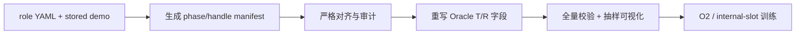

[文档索引](../README.md) · [项目首页](../../README.md)

> 命令不在 docs/ 下执行。带 cd 的独立示例从仓库根目录开始；其后命令沿用该目录。替换所有示例路径后再运行。

<a id=semantic-gt-roles></a>

# 严格 Semantic-GT Target/Reference

## 测试期 Heatmap Action Anchor 归因

标准 closed-loop 测试可选择输出 BridgeVLA translation heatmap 对应的动作锚点：

```bash
ORACLE_PROVIDER=rlbench_gt \
HEATMAP_ACTION_ANCHOR=1 \
bash eval.sh
```

旧的 `HEATMAP_TARGET_OBJECT=1` 仍作为兼容别名。该开关只在 policy evaluation 中
有效，不用于训练或 manifest 生成。provider 按需提供 YAML 中 Target
variation/sequence 的当前可见点云；agent 分别解码：

- `base`：Oracle adapter 之前的 BridgeVLA heatmap；
- `final`：实际用于执行 translation 的最终 heatmap。

若 checkpoint 没有保留 `trans_base`，`base_available=false`，此时 `base` 会回退为
`final`，不能用于判断 adapter 前后的变化。

两者都按 waypoint 到候选点云表面的最小距离输出 candidate、phase、距离和置信度，
并报告到当前 Reference 的距离。超过 0.20 m 为 UNKNOWN。日志前缀是
`[HeatmapActionAnchor]`。`phase=-1` 表示该物体只是配置中的非当前 episode 候选：它会
显示为动作锚点诊断，但会从 `base_eligible` / `final_eligible` 的语义 Target 候选中排除。

这些结果写入 `ActResult.replay_elements`，不覆盖当前 Oracle Target、不修改 Reference，
也不改变实际 action。translation waypoint 可能指向 Target、Reference、接触点或自由空间；
因此 action anchor 不是新的 Target/Reference GT，`final_matches_target=false` 也不自动表示
Oracle 标注错误。

### 让 simulator residual 跟随 BridgeVLA Target

若 simulator object 只用于修正 BridgeVLA，而不应独立决定操作对象，使用：

```bash
ORACLE_PROVIDER=rlbench_gt \
BRIDGEVLA_ALIGNED_OBJECTS=1 \
bash eval.sh
```

该模式执行两次 action forward：第一次只读取 residual 前的 `trans_base`，从所有可见任务
候选中选择最近 Target；第二次以该 Target 点云和 Reference 点云作为 residual 条件生成最终
动作。Target 会跨接近、抓取和搬运保持锁定；只有更强的连续 heatmap 证据、空抓/丢失抓取、
真实 grasp 覆盖或 gripper 重新打开才会改变锁定，避免 waypoint 转向放置点时误切换。

heatmap 只负责抓取前的意图候选。gripper 实际建立 grasp 后，provider 使用 simulator
`get_grasped_objects()` 的 live handle 反查候选；若唯一匹配，它会覆盖 heatmap lock，后续
residual 与最终可视化跟随真实抓取物体。`lock_source=1` 表示 heatmap，`2` 表示实际 grasp；
`grasp_override=true` 表示本步纠正了不一致。

锁定不是永久的：heatmap 候选连续两步比当前锁定对象近至少 2 cm 时允许切换；夹爪闭合且
连续两步确认未抓到候选时解除锁定，并在本次闭合周期屏蔽该失败候选，直到夹爪重新打开或
真实 grasp 建立。无可信锁时对象 residual 完全关闭，动作回到原始 BridgeVLA，不回退到
Oracle T/R。日志中 `recovery=1/2/3` 分别表示 heatmap 切换、空抓/丢失抓取解锁、真实
grasp 覆盖；`failed_blocked=true` 表示当前 heatmap 又指向本周期已失败的候选。

评估入口会强制设置 `oracle_compute_base=True`，因此不依赖训练配置中的
`oracle_log_base_loss`；checkpoint 无需重新训练。

存在可信 Target 锁时，优先使用配置中与其可验证配对的 Reference；无法解析配对关系时，
Reference 回退为 simulator 当前 Reference。`phase=-1` 仍表示该 Target 不属于当前 episode，
而不再意味着一定缺少 Reference 配对。日志 `[BridgeVLAAlignedObjects]` 中
`reference_source=1` 表示使用配对 Reference，`0` 表示使用当前 Reference；若
`used=false`，T/R residual 整体关闭，此时该字段不表示发生了 Oracle 回退。
该路径改变 policy action，应与纯诊断模式分别评估；它是 BridgeVLA-aligned predicted
conditioning，不再把所选 Target 称为 Oracle GT。

`ORACLE_DEBUG` 图仍审计 simulator 的任务 GT，不能代表第二次前向实际使用的对象；对齐后的
residual 以 `[BridgeVLAAlignedObjects] locked=...` 为准，打开 `VISUALIZE=1` 后生成的
`o2_target_prior` / `o2_reference_prior` 才对应最终前向输入。

本流程把 RLBench 当前 phase 的语义角色写入 replay，供 Oracle adapter、relation anchor，
以及 internal-slot 的角色 heatmap 监督使用。它不会生成完整场景 object slots，也不会补全
被真实相机遮挡的物体表面。

正式训练使用全量验证的 `phase_source=demo_events` buffer，不需要重新执行 simulator
expert action。闭环测试使用 live success-condition predicates 选择当前 T/R；两侧共享同一
role YAML、角色语义、`[N,3]` 点集、点数及 NULL/presence 契约。这里追求动作输入尽量一致，
不要求 phase 边界来源完全一致。



| 阶段 | 输出 | 主要函数 |
| --- | --- | --- |
| Manifest | 每个 episode 的 phase、T/R 语义与 handle | `build_demo_event_manifest()`；可选 sim 对照为 `RLBenchGTOracleProvider.observe()` |
| 对齐 | live → stored handle 映射与证据 | `align_handles()`、`align_semantic_handle_group()` |
| Replay 重写 | 固定大小 T/R XYZ、valid 与审计字段 | `_build_oracle()`、`_fill_slot()`、`_audit_fields()` |
| 校验 | `semantic_role_validation.json` 与抽样图 | `_validate_task_output()`、`_visualize_task_output()` |

完整函数定位见[数据流与函数索引](../reference/code-map.md)。

<details>
<summary>严格校验、恢复、handle 对齐与几何契约（按需展开）</summary>


`demo_events` 的生成统计写入 `manifest_results.csv`，字段为生成覆盖率（百分比）、
已生成/请求 episode 数和逻辑 transition 数；TensorBoard 标签为 `manifest_coverage_<task>`。
`eval.sh` 合并为 `*_merged_manifest_results.csv`。覆盖率 100% 只代表 manifest 生成完成，
不是模型闭环成功率，也不代表几何验证通过。普通评估继续使用 `eval_results.csv` 和 `eval_<task>`。
单个 episode 也会输出数值统计；缺失指标不再以 `unknown` 字符串写入 TensorBoard。
若旧版在 TensorBoard 收尾时报错，已经逐 episode 原子保存的 manifest 仍保留，
无需仅为该日志错误重新生成它们。
批量运行中途在 episode `N` 停止时，推荐保留原命令并增加
`EVAL_RESUME=1 SAVE_VIDEO=0 VISUALIZE=0`。这是通用恢复开关：

- 标准 closed-loop 测试每完成一个 episode，就原子保存
  `eval/<task>/<provider>/<model>/episode_results/<task>/episode_N.json`。重启时只有
  checkpoint、实验/MVT 配置、数据目录、episode length、Oracle 关键参数和核心评估源码
  的签名完全一致才会显示 `[Evaluation][RESUME] ... skipped`；签名不同、文件损坏或
  字段无效会重跑。
- `MANIFEST_PHASE_SOURCE=demo_events` 时复用已验证的 manifest，显示
  `[Manifest][RESUME] ... skipped`。缺失、损坏、未完成、alignment 模式或当前 role
  YAML 摘要不一致的 episode 会重新生成。启动时会打印本次实际读取的完整
  `semantic_role_manifests` 路径；不兼容旧文件先无损移动到
  `rejected_semantic_role_manifests/<task>/`，避免失败重试时旧文件继续混在有效目录。
- 正式 `demo_events` 生成可安全恢复。`sim_replay` expert-action manifest 仅作独立的 phase
  对照，不能安全地从普通评估结果恢复，也不是训练前置条件。
- resume 不支持同时保存视频或逐帧可视化，因为跳过的 episode 无法补回这些视觉产物。
  直接调用 `eval.py` 时 resume 仅支持单任务；启用 resume 后，`eval.sh` 会把
  `TASKS="all"` 展开成 18 个独立任务进程，避免跳过整个任务后 simulator task 状态错位。
  因而全任务恢复时会有逐任务重新加载模型的启动开销。

`MANIFEST_RESUME=1` 和 CLI `--manifest-resume` 仍是兼容别名，新命令统一使用
`EVAL_RESUME=1` / `--eval-resume`。旧标准测试没有逐 episode 日志，第一次开启 resume
仍需运行一次；之后才能自动跳过。也可手工使用
`START_EPISODE=4 EVAL_EPISODES=96`，其中 `EVAL_EPISODES` 是本次运行数量，不是终止下标。
Manifest resume 会检查已保存的 mask 指纹是否存在，但为了在 simulator 启动前快速跳过，
不会重新读取 raw mask 计算哈希；semantic replay 重写阶段仍会逐 episode 重算并严格比对。

批量 strict 生成不希望因单个对齐错误停止时，可同时设置
`MANIFEST_CONTINUE_ON_ERROR=1`。该开关只适用于 `demo_events`：失败 episode 不会生成
manifest，也不会伪造 handle 映射；错误记录原子写入
`semantic_oracle/manifest_failures/<task>/episode_N.json`，随后继续下一 episode。建议始终与
`EVAL_RESUME=1` 配合；修复对齐问题后重跑相同命令，完整 episode 被跳过，失败 episode
再次尝试，成功后旧 failure marker 自动删除。最终 `Generated Coverage` 小于 100% 就表示
仍有失败项，不能把该批 manifest 当作完整训练输入。

## 可选的 mask 身份验证（不代表点云几何通过）

`ORACLE_HANDLE_ALIGNMENT=verified` 仍为默认：同时检查多视角 mask 和 1 cm 点云距离。
若已配准视角的完整实例 mask 完全相同，但点云距离检查失败，可显式改为
`ORACLE_HANDLE_ALIGNMENT=mask_verified`。该对齐用于两种 manifest 生成路径；在线 policy
推理始终使用当前 simulator 的 live handles，不执行 stored-handle 映射。
其余命令参数不变，无需关闭 `ORACLE_STRICT=1`。

主路径要求至少两个支持视角、每个至少 16 像素、完整实例 mask 的
precision/recall 均不低于 0.9，并且映射唯一。`mask_verified` 中两票高 overlap 已形成
quorum 后，第三视角冲突只记入审计，不否决两票；不足两票时，冲突仍限制受限回退。
`verified` 模式的实质性冲突仍会否决。隐藏实体不能靠这个模式猜测。
`min_pixels=16` 只决定某视角能否提供正向投票，不单独制造 hard conflict。例如
15/16 像素且 15 像素重合属于弱支持，不会否决另外两个完全一致的视角；0/16 或
precision/recall 低于 0.5 仍记为 hard conflict，但不能否决已经形成的 mask-only 两票 quorum。
薄环等只在一个相机达到 16 像素的实体采用受限回退：候选必须全局唯一，并且只有一个
可见检查、至少 32 像素、mask precision/recall 均不低于 0.98、点云 P95 距离不超过
1 cm。报告以 `registered_mask_overlap_single_view_geometry` 标记；不满足任一条件仍拒绝。
顶层 `geometry_policy=audit_only_except_explicit_identity_corroboration` 表示全局点云几何
仍未认证；只有明确列出的受限身份回退会使用当前实例的局部几何作为佐证，包括单视角
几何回退，以及唯一小物体候选的“一个精确视角 + 一个轮廓膨胀视角”证书。
对于由多个 simulator handles 组成的同一语义实体，若某个部件在所有已配准视角均少于
16 像素且没有候选映射，该部件以 `excluded_unobservable` 记入审计而不猜测 ID；只有
同一实体至少还有一个其他部件通过多视角映射时才允许生成。若整个实体不可观测，仍会
在 strict 模式中终止。
`reach_and_drag` 是明确例外：RLBench 的彩色 `target0` 不出现在保存的实例 mask 中，
因此 Reference 定义为 `site`，而不是伪造 object handle。Target 仍为 `stick`；当前
兼容表示及后续统一几何约定见 [交互实体几何表示](#semantic-gt-entity-geometry)。
点云偏差只审计，不阻止身份映射；不修正原始点云，也不保证所有 episode 都能通过。
报告和 manifest 使用独立的 `status=mask_verified`、`geometry_verified=false`；
逐候选视角包含 `geometry_passed` / `geometry_warnings`。

普通证书失败后按下表检查 relocation/shifted，再检查 scene-ranked fallback。
以逐候选 `source`、`certificate` 和 `failure_reasons` 为准，不能只看顶层 status。

| 路径 | 必要证据与 quorum |
| --- | --- |
| 主 mask quorum | 两个独立配准视角高 overlap，候选唯一；第三票冲突不能否决 |
| 单视角等受限证书 | 仅接受代码明确规定的 exact/interior/small-instance 证书；局部几何是否认证依证书类型，不一般降低阈值 |
| relocation / shifted | 大支撑面覆盖的双视角 trigger，或三视角至少 60% 双向 mask overlap；去中心几何证据至少 `max(2,min(3,visible_views))` 票 |
| scene-ranked | 普通证书失败后，像素/几何/containment 与 score margin 均须通过；严格多数 `max(2,visible_views//2+1)`，即 3 可见视角需 2 票、4 需 3 票 |

relocation 记录 `registered_centered_geometry_relocation`，shifted 记录
`registered_centered_geometry_shifted_mask`，scene-ranked 记录 `registered_scene_ranked_fallback`。
几何同形候选也必须有证书要求的唯一 mask/排名证据，不能仅按形状猜 ID。局部证书不代表整幅
场景几何对齐；`geometry_verified` 仍为 `false`，也不修正原始点云。

后续 `tools/rewrite_replay_with_semantic_roles.py` 默认拒绝这种 manifest。
检查几何审计并决定接受后，须显式添加 `--allow-mask-verified-handles`，
输出到独立 buffer。正式几何可信的 upper-bound 实验仍应先定位并修复深度偏差，
不能将 mask 身份验证通过描述为几何验证通过。

正式 O2 upper-bound 不再使用最近距离、运动幅度、Qwen 或时域 ID 猜测角色。唯一语义
契约是 `finetune/RLBench/configs/rlbench_o2_semantic_roles.yaml`：Target 是当前未完成
子目标中必须直接接触、抓取或控制的实体；Reference 是该子目标终止条件中与 Target
构成空间关系的唯一物体或 site。单物体关节任务没有 Reference。一个语义实体可合并
多个 simulator handles，phase 只在 live RLBench 成功条件满足后推进。

<a id="semantic-gt-entity-geometry"></a>

### 交互实体几何表示

predicted/internal-slot 路线的统一目标是将语义角色与几何载体分开：instruction 决定
整项任务相关的实体集合，phase 再从中绑定当前唯一的 Target/Reference。当前 V1 replay
接口统一使用固定大小的 XYZ 集合：

```text
G_xyz = {x_i ∈ R^3}_{i=1..N}
```

`kind=object` 从四视角实例 mask 的可见表面点云采样。`kind=site` 使用
`SiteGeometry(primitive=box_volume)`：记录世界坐标 `center_world [3]`、
`rotation_world [3,3]`、完整边长 `extent [3]` 和 `source`，再用确定性的低差异采样生成
定向体积点集。几何优先来自 PyRep 对象局部 bounding box 与 world matrix；平面或线形
bbox 保留其零 extent 轴。仅当 bbox 接口缺失或三轴全为零时，才以对象位置为中心生成
`[0.02,0.02,0.02] m` 的 `fallback_box`。这个 fallback 是人为交互 kernel，不是传感器
或 dummy 的真实物理体积。`site_position` 仍单独保留，供 phase/contact 距离判断使用。

全局 fallback 在 semantic-role YAML 中配置为：

```yaml
site_geometry_defaults:
  primitive: box_volume
  fallback_extent_m: [0.02, 0.02, 0.02]
```

单个 site role 可在 `site_geometry.fallback_extent_m` 覆盖边长；V1 不接受其他
primitive。

manifest 与离线重写器使用 `rlbench_o2_semantic_roles_v2`，完整序列化上述描述；旧 v1
manifest 会被拒绝，不能静默恢复为重复中心点。当前 schema 仍只有 XYZ 与 valid；
normal、weight、置信度和未被当前 phase 选中的完整实体集合属于后续版本。已有 semantic
manifest 与 semantic-GT buffer 必须重新生成；网络输入 shape 和参数结构未变，已有 O2
checkpoint 可继续加载。

| 任务类型 | Target / Reference | phase 规则 |
| --- | --- | --- |
| 单关节 | `open_drawer`、`push_buttons`、`turn_tap`：T 为源码指定的可动部件，R 不存在 | 对应 joint condition 满足 |
| 单次放置 | `close_jar`、`light_bulb_in`、`meat_off_grill`、`place_shape_in_shape_sorter`、`place_wine_at_rack_location`、`put_groceries_in_cupboard`、`put_item_in_drawer`、`put_money_in_safe`、`slide_block_to_color_target` | variation 决定唯一 T/R；detector 和需要时的释放条件满足 |
| 顺序操作 | `place_cups`、`stack_blocks`、`stack_cups` | 固定源码顺序；空抓、错误张合和其他物体移动不推进 |
| 工具任务 | `reach_and_drag`：stick/target；`sweep_to_dustpan_of_size`：broom/dustpan site | 不新增第三个 Tool 通道 |
| 几何选择 | `insert_onto_square_peg`：ring/与 `success_centre` 对齐的 pillar | 四个 detector 同时满足 |

manifest 会记录完整 `site_geometry`；replay audit 还记录
`oracle_{target,reference}_geometry_source`，以区分 `object_mask`、`object_bbox`、
`fallback_box` 和 `none`，这些字段不输入网络。

正式生成前先对全部 variation 做 strict reset 审计（不需要 checkpoint）：

```bash
cd finetune/RLBench
python validate_semantic_roles.py \
    --output-dir semantic_role_validation \
    --headless
```

任一对象选择器无法解析、T/R 混入 robot handle 或层级不满足契约时立即报错；成功时
输出 `variation_role_audit.json`、逐 variation 首帧 audit 图和 provider 统计。

</details>

## 1. 生成 phase/handle manifest

### 可选诊断：`sim_replay` phase 对照

这条路径在 RLBench 环境中回放保存的 expert keypoints。每个 episode 只调用一次
`reset_to_demo`，provider 直接查询 task 对象属性、层级、variation、success condition 和
四视角 GT mask。它用于量化多阶段任务的 phase 时序差异，不是正式训练前置步骤：

```bash
cd finetune/RLBench
TASKS="all" \
MODEL_FOLDER=/home/yiwei/project/BridgeVLA/checkpoints/RLBench_sim_replay_phase_audit \
MODEL_NAME=model_80.pth \
EXP_CFG_PATH=/home/yiwei/project/BridgeVLA/finetune/RLBench/configs/rlbench_config.yaml \
EVAL_DATAFOLDER=/home/yiwei/project/BridgeVLA/LPY/BridgeVLA_RLBench_TRAIN_DATA/train \
EVAL_EPISODES=100 \
EPISODE_LENGTH=50 \
REPLAY_GROUND_TRUTH=1 \
GT_REPLAY_RETRIES=3 \
MANIFEST_PHASE_SOURCE=sim_replay \
ORACLE_HANDLE_ALIGNMENT=mask_verified \
SAVE_VIDEO=0 \
ORACLE_PROVIDER=rlbench_gt \
ORACLE_STRICT=1 \
ORACLE_DEBUG=0 \
bash eval.sh
```

manifest 生成只回放 expert action，不调用 policy，因此可以使用已有 baseline checkpoint，
不依赖尚未训练的 O2 checkpoint；模型仅用于复用现有 eval 启动入口。

`GT_REPLAY_RETRIES` 表示首次 expert replay 失败后，最多从同一个 `reset_to_demo`
完整重跑 episode 的次数，默认是 3；设为 0 可关闭。重试不会增加逻辑 episode 或任务切换
计数，Final Score 仍只统计每个 episode 最终采用的尝试。provider 会丢弃失败尝试的全部
entries，manifest 的 `generation_attempt` 从 1 开始记录最终采用的是第几次尝试。若全部重试仍失败，
保留最后一次失败 manifest，离线重写器会因最终 `completion_satisfied=False` 拒绝使用。

### 正式训练：可恢复的 `demo_events`

18 个任务均支持不重新执行动作的 stored-demo phase 模式。这是正式 semantic-GT buffer
的 manifest 来源；命令可恢复，且不需要先生成 `sim_replay` manifest：

```bash
export REPO=/home/yiwei/project/BridgeVLA
export RAW_DATA=$REPO/LPY/BridgeVLA_RLBench_TRAIN_DATA/train
export MODEL_FOLDER=$REPO/checkpoints/RLBench
export MODEL_NAME=model_80.pth

cd "$REPO/finetune/RLBench"

TASKS="all" \
MODEL_FOLDER="$MODEL_FOLDER" \
MODEL_NAME="$MODEL_NAME" \
EXP_CFG_PATH="$REPO/finetune/RLBench/configs/rlbench_config.yaml" \
EVAL_DATAFOLDER="$RAW_DATA" \
START_EPISODE=0 \
EVAL_EPISODES=100 \
EPISODE_LENGTH=50 \
DEVICE=0 \
REPLAY_GROUND_TRUTH=1 \
MANIFEST_PHASE_SOURCE=demo_events \
EVAL_RESUME=1 \
MANIFEST_CONTINUE_ON_ERROR=1 \
ORACLE_PROVIDER=rlbench_gt \
ORACLE_ROLE_CONFIG="$REPO/finetune/RLBench/configs/rlbench_o2_semantic_roles.yaml" \
ORACLE_NUM_POINTS=512 \
ORACLE_HANDLE_ALIGNMENT=mask_verified \
ORACLE_STRICT=1 \
ORACLE_DEBUG=0 \
SAVE_VIDEO=0 \
VISUALIZE=0 \
bash eval.sh
```

按实际数据量修改 `EVAL_EPISODES`；若 expert keypoint 数超过当前上限，应增大
`EPISODE_LENGTH`。`EVAL_RESUME=1` 会把 `TASKS="all"` 展开成 18 个独立任务进程，
并自动重新生成缺失、损坏、旧 v1 或与当前 role YAML 摘要不一致的 manifest。

该模式不调用 simulator `step()`，因此没有 IK、路径规划或接触重放失败，也不需要重试。
18 个任务使用 YAML 中逐任务声明的严格策略：

| 策略 | 任务 | phase 边界 |
| --- | --- | --- |
| `single_success` | 除下列 4 个多阶段任务外的 14 个任务 | 成功 stored demo 的末帧；这些任务始终只有 phase 0 |
| `release_cycles` | `place_cups`、`stack_blocks`、`stack_cups` | 每次夹爪 close→open 完成一个固定顺序子目标；释放次数必须严格等于 phase 数 |
| `ordered_target_contact` | `push_buttons` | 按源码固定按钮顺序，在 expert keypoints 中用夹爪到对应 GT top-plate 的距离定位接触；要求边界严格递增且距离不超过 YAML 的 `max_distance` |

`push_buttons` 使用接触距离仅定位“何时切 phase”，不会用距离选择“哪个物体是
Target”；Target 顺序仍唯一来自任务源码和 YAML。原因是当前 legacy stored observation
没有 task joint state，无法离线读取 `button_joint >= 0.003`。manifest 会额外保存
`phase_strategy`、`phase_boundary_source`、`phase_boundary_frames`，按钮任务还保存
`contact_distances`，便于审计；任何次数、顺序、可见性或距离校验失败都会终止该 episode，
不会静默退回启发式角色。

manifest 和每个 entry 都记录 `phase_source=demo_events`，并把 object handles 严格转换到
raw dataset 的 stored mask namespace。在线闭环仍以 live success conditions、live handles
和当前可见点云构造完全相同格式的 T/R 输入。14 个 `single_success` 任务没有中间 phase
切换；`place_cups`、`stack_blocks`、`stack_cups`、`push_buttons` 仍可能存在少量 phase
切换时序差异，应按 phase 单独统计失败，而不是为此改用 sim replay 重建训练集。

`MANIFEST_PHASE_SOURCE=sim_replay` 只保留为可选上界/phase 审计。若生成，必须使用独立
`MODEL_FOLDER`，不能覆盖正式 `demo_events` manifest。
生成前仍会执行一次 simulator reset，并将 live 首帧与 stored demo 第 0 帧的 T/R handle
可见性进行交叉检查；只有 manifest 中 `source_alignment_validated=true` 时，离线重写器
才接受该 demo-events 标注。
该模式日志中的 `Generated Coverage=100` 只表示原始 demo 通过事件校验并生成了完整
manifest，不表示重新执行动作获得了 100% closed-loop success。

生成训练 manifest 时必须显式指定对应的训练 raw 数据目录。前一个命令中的临时
环境变量不会自动保留给下一个命令；省略 EVAL_DATAFOLDER 会采用脚本默认值或
shell 已导出的值。

若出现首帧 live/stored 不一致，检查现在会在 phase 生成前失败，并列出 T/R 的
live handles、各相机保存 mask 中的匹配像素数、有效点数和主要 handle：

- stored_masks_missing：保存 observation 没有加载 mask。
- matching_mask_pixels_but_no_finite_point_cloud：mask 有对应实例，但缺点云或对应点均无效。
- live_role_handles_absent_from_stored_masks：保存 mask 中没有当前 simulator 的角色 handle；
  需检查数据目录、原始采集环境及名称到 handle 的映射。

reset_to_demo 恢复场景初始条件，并不能据此保证跨 simulator 会话的 handle 编号相同。
demo_events 默认启用 ORACLE_HANDLE_ALIGNMENT=verified。在首次生成 phase 前，收集
该 episode **所有 phase** 的 T/R 可渲染部件，建立一次 live→stored 映射，随后统一使用
stored handles 提取保存帧点云。不可渲染的物理部件、dummy/joint 不需要 mask ID；
首帧遮挡的可渲染部件仍必须有映射，不能默默忽略。

| 参数或检查 | 行为 |
| --- | --- |
| ORACLE_HANDLE_ALIGNMENT=verified | 默认；用于 manifest 的 live→stored 证书，在线 policy 仍使用 live handles |
| ORACLE_HANDLE_ALIGNMENT=identity | 旧编号假设，仅用于已有同编号数据的兼容检查；不能解决编号错配 |
| ORACLE_HANDLE_MAP_DIR | 可选原始采集映射根目录，文件为 task/episode_N.json；显式指定后缺文件或内容不完整会报错 |
| 相机一致性 | 逐视角检查内外参（绝对容差 1e-4）和 mask/点云分辨率；无法配准的视角退出匹配并记录原因，其余视角继续验证 |
| 自动匹配证据 | 至少两个相机各有 16 个实例像素，mask 双向覆盖率均 ≥0.90，对应点的三维距离 P95 ≤1 cm，且 ≥95% 重合像素有有限点坐标 |
| 冲突处理 | 已配准相机的 mask/几何证据有矛盾、对应关系不唯一、多对一、部件缺失均拒绝；自动匹配仍要求至少两个相机支持每个部件 |

兼容模式不会替换上述证书。只有 `mask_verified` 的原有路径得到 `accepted=[]`、且没有
原始采集映射时，才启用统一的 `scene_ranked_fallback_v1`：对所有未占用 saved handles
使用同一组多视角 mask containment、面积比例、中心化点云、extent 和位移指标排序。
视角 quorum 使用严格多数（2→2、3→2、4→3）。单一几何候选仍需达到最低分；存在多个
候选时还必须有达到 quorum 的多视角注册重合和明确的第一/第二名
分差，否则继续拒绝。成功审计写入 `scene_ranked_fallback_verified=true` 和
`source=registered_scene_ranked_fallback`。完整 manifest 在 `EVAL_RESUME=1` 下仍直接跳过，
不会因加入该失败后回退而重写。
为避免小物体在不同相机中的遮挡轮廓把真实实例误拒，只有单视角 mask containment ≥0.70
时，该视角的 extent error 上限才从 1.5 cm 提高到 3 cm；质心偏移、中心化点云距离、面积
比例、视角 quorum 和多候选 margin 均不放宽。没有注册 mask 支持的候选仍使用 1.5 cm。

优先读取显式文件，其次读取 demo[0].misc.oracle_handle_metadata；都没有时才尝试上述
已标定多视角的 mask 对应。这是有几何证据的编号配准，**仍需检查真实数据的 audit**，
并不等价于原始采集时记录的身份真值。manifest 用 source 区分 acquisition_metadata 与
registered_masks；T/R 语义仍由任务配置决定。

例如 wrist 外参在 live reset 与 stored 第 0 帧之间不一致时，该视角不能做逐像素匹配；
可由其余已配准视角继续建立映射。evidence._registration 记录 used_cameras、
excluded_cameras，以及标定矩阵的最大元素差值。排除后少于两个有效视角会明确报错。
这里排除仅影响首帧编号配准；映射建立后，保存数据的四视角仍参与 T/R 点云提取。
有原始采集映射时沿用元数据路径的检查规则，至少保留一个已配准视角。

原始映射文件使用以下格式（数值仅示例，必须替换成采集时真实 ID，包含所有所需可渲染子部件）：

```json
{
  "schema_version": "rlbench_name_to_handle_v1",
  "task": "close_jar",
  "episode_idx": 0,
  "variation": 4,
  "name_to_handle": {"jar_lid0": 12345, "jar0": 12346}
}
```

映射元数据必须来自对应 episode；程序检查 task/variation/episode/schema，并拒绝可见区域
与声明矛盾的映射。对于完全不可见部件，依赖采集元数据的真实性。失败证据即使
ORACLE_DEBUG=0 也写入 semantic_oracle/handle_alignment/task/episode_N.json。

每个成功 episode 的 manifest 立即原子落盘；后续 episode 失败不会丢失之前已完成的文件。
manifest 的 handle_namespace=stored，handle_alignment 保存 live_to_stored 和各视角证据。
离线重写器直接使用 stored handles，并检查原始第 0 帧 mask 的 SHA-256 指纹，防止对另一份
数据应用映射。生成与重写必须使用相同 raw 数据及 mask 分辨率。无需重新生成 baseline replay。
source_alignment_validated 表示相应检查通过；它不替代真实 simulator episode 的验收。

对 18 个任务可把 `TASKS` 设为 `finetune/bridgevla/utils/rvt_utils.py` 中的完整任务列表。
若 expert keypoint 数超过 `EPISODE_LENGTH`，离线重写器会拒绝不完整 manifest，不能静默
沿用最后一个 phase。每个 checkpoint/task 的输出位于：

- `.../eval/<task>/rlbench_gt/<model>/semantic_oracle/semantic_role_manifests/<task>/episode_N.json`；
- `oracle_provider_stats.json`：区分 `mapping_errors`、`not_visible_*` 和 `no_reference`；
- `semantic_role_audits/<task>/episode_N/role_audit_step_NNN.png`：按
  `ORACLE_DEBUG_INTERVAL` 输出 policy step；包含四视角 overlay、原图、instance handles、
  以 `30% 完整 RGB 层 + 70% role-mask 层` 合成的 Target/Reference 图、三正交点云与
  phase 状态。非角色区域保留较暗的 30% RGB，角色区域叠加红/蓝色以突出边界。

## 2. 只重写 Oracle 字段，生成 semantic-GT buffer

以下命令在仓库根目录执行；若刚运行完上一节，请先返回仓库根目录。先检查 manifest
是否完整。18 个任务、每个 100 个 episode 时，manifest 数应为 1800，failure 数应为 0：

```bash
find $MODEL_FOLDER/eval \
    -path '*/semantic_role_manifests/*/episode_*.json' \
    -type f | wc -l

find $MODEL_FOLDER/eval \
    -path '*/manifest_failures/*/episode_*.json' \
    -type f | wc -l
```

使用独立输出目录重写，避免已有旧 buffer 被 `--resume` 跳过：

```bash
export SEMANTIC_BUFFER=$REPO/LPY/BridgeVLA_RLBench_SEMANTIC_GT_MASK_VERIFIED_Buffer

cd $REPO

python tools/rewrite_replay_with_semantic_roles.py \
    --replay-dir $REPO/LPY/BridgeVLA_RLBench_TRAIN_Buffer \
    --raw-data-dir $RAW_DATA \
    --manifest-dir $MODEL_FOLDER/eval \
    --output-dir $SEMANTIC_BUFFER \
    --task all \
    --max-objects 32 \
    --num-points 512 \
    --cache-frames 128 \
    --cache-episodes 2 \
    --workers 4 \
    --allow-mask-verified-handles \
    --validate-output \
    --validate-every 1 \
    --visualize-every 500 \
    --visualize-output-dir $REPO/LPY/semantic_role_visualizations \
    --resume
```

### 这份 buffer 是否适合当前 design

结论是：**适合 Oracle relation/anchor 主线，也适合当前 phase 的 T/R heatmap 监督；但不能
把 `~valid` 用作 NULL 标签，也不能作为通用 object discovery 数据。**

| 用途 | 适配性 | 原因与使用边界 |
| --- | --- | --- |
| `o2_gt_instance` / relation adapter | 直接适合 | slot 0/1 就是当前 phase 的 T/R，`512` 点与现有配置一致 |
| `oracle_prior_relation_anchor` | 直接适合 | anchor 以当前 relation state 和 T/R 几何为条件，不需要显式 phase affordance 标签 |
| Internal slots 的 T/R heatmap | 有条件适合 | 可作为角色 mask/heatmap teacher；训练时 Oracle 点不会进入 policy adapter |
| NULL Reference / presence loss | 审计字段完整时适合 | 新 loader 从角色 `kind` 派生 presence/known，几何 invalid 不再用作 NULL 标签 |
| 全场景 object-slot pretraining | 不适合 | 数据只保存已选中的当前 T/R，不包含 distractor 和未选中的任务相关实体 |
| 遮挡补全或 temporal memory | 不适合 | object 点来自当前四相机可见表面；虚拟正交视图只是同一可见点云的再投影 |

`--max-objects 32` 与现有 replay shape 兼容，但 semantic rewriter 实际只使用角色 slot
`0/1`；它不会因此产生 32 个场景实体。`--allow-mask-verified-handles` 表示接受严格 mask
身份映射、同时保留“点云几何未通过身份认证”的审计状态；它不意味着物体几何完整，也
不应描述为 geometry-verified upper bound。

当前 replay audit 已保存 `oracle_reference_kind=none` 等语义信息，新 loader 在读取时派生
`oracle_target_present` / `oracle_reference_present` 和 `oracle_role_present_known`，无需重写点云。因此：

- 只做 Oracle adapter / anchor：可以直接使用这条命令生成的 buffer；
- 做 internal-slot heatmap 消融：可以使用，但建议先设
  `rvt.object_slot_null_loss_weight: 0.0`，不要声称已学习可靠 NULL；
- 要训练 NULL/presence：使用 [joint 配置](../experiments/object-conditioned-joint.md)，presence 来自已有 kind；
  缺少审计或终止占位只屏蔽该监督，`oracle_object_valid` 继续表示几何可用。

这一区分也适用于遮挡：`present=True, valid=False` 只屏蔽相关几何条件，不改写为 NULL。
新预测模式不因 Reference 不可用而关闭有效 Target；独立 visibility 与 memory 本轮不提供。

工具保留 action、图像、点云、语言、`episode_idx/sample_frame` 和其他 baseline 字段；只
替换六个 Oracle tensor，并增加不输入网络的审计字段：schema version、phase ID、T/R
semantic name、kind、几何来源、原始 handle 集合、`oracle_phase_source` 及各角色 valid。输出中的 T/R 使用固定小 slot ID
`0/1`，不会把上千万的 simulator handle 当作显示 ID；真实 handle 仍保存在 audit 字段。

严格行为如下：

- live mask 与保存 mask 在相同 manifest frame 的 handle 体系不一致：立即停止并报告
  `mapping_error`，禁止用邻近实例代替；
- 角色正确但当前四个相机均不可见：该角色 `valid=False` 并计入 `not_visible`；
- 任务定义没有 R：计入 `no_reference`，不是异常，网络的 R residual 为零；
- raw/replay frame 越界：立即停止，不截断到最后一帧，也不生成伪点云；
- `--resume` 只按目标文件是否存在来跳过已经原子写完的 replay，不会检查 manifest 是否
  更新。上面的新输出目录可保留旧 buffer 并完整重写；若明确需要原地替换旧目录，应移除
  `--resume` 并使用与其互斥的 `--overwrite`。完全 resume 的任务可能在
  `semantic_role_rewrite_stats.json` 中显示 `files=0`，它只表示本次没有新写文件；输出总数
  和有效性应以 `semantic_role_validation.json` 为准。
- `--workers N` 按 task 使用多进程，不会把同一 task 内的 replay 拆给多个进程；每个 worker
  拥有独立的 frame/episode cache，因此内存和 raw-data I/O 会随 worker 数增加。磁盘数据集
  建议从 2 或 4 开始。生成结束后的 validation 和 Matplotlib 可视化保持顺序执行，避免
  多进程同时复读全部输出或渲染图片。
- `--validate-output` 在生成或 resume 后检查完整的输入/输出文件集合，并复读选中的
  replay，检查 baseline 字段不变、v2 audit、Oracle shape/dtype/有限值、role-valid
  一致性，以及有效 site 至少包含两个不同 XYZ 点。默认
  `--validate-every 1` 为全量验证；例如 `--validate-every 100` 会确定性验证排序后
  第 0、100、200……个 replay，并强制验证最后一个，适合快速抽查。每个任务写入
  `semantic_role_validation.json`，其中 `validation_mode`、`validated_files`、
  `validation_fraction` 和 `counts_scope` 会明确区分全量与抽样结果；任一已检查项
  失败时命令以错误退出。
- 抽样报告中的 `nonterminal_files`、`site_roles`、`raw_fallback_files` 和
  `phase_sources` 只统计被抽到的 replay。正式 strict 数据验收应省略
  `--validate-every`（或设为 1），并同时满足 `validation_complete=true`、
  `valid=true`、`raw_fallback_files=0`，且 `phase_sources` 只有
  `demo_events`；`role_config_sha256` 还必须与训练使用的 role YAML 一致。
- `--visualize-every N` 直接读取已写入 semantic replay 的 T/R 点，每隔 N 个排序后的
  replay 输出一组 PNG 和同名 JSON；不会重新运行启发式对象提取。PNG 包含四视角 RGB、
  mask box、场景点云和 T/R 的透视/三正交视图，JSON 记录 phase、semantic name、kind
  与 geometry source。输出目录由 `--visualize-output-dir` 指定。单任务抽查可改用
  `--visualize-index N`；两者互斥。添加 `--visualize-objects-only` 可隐藏灰色场景点云。
- `--cache-frames` 与 `--cache-episodes` 都是有界 LRU；默认最多保留 128 个 Oracle
  帧和 2 个 episode 的 low-dim 数据，不会随已处理 episode 数持续增长。

## 3. 正式 semantic-GT O2 训练

```bash
cd $REPO/finetune/RLBench
bash train.sh \
    --exp_cfg_path configs/rlbench_o2_semantic_gt.yaml \
    --train_replay_storage_dir $SEMANTIC_BUFFER \
    --init_checkpoint $MODEL_FOLDER/$MODEL_NAME \
    --train_oracle_adapter_only
```

`rlbench_o2_semantic_gt.yaml` 设置 `oracle_semantic_audit=True`；旧启发式 buffer 必须继续
使用 `rlbench_o2_gt_instance.yaml`（audit schema 默认关闭）。两类 buffer/checkpoint 不应
混在同一实验目录。semantic mapping 是 privileged GT，结果只能解释为 Oracle 上界。

该配置同时启用 fail-closed semantic contract。训练启动会要求每个 task 存在全量
`semantic_role_validation.json`，并核对 schema、`demo_events`、512 点以及 role YAML SHA-256；
报告还必须声明 manifest 已转换为 stored handle namespace。checkpoint 保存同一 contract；
闭环加载时使用运行时 YAML 和点数再次核对。旧 checkpoint、`sim_replay` buffer 或不同
YAML 会明确报错，不会静默测试。该校验约束训练数据来源，不要求在线 provider 伪装成
stored-demo phase tracker。旧 buffer 若没有
`oracle_role_config_sha256`，请用新输出目录重新运行 rewriter；`--resume` 不会改写已存在文件。

兼容既有 demo-trained checkpoint：若 checkpoint 只缺少后来新增的 `semantic_contract`
字段，闭环不会再中止，而是打印 `legacy_demo_checkpoint` warning，并以当前
`demo_events` 配置、role YAML 和点数运行。这个兼容只处理“字段缺失”；checkpoint 已带
contract 但内容不匹配时仍拒绝。训练 replay 的全量 validation、handle alignment 与
`source_alignment_validated` 检查也不会因此关闭。

训练模式、消融和评估见 [O2 实验](../experiments/o2-training.md)。
