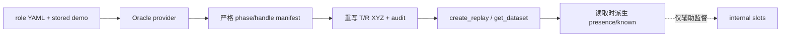

# 数据流与函数索引

[文档索引](../README.md) · [Object-prior 模式](../experiments/object-prior-modes.md) · [联合实验](../experiments/object-conditioned-joint.md)

## Semantic-GT 数据流



| 阶段 | 文件或函数 |
| --- | --- |
| 角色/manifest | `finetune/RLBench/utils/o2_oracle_provider.py`：`_build_assignment()`、`build_demo_event_manifest()` |
| handle 证书 | `oracle_handle_alignment.py`：`align_handles()`、`align_semantic_handle_group()` |
| object/site 几何 | `_sample_entity_points()`、`site_geometry_from_object()`、`sample_site_geometry()` |
| replay 重写/审计 | `tools/rewrite_replay_with_semantic_roles.py`：`_load_manifest()`、`_build_oracle()`、`_fill_slot()`、`_audit_fields()` |
| 校验/可视化 | `_validate_semantic_transition()`、`_validate_task_output()`、`_visualize_task_output()` |
| schema/loader | `finetune/RLBench/utils/dataset.py::create_replay()`、`utils/get_dataset.py::get_dataset()` |
| 旧数据 presence | `uniform_replay_buffer.py::_derive_role_presence()`、`_copy_required_disk_fields()`；不改写文件 |
| train/eval 契约 | `finetune/RLBench/utils/semantic_contract.py`、`train.py::_validate_semantic_replay_schema()`、`eval.py::load_agent()` |

## Policy 数据流

```text
RVTAgent.update/act
 → MVT.forward：Oracle 或预测模式输入隔离
 → MVTSingle.forward：同次 VLM feature / instruction context
 → slots（预测模式）→ relation/anchor adapter
 → action_feature_routes → translation / R/G/C
```

| 功能 | 函数或模块 |
| --- | --- |
| 模式解析 | `resolve_object_prior_mode()` |
| Oracle/external 选择 | `RVTAgent._select_oracle_prior_points()`、`_oracle_network_kwargs()` |
| prior 投影 | `MVT._build_oracle_instance_prior()`、`rasterize_instance_points()` |
| 同次前向 text pooling | `object_conditioning.py::pool_instruction_context()` |
| 内部 maps/tokens/NULL | `InternalObjectSlotPredictor.forward()` |
| 可微可见几何 | `object_conditioning.py::soft_role_geometry()`；`_extract_points()` 仅兼容/可视化 |
| 原 relation / anchor query | `OracleRelationGatedFeatureAdapter`、`OracleRelationAnchorFeatureAdapter.forward_with_anchor()` |
| 完整动作特征 | `action_feature_routes()`、`MVTSingle.forward()`，共享模式重新池化 global |
| teacher-only 辅助监督 | `RVTAgent._object_slot_auxiliary_losses()`、`reference_null_loss()` |
| 初始化/resume | `train.py::load_initial_model_checkpoint()`、`load_training_checkpoint()` |
| 配对闭环 CI | `tools/compare_paired_success.py::compare()` |

## 配置与实现状态

| 配置/能力 | 入口或状态 |
| --- | --- |
| `rlbench_o2_semantic_gt.yaml` | 旧 Oracle relation adapter |
| `rlbench_o2_semantic_gt_relation_anchor.yaml` | 旧 translation-anchor 路由 |
| `rlbench_o2_predicted_objects.yaml` | 外部预测 T/R |
| `rlbench_o2_internal_slots.yaml` | 旧单帧 heatmap 诊断，NULL weight 默认 0 |
| `rlbench_o2_semantic_gt_joint.yaml` | opt-in shared action + instruction，先验证 GT |
| `rlbench_o2_internal_slots_joint.yaml` | opt-in soft roles/geometry + joint training，GT gate 后实验 |
| present/known、soft tokens、instruction query | 已提供代码，数值/闭环待目标环境验收 |
| visibility、当前 EE pose、跨 query memory | 未实现；`RVTAgent.reset()` 不维护 role memory |
| 显式 phase/graph、object-local views、risk head | 不进入本轮；按瓶颈选扩展 |

`current_state[B,3]` 是当前夹爪状态，不是 phase GT；旧 relation-state 名称兼容。
所有部署路线均不允许 simulator handle、GT phase 或未来动作作为策略 condition。
