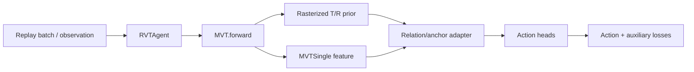

# 数据流与函数索引

[文档索引](../README.md) · [Object-prior 模式](../experiments/object-prior-modes.md)

本页用于从文档中的概念快速定位到实现；行为细节仍以对应指南和实验页为准。

## Semantic-GT 数据流

| 阶段 | 文件 | 关键函数 |
| --- | --- | --- |
| 语义角色与 phase | `finetune/RLBench/utils/o2_oracle_provider.py` | `RLBenchGTOracleProvider._build_assignment()`、`build_demo_event_manifest()` |
| handle 对齐 | `finetune/RLBench/utils/oracle_handle_alignment.py` | `align_handles()`、`align_semantic_handle_group()` |
| object/site 几何 | Oracle provider 与 site geometry 工具 | `_sample_entity_points()`、`site_geometry_from_object()`、`sample_site_geometry()` |
| replay 重写 | `tools/rewrite_replay_with_semantic_roles.py` | `_load_manifest()`、`_build_oracle()`、`_fill_slot()`、`_audit_fields()`、`process_task()` |
| 输出校验 | 同上 | `_validate_semantic_transition()`、`_validate_task_output()`、`_visualize_task_output()` |
| batch 读取 | `finetune/RLBench/utils/dataset.py` | Oracle / predicted object 字段采样逻辑 |

## Policy 数据流

| 功能 | 关键函数或模块 |
| --- | --- |
| 模式解析 | `resolve_object_prior_mode()` |
| Oracle/external 输入选择 | `RVTAgent._select_oracle_prior_points()`、`_oracle_network_kwargs()` |
| Internal-slot auxiliary loss | `RVTAgent._object_slot_auxiliary_losses()` |
| 训练与推理 | `RVTAgent.update()`、`RVTAgent.act()`、`RVTAgent.get_pred()` |
| prior 构造 | `MVT._build_oracle_instance_prior()`、`rasterize_instance_points()` |
| relation feature adapter | `OracleRelationGatedFeatureAdapter` |
| phase-dependent anchor | `OracleRelationAnchorFeatureAdapter.forward_with_anchor()` |
| 网络内部 slots | `InternalObjectSlotPredictor.forward()`、`_extract_points()` |
| action 输出 | `MVTSingle.forward()` |

## 配置到代码

| 配置 | 说明文档 | 主要入口 |
| --- | --- | --- |
| `rlbench_o2_semantic_gt.yaml` | [O2 训练](../experiments/o2-training.md) | Oracle T/R adapter |
| `rlbench_o2_semantic_gt_relation_anchor.yaml` | [Relation anchor](../experiments/relation-anchor.md) | phase-dependent action anchor |
| `rlbench_o2_predicted_objects.yaml` | [External prediction](../experiments/predicted-objects.md) | predicted T/R fields |
| `rlbench_o2_internal_slots.yaml` | [Internal slots](../experiments/internal-object-slots.md) | slot predictor + role heatmap |
