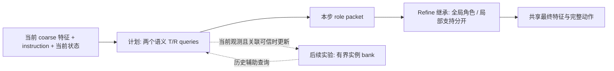

# Object-centric policy / memory 调研

[文档索引](../README.md) · [整体设计](../design/role-relation-prior.md) · [Memory 方案](../design/role-relation-prior.md#object-centric-memory后续未实现)

调研截止 **2026-09-29**。围绕 BridgeVLA 的角色预测、跨尺度继承、实例历史与闭环状态更新，核对原论文的方法、监督和实验边界；不是穷尽式综述，也未复现这些方法。下文区分论文事实、本项目代码事实与待验证设计推论。论文指标不直接横向排名。

## 1. 先明确需要解决的问题

| 问题 | 最小必要机制 | 不能混为一谈的能力 |
| --- | --- | --- |
| coarse 找对 R，refine crop 看不到 R | 本步角色继承、全局 token 与局部支持分开 | 不需要据此引入 temporal memory |
| 当前 mask 模糊或混入邻近物体 | 监督实际使用的角色图，检查特征与投影分辨率 | 更多 slots / 更长历史不自动修复边界 |
| 当前图像相似，但正确对象由历史决定 | 历史证据与当前观测融合 | long-horizon 不一定等于 non-Markovian |
| 同类实例遮挡、交换位置后要保持身份 | 实例关联、重现关联与错误历史抑制 | T/R 的固定角色编号不是物体 ID |
| 曾见几何当前不可见，或相机已移动 | 来源明确、坐标一致且可失效的空间记忆 | 换虚拟视角不能生成未见表面 |
| release 后未放稳，或塔后来塌了 | 当前关系证据与历史事件分开 | 执行动作不等于成功，曾成功不等于仍成立 |

本项目优先解决前两项，再用历史依赖反例判断是否需要后三类模块。此顺序是工程取舍，不是论文已证实的最优架构。

## 2. 相关工作与适用条件

### 2.1 对象表示、关联与时序模型

| 工作与版本 | 方法 / 监督 | 可借鉴内容与限制 |
| --- | --- | --- |
| [SlotVLA](https://arxiv.org/html/2511.06754v1)，[作者页：ICRA 2026](https://slot-vla.github.io/) | slot carryover、实例 box/mask/objectness 与时序 tracking loss；instruction 筛选相关 slots，再生成 relation tokens | 对象与 relation 的表示已有先例；LIBERO+ 的实例级监督比当前 T/R replay 丰富 |
| [SlotSSM](https://arxiv.org/html/2406.12272v6)，NeurIPS 2024 | 各 slot 独立共享参数的状态更新，小型 Slot Mixer 交换信息；OC 版本学习对象分解 | 可作为固定容量时序模型；模块化 state 不自动保证真实对象 ID 或机器人闭环收益 |
| [Embodied-SlotSSM](https://ojs.aaai.org/index.php/AAAI/article/download/37337/41299)，AAAI 2026 正式论文 | 时序 slots、历史/未来 latent 预测、Slot Fusion 与 Relation Encoder；实验版本加入 oracle subgoal | 是直接的机器人 memory 先例，但不能当作自主阶段识别已解决的证据 |
| [PSB](https://arxiv.org/html/2402.17077)，[作者页：ICML 2024](https://parallel-st-binder.github.io/) | 底向上 attention、时轴 attention、对象轴 attention；支持因果 mask 与序列并行训练 | 提供不同于 GRU/SSM 的可扩展路径；在线成本仍依赖历史窗口，不能称为无限历史常数成本 |
| [SemanticSlots](https://arxiv.org/html/2608.21636v1)，作者注明 BMVC 2026 接收 | 静态图像特征重建训练；context-aware decoder 用 slot 检索当前图像，推理可冻结或刷新 slots | 将对象语义与当前位置分开；相同实例仍有歧义，未验证操作策略 |
| [RandSF.Q](https://arxiv.org/html/2508.01345v7)，[AAAI 2026 正式条目](https://ojs.aaai.org/index.php/AAAI/article/view/38322) | 历史 slots 与新到达帧特征共同生成 query；训练随机采样 slot-feature 对 | 历史用于解释新观测，而非盲目预测；主要验证视频对象学习，不是动作闭环 |
| [Dyn-O](https://papers.nips.cc/paper_files/paper/2025/file/b03b9ec80fc599bb5161746edff0f322-Paper-Conference.pdf)，NeurIPS 2025 | SAM2 attention-mask 先验逐步撤去；对象表示预训练后使用 SSM，分离相对静态与动态属性 | 可借鉴分阶段学习与 teacher 撤去；实验是 Procgen，不能外推真机 tracking 或恢复 |

### 2.2 历史如何进入动作策略

| 工作与版本 | 方法 / 额外依赖 | 可借鉴内容与限制 |
| --- | --- | --- |
| [BridgeVLA++](https://arxiv.org/html/2608.05042v1)，2026-08 预印本 | coarse 读初始锚点与历史关键帧；refine 按当前 crop 重渲染、重新编码初始点云 | 是最直接场景级 memory 对照；旧场景不自动等于移动物体的当前状态，空间分支含额外编码 |
| [MemoryVLA](https://arxiv.org/html/2508.19236)，[作者页：ICLR 2026](https://shihao1895.github.io/MemoryVLA/) | 感知/认知双流 bank，时间编码检索、门控融合、相似相邻记录合并 | 有界 scene/context memory 对照；记录不是明确的持久实例，不能直接给出对象重绑定 |
| [PAM](https://arxiv.org/html/2512.24638v1)，2025-12 论文版本 | 当前动作与历史上下文分开，多时间跨度 queries 压缩历史；辅助重建历史特征 | 简洁的非 object-bank 对照；300-frame / 20Hz 是其平台结果，不是本项目预算保证 |
| [HistRISE / History-Aware Policy](https://arxiv.org/html/2509.17141)，[作者项目](https://tonyfang.net/history/) | 初始 SAM2 对象分割、TAPIP3D 点跟踪、对象级轨迹 token；异步跟踪配合训练时丢点增强 | 直接的 object-centric history 参考；需计入外部跟踪延迟和误差，不只是加几个 token |
| [SPOT](https://nvlabs.github.io/object_centric_diffusion/)，ICRA 2025 | 相对目标对象的 SE(3) 轨迹，再转换为操作条件；数据采集包含 mesh 重建与位姿跟踪 | 支持相对几何表示的动机；不必因此替换 BridgeVLA heatmap，也不能忽略 pose/mesh 前提 |

### 2.3 对象状态与动作结果

| 工作与版本 | 方法 / 额外依赖 | 可借鉴内容与限制 |
| --- | --- | --- |
| [AGM](https://arxiv.org/html/2608.29537)，v2：2026-09-28，预印本 | 静态子目标序列与进度指针；夹爪事件触发抓取/放置验证；CoTracker3、冻结视觉编码器与小型 verifier | 重点是更新证据，不是容量；显式序列与运行时防死锁规则不能直接复制为隐式 phase |
| [POT-VLA](https://arxiv.org/html/2607.18016v2)，2026 预印本 | SAM3/RGB-D 建立角色索引 3D 记录；同一记录用于 action head 和 predicate verifier | 动作与验证共享对象状态；依赖 typed subtasks、标定及手设阈值，不是端到端自主发现完整任务结构 |
| [OCC4M](https://arxiv.org/html/2609.28798v1)，2026-09-23，预印本 | 世界坐标轨迹、同类内距离匹配与显式事件/containment；VLM 选目标，低层技能执行 | 区分历史地点与当前物体位置；依赖 SAM3 和已知支撑面，主对照 VLM 未匹配，真机是固定相机 |

额外的模块参照：[Cutie，CVPR 2024](https://arxiv.org/html/2310.12982)将对象信息与当前像素证据结合，但依赖首帧分割。它支持“不要只读旧 token”的动机，不证明我们的三视角角色头已具备视频分割能力。

关联与容量的补充参照：[TrackFormer，CVPR 2022](https://arxiv.org/abs/2101.02702)区分延续轨迹与发现新对象的 queries；[RMem，CVPR 2024](https://arxiv.org/abs/2406.08476)限制 memory 以减少冗余；[Out of Sight, Still in Mind，ICRA 2024](https://arxiv.org/abs/2309.15278)用视频跟踪支持遮挡对象的记忆规划。它们分别约束身份、容量和历史证据，不是本策略的闭环验证。

## 3. 深读后影响设计的结论

### 3.1 保留对象线索，再用当前观测定位

SemanticSlots 的核心是 decoder 能访问当前 frame features，而不是单凭旧 slot 重建位置。冻结、按需刷新、每帧刷新是不同推理模式；其最佳分解结果不能一概归因于完全不更新 slots。论文明确指出语义检索可能混淆相同实体。[方法与限制](https://arxiv.org/html/2608.21636v1#S3)

RandSF.Q 的“next-frame features”指 **新帧已经到达后**使用其特征，不是提前偷看尚未观测的未来。它的轻量 transitioner 同时读旧 slots 与新特征；简单 slot carryover 是必须比较的基线。[方法 §Informative Query Prediction](https://arxiv.org/html/2508.01345v7)

**本项目推论：**历史 token 作为当前 coarse 查询的辅助条件；当前可见位置由新证据更新。不要反复投影旧 heatmap，也不要用语义相似度独自确认同类实例。提议的 T/R queries 是任务角色，而上述论文的 slots 主要用于场景对象分解，两者不等价。

### 3.2 SSM 解决时序计算，不替代身份与监督

Embodied-SlotSSM 的实验版本将 oracle text subgoal 与当前/预测 slots 融合。正式论文 Table 3 的 **83.0% 是 LIBERO-Goal 任务成功率**；Table 4 的 **14.8% 是 LIBERO-Mem 子目标完成比例**，不能作为同一指标比较，也不能解释为长期记忆任务已解决。作者明确将自主 subgoal 推断列为未解决问题。[§Action Control、Tables 3–4、Limitations](https://ojs.aaai.org/index.php/AAAI/article/download/37337/41299)

**本项目推论：**先比较最近可靠 token、短窗口 attention / 简单共享 GRU，再决定是否需要 SlotSSM。固定 K 下递归状态可以控制随时间增长的开销，但总成本仍包含视觉编码、关联与对象间交互；训练更长序列不等于发现 scaling law。

### 3.3 物体历史比夹爪轨迹更接近实际效果，但跟踪有成本

HistRISE 将每个对象的点轨迹聚合成一个历史 token。其异步实验中，直接改为异步会降低性能，训练时模拟最近轨迹缺失才能缓解差距；这要求 history timestamps 与实际推理延迟进入训练契约。论文也发现加入 EE 点轨迹可能使策略过度依赖机器人自身运动。[§III、IV-D](https://arxiv.org/html/2509.17141)

**本项目推论：**记录实际对象证据，不将上一条 action command 当作对象已移动。外部 tracker 是独立对照或 teacher 选项，首轮不加入在线依赖。当前决策步与论文的视频帧不同，窗口预算应同时报告秒数、观测频率和控制步数。

### 3.4 “完成”标志最容易把瞬时错误写成长期错误

AGM 的价值是将尝试与实际结果分开。但其附录 A.5 允许连续拒绝达到上限后推进指针；因此不能概括为“所有进度更新都严格经过成功验证”。其线性序列也不能表达任意合法顺序、分支或任意旧子目标回退。[§3、Appendix A.5 / E](https://arxiv.org/html/2608.29537)

**本项目推论：**先把抓取/放置事件作为诊断，只有可信标签时再训练结果读出。区分 `曾观察到 relation 成立` 与 `当前 relation 仍成立`；记录绑定物体对和任务语境，不将 release 写成 done，不永久禁止曾放好的对象再次成为 T/R。不复制外部阶段 FSM 来改变当前隐式动作主线。

### 3.5 当前对象与历史地点需要不同的几何语义

POT-VLA 保留角色记录，遮挡时将证据标为不确定；predicate 的阈值与稳定窗口由子任务/标定给出，不由动作策略自主学习。[§3.1–3.3](https://arxiv.org/html/2607.18016v2)

OCC4M 区分“某物体当前在哪里”和“它以前所在的地点”。其关联是在同类对象间做世界平面距离 Hungarian 匹配，使用恒速预测和 12cm gate；这不是可以照搬到 RLBench 的通用阈值。当前实现通过已知支撑面求世界点，测量深度是后续选项，不能把它描述成通用 RGB-D 3D tracking。[§2](https://arxiv.org/html/2609.28798v1)

OCC4M 真机的 **85% joint memory accuracy 与 45% 两阶段任务成功率**测的是不同能力；真机使用固定相机的图像平面记录，没有验证移动相机下的世界坐标不变性。主仿真对照固定 executor，但使用不同 VLM；单次扰动展示不是系统性恢复评估。[§3–5](https://arxiv.org/html/2609.28798v1)

**本项目推论：**先仅支持当前对象身份与有效几何；历史地点作为未来独立接口。对象移动可让旧当前位置失效，但不让真正的历史地点随物体移动。不能通过冻结 Reference 的坐标“保持身份”。

### 3.6 需要证明 object-centric 比简单历史更好

BridgeVLA++ 的 temporal bank 保存已编码 tokens，但空间分支每步按当前 crop 重渲染并重新编码初始点云；不能把整个 memory 描述成无需额外视觉编码。[§IV-F](https://arxiv.org/html/2608.05042v1#S4)

MemoryVLA 提供检索/融合/容量管理；PAM 用少量不同时间跨度 queries 压缩历史，均不要求显式实例 bank。[MemoryVLA §3](https://arxiv.org/html/2508.19236)，[PAM §III](https://arxiv.org/html/2512.24638v1)

**本项目推论：**用同一 backbone、action decoder、历史时长与训练预算比较场景历史、角色历史与实例历史。若普通历史条件同样有效，则只能主张 memory 有用，不能主张 object bank 必要。简化实现是结构消融，不冒称复现整篇论文。

## 4. 与当前代码和数据的差距

| 当前可核对事实 | 文件 / 函数 | 对调研方案的约束 |
| --- | --- | --- |
| 无序 slots → objectness / role 分数 → 混合 T/R maps；forward 不接收历史状态 | [oracle_prior.py](../../finetune/bridgevla/models/oracle_prior.py)：`InternalObjectSlotPredictor.forward()` | 当前不是 Slot Attention + SSM，不提供跨帧 ID；局部变量 `memory` 是当前 decoder 的 K/V，不是 temporal bank |
| 有效 GT T/R 与 slots 做最小代价匹配；只监督匹配 slots，无拒配阈值 | [object_conditioning.py](../../finetune/bridgevla/models/object_conditioning.py)：`hungarian_role_slot_losses()`、`mixed_role_map_losses()` | 不等于全场景 discovery/tracking 标签；最终混合角色图监督已 opt-in 实现，收益待验证 |
| coarse/refine 分别调用两个 predictors，未传递共享 role packet | [mvt.py](../../finetune/bridgevla/mvt/mvt.py)：`MVT.forward()` | 本步继承仍是计划，不能写成现有能力 |
| joint 可用 instruction context、soft geometry 与共享最终动作特征 | [mvt_single.py](../../finetune/bridgevla/mvt/mvt_single.py)：`MVT.forward()`；[joint config](../../finetune/RLBench/configs/rlbench_o2_internal_slots_joint.yaml) | 可以复用，不增加第三次 VLM 前向；当前普通配置不默认打开同一路由 |
| 普通配置 K=2，joint K=6；当前状态是夹爪三维低维状态 | [普通 config](../../finetune/RLBench/configs/rlbench_o2_internal_slots.yaml)、上述 predictor | K 与固定 T/R queries、bank capacity 是不同参数；目标 `gripper_pose` 不能用作当前 EE state |

当前 replay 只支持已选 T/R 的监督，未证明全实例 ID、可靠 visibility、逐对成功或失败恢复标签完整可用。`present=True, geometry_valid=False` 不能改成 NULL；缺失角色/关系监督也不能自动变成负例。有效 buffer 不需为本次调研重写。[现有数据契约](../design/role-relation-prior.md#teacher-与数据)

若训练实例 memory，先审计 episode/frame 顺序、同一实例跨决策点的关联及一致的空间增强。随机单帧 replay 不构成时序训练；成功 demo 的 release 边界不构成逐对 placement-success 标签。所有 GT ID / success 只用于 teacher 与诊断，不进入预测策略。

## 5. 推荐的最小方案与后续 memory

### 主结构不因调研扩张

首轮仅验证最终角色图监督、跨尺度继承与两个语义 queries，保持当前三视角 `3×2` 路径和 heatmap decoder。relation/phase 仍由当前对象、instruction 与状态隐式条件化，不增加离散 phase、pair search 或显式进度 head。[实施次序](../design/role-relation-prior.md#实验顺序)

### 时序扩展的最小契约

| 状态 | 存什么 | 不承诺什么 |
| --- | --- | --- |
| 本步 role packet | T/R tokens、R NULL、可信几何与局部支持 | 不是跨帧 ID；下一步允许重新选择 |
| 角色历史基线 | 最近观测的角色 token 与时间；可学习重绑定，不锁死物体 | 同一 T/R 编号换对象时，不能称为同一物体历史 |
| 实例 bank（关联成立后） | 独立 entry key、token、最近位置/有效性、观测时间与关联质量 | key 只是存储索引，不是无需验证的真实 ID；不伪造 covariance/visibility |
| 关系事件（单独实验） | 可验证的 T/R pair、事件时间与证据来源 | 不以 gripper command 生成 done；不是当前永久关系 |

每步先让当前观测与历史共同生成条件，再以当前可信关联写入一次。若同一物体从 T 变为 R，读同一 entry；T 从 A 切为 C 时不能把 A 的状态累积到 C。无法可信关联时保留不确定历史或旁路，不强行合并相似对象。

token 可保留，旧几何须独立失效；全遮挡时不把最后位置冒充当前确认位置。实例数量、bank capacity 与时序长度分别消融。GRU/SSM/attention 是相同表示契约下的替代实现，不同时堆叠；episode/任务切换、overflow、reset/burn-in 必须明确。

## 6. 实验应怎样证明有效

[RoboMME，ICML 2026 Oral](https://robomme.github.io/)覆盖 Counting、Permanence、Reference、Imitation；其论文比较多种 memory 表示/注入方式，未发现跨任务一致最优的方法。[原论文 v3](https://arxiv.org/html/2603.04639v3)支持按失败类型评估，而不是只报总平均。

| 验证组 | 对照 / 反例 | 主要指标 |
| --- | --- | --- |
| 跨尺度 | coarse 正确/错误两组，R crop 外、部分支持、真实 NULL、几何 unknown | role-map、局部误匹配、全局 token 保留、waypoint 与闭环；不只统计 coarse 正确子集 |
| 身份 | 同类物体交叉、交换位置、遮挡后重现、T→R 切换 | identity switch、重现关联、错误合并/写入、角色切换延迟 |
| 空间 | 静止/移动 Reference、旧点失效、相机变化 | 坐标误差、过期几何误导率、拒绝/再观测率 |
| 历史依赖 | 当前观测近似相同、先前操作对象不同；屏蔽/打乱相关与无关历史 | 条件决策正确率、历史敏感性、闭环差；这些干预不证明 causal reasoning |
| 动作效果 | 抓空、滑落、放歪、先成立后坍塌 | 错误进度写入、关系失效识别、明确定义的恢复成功率 |

顺序：**无 memory → 最近可靠观测 → 同预算 scene/context 历史 → 角色历史 → 有可信关联的实例历史 → 最后才试空间缓存或结果读出**。前置 GT/单帧准入和跨尺度配置固定，不在一次实验同时改 renderer、分辨率、query 与 memory。[已有准入规则](../guides/object-conditioning.md#gt-联合对照)

- 相同初始化、解冻范围、数据、训练步数与评估 episodes；至少 3 个训练 seeds 做配对闭环比较，报告成功率差及 95% CI。说明 CI 的重采样单位与训练 seed 变异，不能把同 seed 的各帧当独立样本。
- RLBench 按标准 episode success 统计，失败、超时、拒绝都留在总分母；memory-decision、subgoal completion 与整任务成功分别报告。
- 分别报告 VLM 前向次数、跟踪/关联成本、bank 大小、实际历史秒数、时延与显存。固定历史容量不等于整个模型零额外成本。
- 只有在失败/恢复数据与测试定义明确时报告恢复能力；相关指标未改善时停止追加模块。先定位当前动作执行差距，不用辅助 mask loss 下降代替 closed-loop 收益。

## 7. Motivation 与创新主张

已有工作已经包含 object slots、relation tokens、SSM、scene/object memory 和验证后更新。将这些模块组合不能单独构成创新，也不能把“隐式阶段”“失败恢复”“因果能力”当作架构自带属性。

本项目更具体的研究假设是：**在三视角 coarse/refine 动作定位中，以同一角色条件贯穿两级；历史只辅助当前对象绑定，身份与可能过期的几何分开，减少 crop 导致的角色漂移和错误空间条件。** 当前“两个 queries 足够”“实例 memory 更好”“共享状态改善恢复”均需对照。

可证伪条件：若仅监督最终角色图已获得相同收益，继承/queries 不应独占功劳；若 scene 历史同样有效，不主张 object-centric 必要性；若只减少角色漂移但不改善闭环，不主张操作性能提高；若依赖 GT ID、oracle subgoal 或在线 simulator success，单独标为 Oracle 上界。

## 8. 阅读与复现实验优先级

1. **角色/定位：SemanticSlots → RandSF.Q → SlotVLA。** 看 query 语义、当前观测读出和监督差异；不直接复制其数据假设。
2. **历史是否有用：PAM / MemoryVLA → BridgeVLA++ → HistRISE。** 先建立便宜 scene/context 基线，再核对对象跟踪收益与额外成本。
3. **写入与几何：AGM → OCC4M → POT-VLA。** 关注动作结果、历史地点、身份/几何分离，同时保留显式规划/阈值的限制。
4. **时序规模：SlotSSM / PSB → Embodied-SlotSSM / Dyn-O。** 关联与数据契约成立后，再选择时序算子，不把模块名当收益保证。

版本说明：Embodied-SlotSSM 使用 AAAI 正式 PDF；RandSF.Q 核对 v7 与 AAAI 条目；SemanticSlots 的接收状态来自作者 arXiv 声明；AGM 核对 v2；OCC4M 核对 v1。其他无版本后缀的链接可能随作者更新而变化，复现时应记录具体版本、代码 commit 和运行配置。
